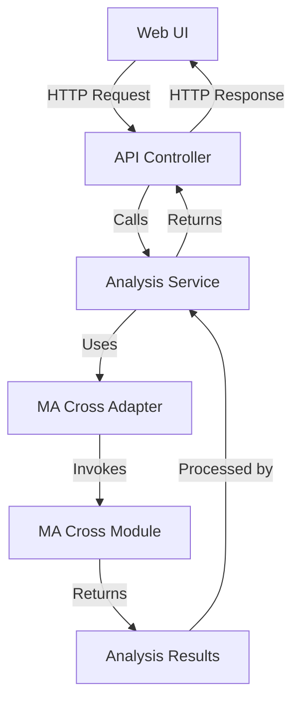

# SensitivityTrader Integration with MA Cross Analysis

## Overview

This document outlines the implementation plan for integrating the SensitivityTrader web application with the MA Cross analysis functionality. When a user clicks the "Run Analysis" button in the SensitivityTrader app, the system will send the ticker(s) and configuration to the MA Cross analysis module, process the data, and return the results to populate the "Results" view.

## Design Principles

This implementation strictly adheres to:

- **SOLID**:
  - **S**ingle Responsibility: Each class has one job
  - **O**pen/Closed: Extend functionality without modifying existing code
  - **L**iskov Substitution: Subtypes can replace parent types
  - **I**nterface Segregation: Clients only depend on methods they use
  - **D**ependency Inversion: High-level modules depend on abstractions

- **DRY**: Don't Repeat Yourself - Avoid code duplication
- **KISS**: Keep It Simple, Stupid - Favor simplicity over complexity
- **YAGNI**: You Aren't Gonna Need It - Only implement what's necessary

## Architecture



## Implementation Plan

### 1. Create Interface Definitions

#### 1.1 `IAnalysisAdapter` Interface

```python
# app/SensitivityTrader/interfaces/analysis_adapter.py
from abc import ABC, abstractmethod
from typing import Dict, Any, List

class IAnalysisAdapter(ABC):
    """Interface for analysis adapters."""
    
    @abstractmethod
    def run_analysis(self, config: Dict[str, Any]) -> List[Dict[str, Any]]:
        """
        Run analysis with the provided configuration.
        
        Args:
            config: Configuration for the analysis
            
        Returns:
            Analysis results as a list of dictionaries
        """
        pass
```

#### 1.2 `IAnalysisService` Interface

```python
# app/SensitivityTrader/interfaces/analysis_service.py
from abc import ABC, abstractmethod
from typing import Dict, Any

class IAnalysisService(ABC):
    """Interface for analysis services."""
    
    @abstractmethod
    def run_analysis(self, tickers: str, config: Dict[str, Any]) -> Dict[str, Any]:
        """
        Run analysis with the provided tickers and configuration.
        
        Args:
            tickers: Comma-separated list of tickers
            config: Configuration for the analysis
            
        Returns:
            Dictionary containing analysis results and status
        """
        pass
```

### 2. Create MA Cross Adapter

```python
# app/SensitivityTrader/adapters/ma_cross_adapter.py
import sys
import os
import importlib.util
from typing import Dict, Any, List, Optional
from pathlib import Path

from app.SensitivityTrader.interfaces.analysis_adapter import IAnalysisAdapter
from app.SensitivityTrader.exceptions.analysis_exceptions import AnalysisError

class MACrossAdapter(IAnalysisAdapter):
    """Adapter for MA Cross analysis functionality."""
    
    def __init__(self, ma_cross_path: Optional[str] = None):
        """
        Initialize the MA Cross adapter.
        
        Args:
            ma_cross_path: Path to the MA Cross module directory
        """
        # Default path if not provided
        if ma_cross_path is None:
            # Assuming the app is in the same parent directory as ma_cross
            current_dir = Path(__file__).parent.parent.parent
            ma_cross_path = str(current_dir / "ma_cross")
        
        self.ma_cross_path = ma_cross_path
        
        # Add MA Cross directory to Python path if not already there
        if ma_cross_path not in sys.path:
            sys.path.append(ma_cross_path)
    
    def _load_ma_cross_module(self):
        """
        Dynamically load the MA Cross module.
        
        Returns:
            The loaded module
        
        Raises:
            AnalysisError: If the module cannot be loaded
        """
        try:
            # Path to the script
            script_path = os.path.join(self.ma_cross_path, "1_get_portfolios.py")
            
            # Load the module
            spec = importlib.util.spec_from_file_location("ma_cross_module", script_path)
            if spec is None or spec.loader is None:
                raise AnalysisError(f"Could not load module from {script_path}")
                
            ma_cross_module = importlib.util.module_from_spec(spec)
            spec.loader.exec_module(ma_cross_module)
            
            return ma_cross_module
        except Exception as e:
            raise AnalysisError(f"Failed to load MA Cross module: {str(e)}")
    
    def _convert_config(self, app_config: Dict[str, Any]) -> Dict[str, Any]:
        """
        Convert SensitivityTrader configuration to MA Cross configuration.
        
        Args:
            app_config: Configuration from the SensitivityTrader app
            
        Returns:
            Configuration compatible with MA Cross analysis
        """
        # Extract tickers from the configuration
        tickers = app_config.get("tickers", "")
        tickers_list = [t.strip() for t in tickers.split(",") if t.strip()]
        
        # Create a new configuration dictionary for MA Cross
        ma_config = {
            "TICKER": tickers_list,
            "WINDOWS": app_config.get("WINDOWS", 89),
            "REFRESH": app_config.get("REFRESH", True),
            "STRATEGY_TYPES": app_config.get("STRATEGY_TYPES", ["SMA", "EMA"]),
            "DIRECTION": app_config.get("DIRECTION", "Long"),
            "USE_HOURLY": app_config.get("USE_HOURLY", False),
            "USE_YEARS": app_config.get("USE_YEARS", False),
            "YEARS": app_config.get("YEARS", 15),
            "USE_SYNTHETIC": app_config.get("USE_SYNTHETIC", False),
            "USE_CURRENT": app_config.get("USE_CURRENT", True),
            "MINIMUMS": {
                "WIN_RATE": app_config.get("MINIMUMS", {}).get("WIN_RATE", 0.44),
                "TRADES": app_config.get("MINIMUMS", {}).get("TRADES", 54),
                "EXPECTANCY_PER_TRADE": app_config.get("MINIMUMS", {}).get("EXPECTANCY_PER_TRADE", 1),
                "PROFIT_FACTOR": app_config.get("MINIMUMS", {}).get("PROFIT_FACTOR", 1),
                "SORTINO_RATIO": app_config.get("MINIMUMS", {}).get("SORTINO_RATIO", 0.4),
            },
            "SORT_BY": app_config.get("SORT_BY", "Score"),
            "SORT_ASC": app_config.get("SORT_ASC", False),
            "USE_GBM": app_config.get("USE_GBM", False)
        }
        
        return ma_config
    
    def run_analysis(self, config: Dict[str, Any]) -> List[Dict[str, Any]]:
        """
        Run MA Cross analysis with the provided configuration.
        
        Args:
            config: Configuration for the analysis
            
        Returns:
            Analysis results as a list of dictionaries
            
        Raises:
            AnalysisError: If the analysis fails
        """
        try:
            # Load the MA Cross module
            ma_cross_module = self._load_ma_cross_module()
            
            # Convert the configuration
            ma_config = self._convert_config(config)
            
            # Create a custom logger for capturing output
            class CustomLogger:
                def __init__(self):
                    self.logs = []
                
                def __call__(self, message, level="info"):
                    self.logs.append({"message": message, "level": level})
            
            logger = CustomLogger()
            
            # Execute the analysis
            # We'll use the filter_portfolios function which returns filtered portfolios
            # First we need to get the portfolios from execute_strategy
            portfolios = ma_cross_module.execute_strategy(ma_config, logger)
            
            # Filter the portfolios
            filtered_portfolios = ma_cross_module.filter_portfolios(portfolios, ma_config, logger)
            
            return filtered_portfolios
        
        except Exception as e:
            raise AnalysisError(f"Analysis failed: {str(e)}")
```

### 3. Create Analysis Service

```python
# app/SensitivityTrader/services/analysis_service.py
import logging
from typing import Dict, Any, Optional

from app.SensitivityTrader.interfaces.analysis_service import IAnalysisService
from app.SensitivityTrader.interfaces.analysis_adapter import IAnalysisAdapter
from app.SensitivityTrader.adapters.ma_cross_adapter import MACrossAdapter
from app.SensitivityTrader.exceptions.analysis_exceptions import AnalysisError

logger = logging.getLogger(__name__)

class AnalysisService(IAnalysisService):
    """Service for running analysis and managing results."""
    
    def __init__(self, adapter: Optional[IAnalysisAdapter] = None):
        """
        Initialize the analysis service.
        
        Args:
            adapter: Analysis adapter implementation
        """
        self.adapter = adapter if adapter is not None else MACrossAdapter()
    
    def run_analysis(self, tickers: str, config: Dict[str, Any]) -> Dict[str, Any]:
        """
        Run analysis with the provided tickers and configuration.
        
        Args:
            tickers: Comma-separated list of tickers
            config: Configuration for the analysis
            
        Returns:
            Dictionary containing analysis results and status
        """
        try:
            # Add tickers to the configuration
            config['tickers'] = tickers
            
            logger.info(f"Starting analysis for tickers: {tickers}")
            
            # Run the analysis
            results = self.adapter.run_analysis(config)
            
            # Return the results
            if results:
                return {
                    'status': 'success',
                    'results': results,
                    'message': f"Analysis completed successfully with {len(results)} results"
                }
            else:
                return {
                    'status': 'success',
                    'results': [],
                    'message': "Analysis completed but no results matched the criteria"
                }
        
        except AnalysisError as e:
            logger.error(f"Analysis error: {str(e)}")
            return {
                'status': 'error',
                'message': str(e)
            }
        except Exception as e:
            logger.error(f"Unexpected error: {str(e)}")
            return {
                'status': 'error',
                'message': f"An unexpected error occurred: {str(e)}"
            }
```

### 4. Create Exception Classes

```python
# app/SensitivityTrader/exceptions/analysis_exceptions.py
class AnalysisError(Exception):
    """Base exception for analysis errors."""
    pass
```

### 5. Update Flask API Controller

```python
# app/SensitivityTrader/app.py (Update)
from flask import Flask, render_template, request, jsonify, session
from app.SensitivityTrader.services.analysis_service import AnalysisService

# Initialize the analysis service
analysis_service = AnalysisService()

# Update the analyze endpoint
@app.route('/api/analyze', methods=['POST'])
def analyze():
    """Process the parameter sensitivity analysis request."""
    try:
        data = request.json
        tickers = data.get('tickers', '')
        config = data.get('config', DEFAULT_CONFIG)
        
        logger.debug(f"Received analysis request for tickers: {tickers}")
        
        # Use the analysis service to run the analysis
        result = analysis_service.run_analysis(tickers, config)
        
        return jsonify(result)
    except Exception as e:
        logger.error(f"Error in analysis: {str(e)}")
        return jsonify({'status': 'error', 'message': str(e)}), 500
```

### 6. Create Frontend JavaScript Module

```javascript
// app/SensitivityTrader/static/js/analysis.js
/**
 * Analysis module for handling parameter sensitivity analysis.
 */
const Analysis = (function() {
    // Private variables
    let resultsData = [];
    
    /**
     * Initialize the analysis module.
     */
    function init() {
        // Set up event listeners
        document.getElementById('run-analysis-btn').addEventListener('click', runAnalysis);
    }
    
    /**
     * Run the analysis with the current configuration.
     */
    function runAnalysis() {
        // Get the tickers
        const tickers = document.getElementById('tickers-input').value.trim();
        if (!tickers) {
            showError('Please enter at least one ticker');
            return;
        }
        
        // Get the configuration
        const config = getConfiguration();
        
        // Show loading indicator
        showLoading(true);
        
        // Send the request to the server
        fetch('/api/analyze', {
            method: 'POST',
            headers: {
                'Content-Type': 'application/json'
            },
            body: JSON.stringify({
                tickers: tickers,
                config: config
            })
        })
        .then(response => response.json())
        .then(data => {
            // Hide loading indicator
            showLoading(false);
            
            if (data.status === 'success') {
                // Store the results
                resultsData = data.results || [];
                
                // Display the results
                displayResults();
                
                // Show success message
                showSuccess(data.message || 'Analysis completed successfully');
            } else {
                // Show error message
                showError(data.message || 'Analysis failed');
            }
        })
        .catch(error => {
            // Hide loading indicator
            showLoading(false);
            
            // Show error message
            showError('An error occurred: ' + error.message);
        });
    }
    
    /**
     * Get the current configuration from the form.
     */
    function getConfiguration() {
        return {
            WINDOWS: parseInt(document.getElementById('windows-input').value) || 89,
            REFRESH: document.getElementById('refresh-checkbox').checked,
            STRATEGY_TYPES: getSelectedStrategyTypes(),
            DIRECTION: document.getElementById('direction-select').value,
            USE_HOURLY: document.getElementById('use-hourly-checkbox').checked,
            USE_YEARS: document.getElementById('use-years-checkbox').checked,
            YEARS: parseInt(document.getElementById('years-input').value) || 15,
            USE_SYNTHETIC: document.getElementById('use-synthetic-checkbox').checked,
            USE_CURRENT: document.getElementById('use-current-checkbox').checked,
            MINIMUMS: {
                WIN_RATE: parseFloat(document.getElementById('min-win-rate-input').value) || 0.44,
                TRADES: parseInt(document.getElementById('min-trades-input').value) || 54,
                EXPECTANCY_PER_TRADE: parseFloat(document.getElementById('min-expectancy-input').value) || 1,
                PROFIT_FACTOR: parseFloat(document.getElementById('min-profit-factor-input').value) || 1,
                SORTINO_RATIO: parseFloat(document.getElementById('min-sortino-input').value) || 0.4
            },
            SORT_BY: document.getElementById('sort-by-select').value,
            SORT_ASC: document.getElementById('sort-asc-checkbox').checked,
            USE_GBM: document.getElementById('use-gbm-checkbox').checked
        };
    }
    
    /**
     * Get the selected strategy types.
     */
    function getSelectedStrategyTypes() {
        const strategyTypes = [];
        
        if (document.getElementById('sma-checkbox').checked) {
            strategyTypes.push('SMA');
        }
        
        if (document.getElementById('ema-checkbox').checked) {
            strategyTypes.push('EMA');
        }
        
        return strategyTypes.length > 0 ? strategyTypes : ['SMA', 'EMA'];
    }
    
    /**
     * Display the results in the results container.
     */
    function displayResults() {
        const resultsContainer = document.getElementById('results-container');
        const resultsTable = document.getElementById('results-table');
        
        if (!resultsData || resultsData.length === 0) {
            resultsContainer.innerHTML = '<p class="text-center">No results available</p>';
            return;
        }
        
        // Get the table headers from the first result
        const headers = Object.keys(resultsData[0]);
        
        // Create the table header
        let tableHtml = '<thead><tr>';
        headers.forEach(header => {
            tableHtml += `<th>${header}</th>`;
        });
        tableHtml += '<th>Actions</th></tr></thead>';
        
        // Create the table body
        tableHtml += '<tbody>';
        resultsData.forEach(result => {
            tableHtml += '<tr>';
            headers.forEach(header => {
                tableHtml += `<td>${formatValue(result[header], header)}</td>`;
            });
            tableHtml += `<td><button class="btn btn-sm btn-primary add-to-portfolio-btn" data-index="${resultsData.indexOf(result)}">Add to Portfolio</button></td>`;
            tableHtml += '</tr>';
        });
        tableHtml += '</tbody>';
        
        // Update the table
        resultsTable.innerHTML = tableHtml;
        
        // Add event listeners to the Add to Portfolio buttons
        document.querySelectorAll('.add-to-portfolio-btn').forEach(button => {
            button.addEventListener('click', function() {
                const index = parseInt(this.getAttribute('data-index'));
                addToPortfolio(resultsData[index]);
            });
        });
        
        // Show the results container
        resultsContainer.style.display = 'block';
    }
    
    /**
     * Format a value for display.
     */
    function formatValue(value, header) {
        if (value === undefined || value === null) {
            return '';
        }
        
        if (typeof value === 'number') {
            if (header.includes('[%]') || header.includes('Rate') || header.includes('Percent')) {
                return value.toFixed(2) + '%';
            } else if (Math.abs(value) < 0.01) {
                return value.toFixed(4);
            } else if (Math.abs(value) >= 1000) {
                return value.toLocaleString(undefined, { maximumFractionDigits: 2 });
            } else {
                return value.toFixed(4);
            }
        }
        
        return value;
    }
    
    /**
     * Add a result to the portfolio.
     */
    function addToPortfolio(result) {
        fetch('/api/portfolio', {
            method: 'POST',
            headers: {
                'Content-Type': 'application/json'
            },
            body: JSON.stringify(result)
        })
        .then(response => response.json())
        .then(data => {
            if (data.status === 'success') {
                showSuccess('Added to portfolio');
            } else {
                showError(data.message || 'Failed to add to portfolio');
            }
        })
        .catch(error => {
            showError('An error occurred: ' + error.message);
        });
    }
    
    /**
     * Show a loading indicator.
     */
    function showLoading(isLoading) {
        const loadingIndicator = document.getElementById('loading-indicator');
        loadingIndicator.style.display = isLoading ? 'block' : 'none';
        
        // Disable/enable the run analysis button
        document.getElementById('run-analysis-btn').disabled = isLoading;
    }
    
    /**
     * Show a success message.
     */
    function showSuccess(message) {
        const alertContainer = document.getElementById('alert-container');
        alertContainer.innerHTML = `
            <div class="alert alert-success alert-dismissible fade show" role="alert">
                ${message}
                <button type="button" class="btn-close" data-bs-dismiss="alert" aria-label="Close"></button>
            </div>
        `;
    }
    
    /**
     * Show an error message.
     */
    function showError(message) {
        const alertContainer = document.getElementById('alert-container');
        alertContainer.innerHTML = `
            <div class="alert alert-danger alert-dismissible fade show" role="alert">
                ${message}
                <button type="button" class="btn-close" data-bs-dismiss="alert" aria-label="Close"></button>
            </div>
        `;
    }
    
    // Public API
    return {
        init: init,
        runAnalysis: runAnalysis
    };
})();

// Initialize the analysis module when the DOM is loaded
document.addEventListener('DOMContentLoaded', Analysis.init);
```

### 7. Update HTML Template

```html
<!-- app/SensitivityTrader/templates/index.html (Update) -->
<!-- Add this section for the analysis configuration -->
<div class="card mb-4">
    <div class="card-header">
        <h5 class="card-title">Analysis Configuration</h5>
    </div>
    <div class="card-body">
        <div id="alert-container"></div>
        
        <div class="mb-3">
            <label for="tickers-input" class="form-label">Tickers (comma-separated)</label>
            <input type="text" class="form-control" id="tickers-input" placeholder="e.g., AAPL,MSFT,GOOG">
        </div>
        
        <div class="row mb-3">
            <div class="col-md-6">
                <label for="windows-input" class="form-label">Windows</label>
                <input type="number" class="form-control" id="windows-input" value="89">
            </div>
            <div class="col-md-6">
                <label class="form-label">Strategy Types</label>
                <div class="form-check">
                    <input class="form-check-input" type="checkbox" id="sma-checkbox" checked>
                    <label class="form-check-label" for="sma-checkbox">SMA</label>
                </div>
                <div class="form-check">
                    <input class="form-check-input" type="checkbox" id="ema-checkbox" checked>
                    <label class="form-check-label" for="ema-checkbox">EMA</label>
                </div>
            </div>
        </div>
        
        <div class="row mb-3">
            <div class="col-md-6">
                <label for="direction-select" class="form-label">Direction</label>
                <select class="form-select" id="direction-select">
                    <option value="Long" selected>Long</option>
                    <option value="Short">Short</option>
                </select>
            </div>
        </div>
        
        <div class="mb-3">
            <button class="btn btn-link" type="button" data-bs-toggle="collapse" data-bs-target="#advancedConfig" aria-expanded="false" aria-controls="advancedConfig">
                Advanced Configuration
            </button>
            <div class="collapse" id="advancedConfig">
                <div class="card card-body">
                    <div class="row mb-3">
                        <div class="col-md-6">
                            <div class="form-check">
                                <input class="form-check-input" type="checkbox" id="refresh-checkbox" checked>
                                <label class="form-check-label" for="refresh-checkbox">Refresh</label>
                            </div>
                        </div>
                        <div class="col-md-6">
                            <div class="form-check">
                                <input class="form-check-input" type="checkbox" id="use-hourly-checkbox">
                                <label class="form-check-label" for="use-hourly-checkbox">Use Hourly</label>
                            </div>
                        </div>
                    </div>
                    
                    <div class="row mb-3">
                        <div class="col-md-6">
                            <div class="form-check">
                                <input class="form-check-input" type="checkbox" id="use-years-checkbox">
                                <label class="form-check-label" for="use-years-checkbox">Use Years</label>
                            </div>
                        </div>
                        <div class="col-md-6">
                            <label for="years-input" class="form-label">Years</label>
                            <input type="number" class="form-control" id="years-input" value="15">
                        </div>
                    </div>
                    
                    <div class="row mb-3">
                        <div class="col-md-6">
                            <div class="form-check">
                                <input class="form-check-input" type="checkbox" id="use-synthetic-checkbox">
                                <label class="form-check-label" for="use-synthetic-checkbox">Use Synthetic</label>
                            </div>
                        </div>
                        <div class="col-md-6">
                            <div class="form-check">
                                <input class="form-check-input" type="checkbox" id="use-current-checkbox" checked>
                                <label class="form-check-label" for="use-current-checkbox">Use Current</label>
                            </div>
                        </div>
                    </div>
                    
                    <div class="row mb-3">
                        <div class="col-md-6">
                            <div class="form-check">
                                <input class="form-check-input" type="checkbox" id="use-gbm-checkbox">
                                <label class="form-check-label" for="use-gbm-checkbox">Use GBM</label>
                            </div>
                        </div>
                    </div>
                    
                    <h6 class="mt-3">Minimum Requirements</h6>
                    <div class="row mb-3">
                        <div class="col-md-6">
                            <label for="min-win-rate-input" class="form-label">Win Rate</label>
                            <input type="number" step="0.01" class="form-control" id="min-win-rate-input" value="0.44">
                        </div>
                        <div class="col-md-6">
                            <label for="min-trades-input" class="form-label">Trades</label>
                            <input type="number" class="form-control" id="min-trades-input" value="54">
                        </div>
                    </div>
                    
                    <div class="row mb-3">
                        <div class="col-md-4">
                            <label for="min-expectancy-input" class="form-label">Expectancy per Trade</label>
                            <input type="number" step="0.01" class="form-control" id="min-expectancy-input" value="1">
                        </div>
                        <div class="col-md-4">
                            <label for="min-profit-factor-input" class="form-label">Profit Factor</label>
                            <input type="number" step="0.01" class="form-control" id="min-profit-factor-input" value="1">
                        </div>
                        <div class="col-md-4">
                            <label for="min-sortino-input" class="form-label">Sortino Ratio</label>
                            <input type="number" step="0.01" class="form-control" id="min-sortino-input" value="0.4">
                        </div>
                    </div>
                    
                    <div class="row mb-3">
                        <div class="col-md-6">
                            <label for="sort-by-select" class="form-label">Sort By</label>
                            <select class="form-select" id="sort-by-select">
                                <option value="Score" selected>Score</option>
                                <option value="Win Rate [%]">Win Rate</option>
                                <option value="Total Trades">Total Trades</option>
                                <option value="Expectancy per Trade">Expectancy per Trade</option>
                                <option value="Profit Factor">Profit Factor</option>
                                <option value="Sortino Ratio">Sortino Ratio</option>
                                <option value="Total Return [%]">Total Return</option>
                            </select>
                        </div>
                        <div class="col-md-6">
                            <div class="form-check mt-4">
                                <input class="form-check-input" type="checkbox" id="sort-asc-checkbox">
                                <label class="form-check-label" for="sort-asc-checkbox">Sort Ascending</label>
                            </div>
                        </div>
                    </div>
                </div>
            </div>
        </div>
        
        <div class="mt-3">
            <button id="run-analysis-btn" class="btn btn-primary">Run Analysis</button>
        </div>
        
        <div id="loading-indicator" class="mt-3" style="display: none;">
            <div class="spinner-border text-primary" role="status">
                <span class="visually-hidden">Loading...</span>
            </div>
            <span class="ms-2">Running analysis...</span>
        </div>
    </div>
</div>

<!-- Results section -->
<div class="card mb-4">
    <div class="card-header d-flex justify-content-between align-items-center">
        <h5 class="card-title mb-0">Results</h5>
        <div>
            <button id="view-toggle-btn" class="btn btn-sm btn-outline-secondary">View as Text</button>
        </div>
    </div>
    <div class="card-body">
        <div id="results-container" style="display: none;">
            <div id="results-table-container">
                <table id="results-table" class="table table-striped table-bordered"></table>
            </div>
            <div id="results-text-container" style="display: none;">
                <textarea id="results-text" class="form-control" rows="20" readonly></textarea>
            </div>
        </div>
    </div>
</div>

<!-- Include the analysis.js script -->
<script src="{{ url_for('static', filename='js/analysis.js') }}"></script>
```

## Directory Structure

```
app/SensitivityTrader/
├── interfaces/
│   ├── __init__.py
│   ├── analysis_adapter.py
│   └── analysis_service.py
├── exceptions/
│   ├── __init__.py
│   └── analysis_exceptions.py
├── adapters/
│   ├── __init__.py
│   └── ma_cross_adapter.py
├── services/
│   ├── __init__.py
│   └── analysis_service.py
├── static/
│   ├── css/
│   └── js/
│       └── analysis.js
├── templates/
│   └── index.html
├── app.py
├── data_processor.py
└── models.py
```

## Implementation Steps

1. **Create Directory Structure**
   - Create the necessary directories and files

2. **Implement Interfaces**
   - Create the interface definitions for the adapter and service

3. **Implement Exception Classes**
   - Create the exception classes for error handling

4. **Implement MA Cross Adapter**
   - Create the adapter for the MA Cross module

5. **Implement Analysis Service**
   - Create the service for managing the analysis workflow

6. **Update Flask API Controller**
   - Update the Flask app to use the new service

7. **Create Frontend JavaScript**
   - Implement the JavaScript for handling the analysis

8. **Update HTML Template**
   - Update the HTML template to include the necessary UI elements

9. **Testing**
   - Test the integration with various tickers and configurations

## SOLID Principles Application

### Single Responsibility Principle
- Each class has a single responsibility:
  - `MACrossAdapter`: Adapts the MA Cross module
  - `AnalysisService`: Manages the analysis workflow
  - `AnalysisError`: Represents analysis errors

### Open/Closed Principle
- The system is open for extension but closed for modification:
  - New adapters can be added without modifying existing code
  - New services can be added without modifying existing code

### Liskov Substitution Principle
- Subtypes can be substituted for their base types:
  - Any implementation of `IAnalysisAdapter` can be used in the `AnalysisService`
  - Any implementation of `IAnalysisService` can be used in the Flask controller

### Interface Segregation Principle
- Interfaces are focused and minimal:
  - `IAnalysisAdapter` only includes methods needed for adapters
  - `IAnalysisService` only includes methods needed for services

### Dependency Inversion Principle
- High-level modules depend on abstractions:
  - `AnalysisService` depends on `IAnalysisAdapter`, not concrete implementations
  - Flask controller depends on `IAnalysisService`, not concrete implementations

## DRY Principle Application
- Configuration conversion is centralized in the adapter
- Error handling is centralized in the service
- UI components are reused across the application

## KISS Principle Application
- Simple, focused interfaces
- Clear separation of concerns
- Straightforward error handling
- Minimal dependencies

## YAGNI Principle Application
- Only implementing features that are needed:
  - No complex caching mechanisms
  - No unnecessary abstraction layers
  - No premature optimization