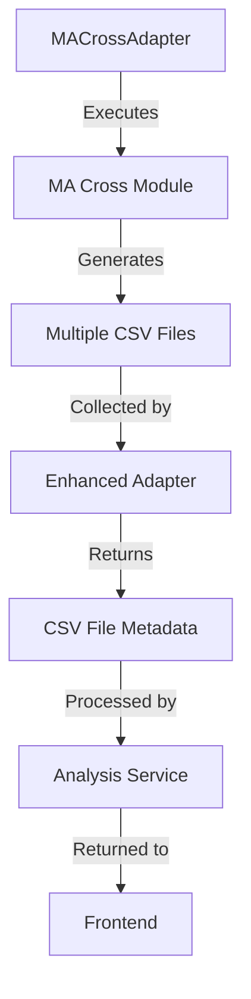

# SensitivityTrader MA Cross Integration Plan

This document outlines the implementation plan for integrating the SensitivityTrader web application with the MA Cross analysis functionality, focusing on returning multiple CSV files and implementing a dropdown selector in the Results table.

## Current Understanding

1. **MA Cross Analysis Process**:
   - `app/ma_cross/1_get_portfolios.py` generates multiple CSV files in different directories:
     - `csv/portfolios_filtered/` - Contains filtered portfolios for different tickers and strategies (EMA/SMA)
     - `csv/portfolios_best/` - Contains the best portfolios with timestamps
   - The CSV files contain detailed portfolio metrics (Win Rate, Profit Factor, etc.)

2. **SensitivityTrader Integration**:
   - The integration plan in `SensitivityTrader_Integration_Plan.md` outlines interfaces, adapters, services, and frontend components
   - The `MACrossAdapter` class is responsible for executing the MA Cross analysis and returning results

3. **Current Limitations**:
   - The current implementation doesn't return all CSV files in the response
   - There's no dropdown in the Results table to select different CSV files

## Requirements

1. Modify `app/ma_cross/1_get_portfolios.py` to return all CSV files in the response message when the process is complete
2. Add a dropdown to the Results table that allows the user to select which CSV file is displayed (portfolio best as default)

## Implementation Plan

### 1. Enhance the MA Cross Adapter



#### 1.1 Modify `MACrossAdapter` to Collect CSV Files

```python
# app/SensitivityTrader/adapters/ma_cross_adapter.py (Update)

class MACrossAdapter(IAnalysisAdapter):
    # ... existing code ...
    
    def _collect_csv_files(self, config: Dict[str, Any]) -> List[Dict[str, Any]]:
        """
        Collect all CSV files generated by the MA Cross analysis.
        
        Args:
            config: Configuration used for the analysis
            
        Returns:
            List of dictionaries containing CSV file metadata
        """
        csv_files = []
        
        # Determine base directory
        base_dir = os.path.join(config.get("BASE_DIR", ""), "csv")
        
        # Collect files from portfolios_filtered directory
        filtered_dir = os.path.join(base_dir, "portfolios_filtered")
        if os.path.exists(filtered_dir):
            for file in os.listdir(filtered_dir):
                if file.endswith(".csv"):
                    file_path = os.path.join(filtered_dir, file)
                    # Parse filename to extract ticker, timeframe, and strategy
                    parts = file.replace(".csv", "").split("_")
                    if len(parts) >= 3:
                        ticker = parts[0]
                        timeframe = parts[1]  # D for daily, H for hourly
                        strategy = parts[2]   # EMA or SMA
                        
                        csv_files.append({
                            "file_path": file_path,
                            "file_name": file,
                            "type": "filtered",
                            "ticker": ticker,
                            "timeframe": timeframe,
                            "strategy": strategy,
                            "display_name": f"{ticker} ({timeframe}, {strategy}) - Filtered"
                        })
        
        # Collect files from portfolios_best directory
        best_dir = os.path.join(base_dir, "portfolios_best")
        if os.path.exists(best_dir):
            for file in os.listdir(best_dir):
                if file.endswith(".csv"):
                    file_path = os.path.join(best_dir, file)
                    # Parse filename to extract ticker, timestamp, timeframe, and strategy
                    parts = file.replace(".csv", "").split("_")
                    if len(parts) >= 3:
                        if len(parts) >= 4 and parts[1].isdigit() and parts[2].isdigit():
                            # Format: TICKER_YYYYMMDD_HHMM_TIMEFRAME.csv or TICKER_YYYYMMDD_HHMM_TIMEFRAME_STRATEGY.csv
                            ticker = parts[0]
                            timestamp = f"{parts[1]}_{parts[2]}"
                            timeframe = parts[3]
                            strategy = parts[4] if len(parts) >= 5 else "MIXED"
                        else:
                            # Format: TICKER_TIMEFRAME_STRATEGY.csv
                            ticker = parts[0]
                            timestamp = "latest"
                            timeframe = parts[1]
                            strategy = parts[2]
                        
                        csv_files.append({
                            "file_path": file_path,
                            "file_name": file,
                            "type": "best",
                            "ticker": ticker,
                            "timestamp": timestamp,
                            "timeframe": timeframe,
                            "strategy": strategy,
                            "display_name": f"{ticker} ({timeframe}, {strategy}) - Best" + (f" ({timestamp})" if timestamp != "latest" else "")
                        })
        
        # Sort files by ticker, type (best first), and timestamp (newest first)
        csv_files.sort(key=lambda x: (
            x["ticker"],
            0 if x["type"] == "best" else 1,
            x.get("timestamp", "")
        ))
        
        return csv_files
    
    def run_analysis(self, config: Dict[str, Any]) -> Dict[str, Any]:
        """
        Run MA Cross analysis with the provided configuration.
        
        Args:
            config: Configuration for the analysis
            
        Returns:
            Dictionary containing analysis results and CSV file metadata
            
        Raises:
            AnalysisError: If the analysis fails
        """
        try:
            # Load the MA Cross module
            ma_cross_module = self._load_ma_cross_module()
            
            # Convert the configuration
            ma_config = self._convert_config(config)
            
            # Create a custom logger for capturing output
            class CustomLogger:
                def __init__(self):
                    self.logs = []
                
                def __call__(self, message, level="info"):
                    self.logs.append({"message": message, "level": level})
            
            logger = CustomLogger()
            
            # Execute the analysis
            portfolios = ma_cross_module.execute_strategy(ma_config, logger)
            
            # Filter the portfolios
            filtered_portfolios = ma_cross_module.filter_portfolios(portfolios, ma_config, logger)
            
            # Collect CSV files generated by the analysis
            csv_files = self._collect_csv_files(ma_config)
            
            # Return both the filtered portfolios and CSV file metadata
            return {
                "portfolios": filtered_portfolios,
                "csv_files": csv_files,
                "logs": logger.logs
            }
        
        except Exception as e:
            raise AnalysisError(f"Analysis failed: {str(e)}")
```

### 2. Update Analysis Service to Handle CSV Files

```python
# app/SensitivityTrader/services/analysis_service.py (Update)

class AnalysisService(IAnalysisService):
    # ... existing code ...
    
    def run_analysis(self, tickers: str, config: Dict[str, Any]) -> Dict[str, Any]:
        """
        Run analysis with the provided tickers and configuration.
        
        Args:
            tickers: Comma-separated list of tickers
            config: Configuration for the analysis
            
        Returns:
            Dictionary containing analysis results, CSV file metadata, and status
        """
        try:
            # Add tickers to the configuration
            config['tickers'] = tickers
            
            logger.info(f"Starting analysis for tickers: {tickers}")
            
            # Run the analysis
            result = self.adapter.run_analysis(config)
            
            # Extract portfolios and CSV files from the result
            portfolios = result.get("portfolios", [])
            csv_files = result.get("csv_files", [])
            logs = result.get("logs", [])
            
            # Return the results
            if portfolios:
                return {
                    'status': 'success',
                    'results': portfolios,
                    'csv_files': csv_files,
                    'logs': logs,
                    'message': f"Analysis completed successfully with {len(portfolios)} results and {len(csv_files)} CSV files"
                }
            else:
                return {
                    'status': 'success',
                    'results': [],
                    'csv_files': csv_files,
                    'logs': logs,
                    'message': "Analysis completed but no results matched the criteria"
                }
        
        except AnalysisError as e:
            logger.error(f"Analysis error: {str(e)}")
            return {
                'status': 'error',
                'message': str(e)
            }
        except Exception as e:
            logger.error(f"Unexpected error: {str(e)}")
            return {
                'status': 'error',
                'message': f"An unexpected error occurred: {str(e)}"
            }
```

### 3. Create API Endpoint to Serve CSV Files

```python
# app/SensitivityTrader/app.py (Update)

from flask import Flask, render_template, request, jsonify, session, send_file
import os

# ... existing code ...

@app.route('/api/csv/<path:filename>', methods=['GET'])
def get_csv_file(filename):
    """Serve a CSV file."""
    try:
        # Ensure the filename is safe and within the csv directory
        base_dir = os.path.join(app.config['BASE_DIR'], 'csv')
        file_path = os.path.normpath(os.path.join(base_dir, filename))
        
        # Security check: ensure the file is within the csv directory
        if not file_path.startswith(base_dir):
            return jsonify({'status': 'error', 'message': 'Invalid file path'}), 403
        
        # Check if the file exists
        if not os.path.isfile(file_path):
            return jsonify({'status': 'error', 'message': 'File not found'}), 404
        
        # Serve the file
        return send_file(file_path, mimetype='text/csv', as_attachment=True)
    except Exception as e:
        logger.error(f"Error serving CSV file: {str(e)}")
        return jsonify({'status': 'error', 'message': str(e)}), 500
```

### 4. Update Frontend JavaScript to Handle CSV Files and Dropdown

```javascript
// app/SensitivityTrader/static/js/analysis.js (Update)

/**
 * Analysis module for handling parameter sensitivity analysis.
 */
const Analysis = (function() {
    // Private variables
    let resultsData = [];
    let csvFiles = [];
    let currentCsvFile = null;
    
    /**
     * Initialize the analysis module.
     */
    function init() {
        // Set up event listeners
        document.getElementById('run-analysis-btn').addEventListener('click', runAnalysis);
        
        // Set up CSV file selector dropdown
        const csvSelector = document.getElementById('csv-file-selector');
        if (csvSelector) {
            csvSelector.addEventListener('change', function() {
                const selectedValue = this.value;
                if (selectedValue) {
                    loadCsvFile(selectedValue);
                }
            });
        }
        
        // Set up download button
        const downloadBtn = document.getElementById('download-csv-btn');
        if (downloadBtn) {
            downloadBtn.addEventListener('click', downloadCurrentCsv);
        }
    }
    
    /**
     * Run the analysis with the current configuration.
     */
    function runAnalysis() {
        // Get the tickers
        const tickers = document.getElementById('tickers-input').value.trim();
        if (!tickers) {
            showError('Please enter at least one ticker');
            return;
        }
        
        // Get the configuration
        const config = getConfiguration();
        
        // Show loading indicator
        showLoading(true);
        
        // Send the request to the server
        fetch('/api/analyze', {
            method: 'POST',
            headers: {
                'Content-Type': 'application/json'
            },
            body: JSON.stringify({
                tickers: tickers,
                config: config
            })
        })
        .then(response => response.json())
        .then(data => {
            // Hide loading indicator
            showLoading(false);
            
            if (data.status === 'success') {
                // Store the results
                resultsData = data.results || [];
                
                // Store CSV files
                csvFiles = data.csv_files || [];
                
                // Update CSV file selector
                updateCsvFileSelector();
                
                // Display the results
                displayResults();
                
                // Show success message
                showSuccess(data.message || 'Analysis completed successfully');
            } else {
                // Show error message
                showError(data.message || 'Analysis failed');
            }
        })
        .catch(error => {
            // Hide loading indicator
            showLoading(false);
            
            // Show error message
            showError('An error occurred: ' + error.message);
        });
    }
    
    /**
     * Update the CSV file selector dropdown with available files.
     */
    function updateCsvFileSelector() {
        const selector = document.getElementById('csv-file-selector');
        if (!selector) return;
        
        // Clear existing options
        selector.innerHTML = '';
        
        // Add default option
        const defaultOption = document.createElement('option');
        defaultOption.value = '';
        defaultOption.textContent = 'Select a CSV file...';
        selector.appendChild(defaultOption);
        
        // Add option for current results
        const currentOption = document.createElement('option');
        currentOption.value = 'current';
        currentOption.textContent = 'Current Results';
        currentOption.selected = true;
        selector.appendChild(currentOption);
        
        // Group files by type
        const bestFiles = csvFiles.filter(file => file.type === 'best');
        const filteredFiles = csvFiles.filter(file => file.type === 'filtered');
        
        // Add best files group
        if (bestFiles.length > 0) {
            const bestGroup = document.createElement('optgroup');
            bestGroup.label = 'Best Portfolios';
            
            bestFiles.forEach(file => {
                const option = document.createElement('option');
                option.value = file.file_name;
                option.textContent = file.display_name;
                bestGroup.appendChild(option);
            });
            
            selector.appendChild(bestGroup);
        }
        
        // Add filtered files group
        if (filteredFiles.length > 0) {
            const filteredGroup = document.createElement('optgroup');
            filteredGroup.label = 'Filtered Portfolios';
            
            filteredFiles.forEach(file => {
                const option = document.createElement('option');
                option.value = file.file_name;
                option.textContent = file.display_name;
                filteredGroup.appendChild(option);
            });
            
            selector.appendChild(filteredGroup);
        }
        
        // Enable the selector if we have files
        selector.disabled = csvFiles.length === 0;
        
        // Show the selector container
        const selectorContainer = document.getElementById('csv-selector-container');
        if (selectorContainer) {
            selectorContainer.style.display = csvFiles.length > 0 ? 'block' : 'none';
        }
        
        // Show download button
        const downloadBtn = document.getElementById('download-csv-btn');
        if (downloadBtn) {
            downloadBtn.style.display = csvFiles.length > 0 ? 'inline-block' : 'none';
        }
    }
    
    /**
     * Load a CSV file and display its contents.
     */
    function loadCsvFile(fileName) {
        // If 'current' is selected, display the current results
        if (fileName === 'current') {
            displayResults(resultsData);
            return;
        }
        
        // Find the file in the csvFiles array
        const fileInfo = csvFiles.find(file => file.file_name === fileName);
        if (!fileInfo) {
            showError('File not found');
            return;
        }
        
        // Show loading indicator
        showLoading(true);
        
        // Determine the file path
        const filePath = fileInfo.type === 'best' 
            ? `portfolios_best/${fileName}`
            : `portfolios_filtered/${fileName}`;
        
        // Fetch the CSV file
        fetch(`/api/csv/${filePath}`)
            .then(response => {
                if (!response.ok) {
                    throw new Error('Failed to load CSV file');
                }
                return response.text();
            })
            .then(csvText => {
                // Parse CSV text to array of objects
                const parsedData = parseCSV(csvText);
                
                // Store the current CSV file
                currentCsvFile = {
                    fileName: fileName,
                    fileInfo: fileInfo,
                    data: parsedData
                };
                
                // Display the results
                displayResults(parsedData);
                
                // Hide loading indicator
                showLoading(false);
            })
            .catch(error => {
                // Hide loading indicator
                showLoading(false);
                
                // Show error message
                showError('Error loading CSV file: ' + error.message);
            });
    }
    
    /**
     * Parse CSV text to array of objects.
     */
    function parseCSV(csvText) {
        // Split by lines
        const lines = csvText.split('\n');
        
        // Get headers
        const headers = lines[0].split(',');
        
        // Parse data rows
        const data = [];
        for (let i = 1; i < lines.length; i++) {
            if (lines[i].trim() === '') continue;
            
            const values = lines[i].split(',');
            const row = {};
            
            for (let j = 0; j < headers.length; j++) {
                row[headers[j]] = values[j];
            }
            
            data.push(row);
        }
        
        return data;
    }
    
    /**
     * Download the currently displayed CSV file.
     */
    function downloadCurrentCsv() {
        // If no CSV file is selected, use the current results
        if (!currentCsvFile) {
            // Convert current results to CSV
            const csv = convertToCSV(resultsData);
            
            // Create a download link
            const blob = new Blob([csv], { type: 'text/csv' });
            const url = URL.createObjectURL(blob);
            const a = document.createElement('a');
            a.href = url;
            a.download = 'analysis_results.csv';
            document.body.appendChild(a);
            a.click();
            document.body.removeChild(a);
            URL.revokeObjectURL(url);
            return;
        }
        
        // Get file info
        const fileInfo = currentCsvFile.fileInfo;
        
        // Determine the file path
        const filePath = fileInfo.type === 'best' 
            ? `portfolios_best/${fileInfo.fileName}`
            : `portfolios_filtered/${fileInfo.fileName}`;
        
        // Create a download link
        const a = document.createElement('a');
        a.href = `/api/csv/${filePath}`;
        a.download = fileInfo.fileName;
        document.body.appendChild(a);
        a.click();
        document.body.removeChild(a);
    }
    
    /**
     * Convert an array of objects to CSV string.
     */
    function convertToCSV(data) {
        if (!data || data.length === 0) return '';
        
        // Get headers
        const headers = Object.keys(data[0]);
        
        // Create header row
        let csv = headers.join(',') + '\n';
        
        // Add data rows
        data.forEach(row => {
            const values = headers.map(header => {
                const value = row[header];
                // Handle values with commas by wrapping in quotes
                return typeof value === 'string' && value.includes(',') 
                    ? `"${value}"`
                    : value;
            });
            csv += values.join(',') + '\n';
        });
        
        return csv;
    }
    
    /**
     * Display the results in the results container.
     */
    function displayResults(data = null) {
        const resultsContainer = document.getElementById('results-container');
        const resultsTable = document.getElementById('results-table');
        
        // Use provided data or fall back to resultsData
        const displayData = data || resultsData;
        
        if (!displayData || displayData.length === 0) {
            resultsContainer.innerHTML = '<p class="text-center">No results available</p>';
            return;
        }
        
        // Get the table headers from the first result
        const headers = Object.keys(displayData[0]);
        
        // Create the table header
        let tableHtml = '<thead><tr>';
        headers.forEach(header => {
            tableHtml += `<th>${header}</th>`;
        });
        tableHtml += '<th>Actions</th></tr></thead>';
        
        // Create the table body
        tableHtml += '<tbody>';
        displayData.forEach(result => {
            tableHtml += '<tr>';
            headers.forEach(header => {
                tableHtml += `<td>${formatValue(result[header], header)}</td>`;
            });
            tableHtml += `<td><button class="btn btn-sm btn-primary add-to-portfolio-btn" data-index="${displayData.indexOf(result)}">Add to Portfolio</button></td>`;
            tableHtml += '</tr>';
        });
        tableHtml += '</tbody>';
        
        // Update the table
        resultsTable.innerHTML = tableHtml;
        
        // Add event listeners to the Add to Portfolio buttons
        document.querySelectorAll('.add-to-portfolio-btn').forEach(button => {
            button.addEventListener('click', function() {
                const index = parseInt(this.getAttribute('data-index'));
                addToPortfolio(displayData[index]);
            });
        });
        
        // Show the results container
        resultsContainer.style.display = 'block';
    }
    
    // ... existing code ...
    
    // Public API
    return {
        init: init,
        runAnalysis: runAnalysis
    };
})();

// Initialize the analysis module when the DOM is loaded
document.addEventListener('DOMContentLoaded', Analysis.init);
```

### 5. Update HTML Template to Include CSV File Selector

```html
<!-- app/SensitivityTrader/templates/index.html (Update) -->

<!-- Results section -->
<div class="card mb-4">
    <div class="card-header d-flex justify-content-between align-items-center">
        <h5 class="card-title mb-0">Results</h5>
        <div class="d-flex">
            <!-- CSV File Selector -->
            <div id="csv-selector-container" class="me-3" style="display: none;">
                <select id="csv-file-selector" class="form-select form-select-sm">
                    <option value="">Select a CSV file...</option>
                    <option value="current" selected>Current Results</option>
                </select>
            </div>
            <div class="me-2">
                <button id="download-csv-btn" class="btn btn-sm btn-outline-primary" style="display: none;">
                    <i class="bi bi-download"></i> Download CSV
                </button>
            </div>
            <div>
                <button id="view-toggle-btn" class="btn btn-sm btn-outline-secondary">View as Text</button>
            </div>
        </div>
    </div>
    <div class="card-body">
        <div id="results-container" style="display: none;">
            <div id="results-table-container">
                <table id="results-table" class="table table-striped table-bordered"></table>
            </div>
            <div id="results-text-container" style="display: none;">
                <textarea id="results-text" class="form-control" rows="20" readonly></textarea>
            </div>
        </div>
    </div>
</div>
```

## Implementation Steps

1. **Update MA Cross Adapter**:
   - Modify `MACrossAdapter` to collect CSV files generated by the analysis
   - Update `run_analysis` method to return both portfolios and CSV file metadata

2. **Update Analysis Service**:
   - Modify `AnalysisService.run_analysis` to handle CSV file metadata
   - Return CSV file metadata in the response

3. **Add API Endpoint**:
   - Create a new endpoint to serve CSV files

4. **Update Frontend**:
   - Add CSV file selector dropdown to the Results section
   - Implement functionality to load and display selected CSV files
   - Add download button for CSV files

5. **Testing**:
   - Test the integration with various tickers and configurations
   - Verify that all CSV files are returned in the response
   - Test the dropdown selector functionality
   - Test the download functionality

## SOLID Principles Application

### Single Responsibility Principle
- `MACrossAdapter` is responsible for executing the MA Cross analysis and collecting results
- `AnalysisService` is responsible for managing the analysis workflow
- Frontend components have clear responsibilities (file selection, display, download)

### Open/Closed Principle
- The system is extended to handle CSV files without modifying existing functionality
- New methods are added to collect and serve CSV files

### Liskov Substitution Principle
- The enhanced `MACrossAdapter` maintains the same interface contract
- The return type of `run_analysis` is extended but remains compatible

### Interface Segregation Principle
- The CSV file handling is separated from the core analysis functionality
- Frontend components are focused on specific tasks

### Dependency Inversion Principle
- High-level modules depend on abstractions
- The frontend depends on the API endpoints, not the implementation details

## Conclusion

This implementation plan provides a comprehensive approach to integrating the SensitivityTrader web application with the MA Cross analysis functionality. By following this plan, we will:

1. Enhance the MA Cross adapter to collect and return all CSV files generated by the analysis
2. Add a dropdown selector to the Results table to allow users to view different CSV files
3. Provide download functionality for CSV files

The implementation follows SOLID principles and maintains a clean separation of concerns, making it maintainable and extensible for future enhancements.