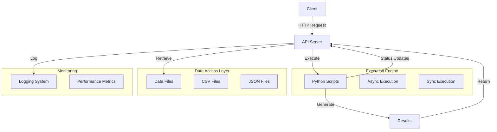

# API Server Implementation Plan

## 1. Overview

This implementation plan outlines the approach to build an API server that will:
1. Execute various Python scripts from the codebase
2. Retrieve CSV and JSON data files from the codebase
3. Support both synchronous and asynchronous execution
4. Provide status updates for long-running scripts
5. Include logging and monitoring capabilities

## 2. Architecture



## 3. Technology Stack

Based on the project requirements and existing dependencies, I recommend:

- **Web Framework**: FastAPI
  - Advantages:
    - Native async/await support for asynchronous operations
    - Automatic OpenAPI documentation generation
    - Type hints and validation with Pydantic
    - High performance
    - Compatible with existing Flask knowledge
  
- **Script Execution**:
  - For synchronous execution: Direct module imports or subprocess
  - For asynchronous execution: Background tasks with FastAPI + asyncio

- **Data Access**: Direct file system access with proper path validation

- **Logging**: Extend existing setup_logging.py for API-specific logging

## 4. API Endpoints Design

### 4.1 Script Execution Endpoints

```
POST /api/scripts/execute
```

Request body:
```json
{
  "script_path": "app/ma_cross/1_get_portfolios.py",
  "async": true,
  "parameters": {
    "TICKER": ["NVDA", "NFLX"],
    "WINDOWS": 89,
    "DIRECTION": "Long"
  }
}
```

Response (synchronous):
```json
{
  "status": "success",
  "execution_id": null,
  "result": {
    "success": true,
    "message": "Script executed successfully",
    "data": { ... }
  }
}
```

Response (asynchronous):
```json
{
  "status": "accepted",
  "execution_id": "task-123456",
  "message": "Script execution started"
}
```

### 4.2 Script Status Endpoint

```
GET /api/scripts/status/{execution_id}
```

Response:
```json
{
  "execution_id": "task-123456",
  "status": "running",
  "progress": 45,
  "message": "Processing ticker NFLX",
  "start_time": "2025-04-10T00:15:01Z",
  "elapsed_time": 120
}
```

### 4.3 Data Retrieval Endpoints

```
GET /api/data/csv/{path}
GET /api/data/json/{path}
```

Response:
```json
{
  "status": "success",
  "data": { ... }
}
```

### 4.4 Available Scripts Endpoint

```
GET /api/scripts/list
```

Response:
```json
{
  "status": "success",
  "scripts": [
    {
      "path": "app/ma_cross/1_get_portfolios.py",
      "description": "Portfolio Analysis Module for EMA Cross Strategy",
      "parameters": {
        "TICKER": "string or array",
        "WINDOWS": "integer",
        "DIRECTION": "string"
      }
    },
    ...
  ]
}
```

### 4.5 Available Data Endpoint

```
GET /api/data/list
GET /api/data/list/{directory}
```

Response:
```json
{
  "status": "success",
  "files": [
    {
      "path": "csv/strategies/DAILY.csv",
      "type": "csv",
      "size": 1024,
      "last_modified": "2025-04-10T00:00:00Z"
    },
    ...
  ]
}
```

## 5. Implementation Approach

### 5.1 Project Structure

```
app/
  api/
    __init__.py
    main.py              # FastAPI application
    routers/
      scripts.py         # Script execution endpoints
      data.py            # Data retrieval endpoints
    models/
      request.py         # Request models
      response.py        # Response models
    services/
      script_executor.py # Script execution service
      data_service.py    # Data retrieval service
    utils/
      logging.py         # API-specific logging
      monitoring.py      # Monitoring utilities
      security.py        # Security utilities (for future auth)
    config.py            # API configuration
```

### 5.2 Script Execution Service

The script execution service will:

1. Validate the script path to ensure it's within the allowed directories
2. Parse and validate parameters for the script
3. Execute the script with the provided parameters
4. Capture output and return results
5. For async execution, manage background tasks and provide status updates

Implementation approaches:

#### Synchronous Execution
- Direct module import and function call
- Subprocess execution with parameter passing

#### Asynchronous Execution
- FastAPI background tasks
- Status tracking with in-memory store or database

### 5.3 Data Retrieval Service

The data retrieval service will:

1. Validate the requested file path to ensure it's within allowed directories
2. Read and parse the file based on its type (CSV or JSON)
3. Return the data in a structured format

Security considerations:
- Path traversal prevention
- File size limits
- Access control (for future implementation)

### 5.4 Logging and Monitoring

Extend the existing setup_logging.py to include:

1. API-specific logging
2. Request/response logging
3. Performance metrics
4. Error tracking

## 6. Implementation Phases

### Phase 1: Core API Setup
- Set up FastAPI application
- Implement basic routing
- Configure logging and error handling

### Phase 2: Script Execution
- Implement synchronous script execution
- Create script parameter validation
- Develop script discovery and metadata

### Phase 3: Data Retrieval
- Implement CSV and JSON file access
- Create file listing functionality
- Add path validation and security

### Phase 4: Asynchronous Execution
- Implement background task management
- Create status tracking system
- Develop progress reporting

### Phase 5: Documentation and Testing
- Complete API documentation
- Write comprehensive tests
- Create usage examples

## 7. Future Enhancements

1. **Authentication**:
   - API key authentication system
   - Role-based access control

2. **Rate Limiting**:
   - Request throttling
   - Usage quotas

3. **Containerization**:
   - Docker containerization
   - Docker Compose for local development

4. **Advanced Monitoring**:
   - Prometheus metrics
   - Grafana dashboards

5. **Webhooks**:
   - Event-based notifications
   - Integration with external systems

## 8. Testing Strategy

1. **Unit Tests**:
   - Test individual components (services, utilities)
   - Mock external dependencies

2. **Integration Tests**:
   - Test API endpoints with actual script execution
   - Verify data retrieval functionality

3. **Performance Tests**:
   - Measure response times
   - Test concurrent requests
   - Evaluate resource usage

4. **Security Tests**:
   - Test path traversal prevention
   - Verify input validation

## 9. Risks and Mitigations

| Risk | Impact | Mitigation |
|------|--------|------------|
| Long-running scripts blocking the server | High | Use proper async execution and background tasks |
| Memory leaks from script execution | Medium | Implement resource monitoring and cleanup |
| Security vulnerabilities in file access | High | Strict path validation and access controls |
| Performance degradation with large files | Medium | Implement streaming responses and pagination |
| Script errors affecting API stability | High | Proper error handling and isolation |

## 10. Implementation Timeline

| Phase | Duration | Key Deliverables |
|-------|----------|------------------|
| Core API Setup | 1 week | Basic API structure, routing, logging |
| Script Execution | 2 weeks | Synchronous execution, parameter validation |
| Data Retrieval | 1 week | File access, listing functionality |
| Asynchronous Execution | 2 weeks | Background tasks, status tracking |
| Documentation and Testing | 1 week | API docs, tests, examples |

Total estimated time: 7 weeks