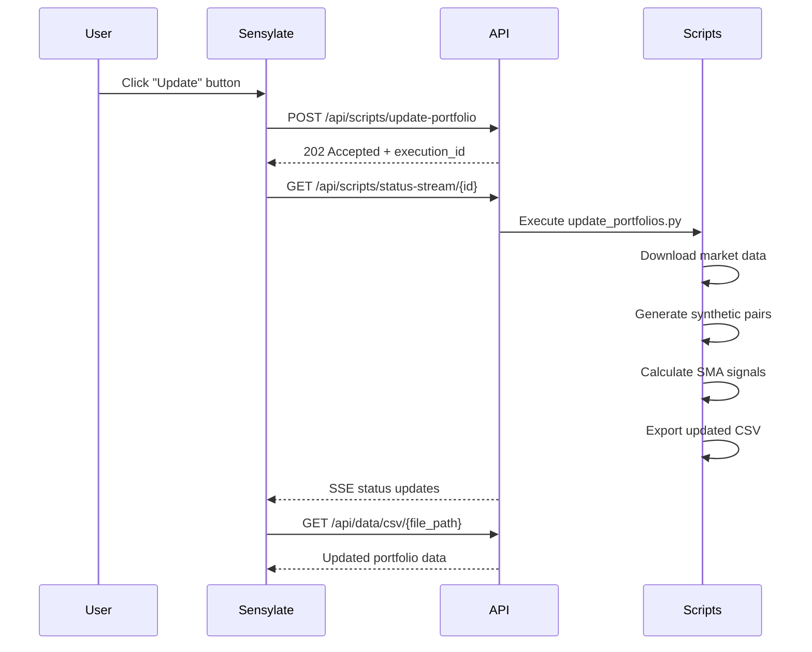

# Trading API Server

This FastAPI server provides endpoints for executing Python scripts and retrieving data files from the trading codebase. It serves as the backend for Sensylate, a React PWA for CSV-based portfolio analysis and strategy visualization.

## Features

- Execute Python scripts with parameters
- Support for both synchronous and asynchronous execution
- Real-time status updates via Server-Sent Events (SSE)
- Retrieve CSV and JSON data files with security validation
- List available scripts and data files
- Specialized portfolio update workflows
- MCP server integration for AI assistant access
- Comprehensive logging and monitoring

## API Endpoints

### Script Execution

- `POST /api/scripts/execute` - Execute any script with parameters
- `POST /api/scripts/update-portfolio` - Specialized portfolio update endpoint
- `GET /api/scripts/status/{execution_id}` - Get script execution status
- `GET /api/scripts/status-stream/{execution_id}` - Real-time status updates via SSE
- `GET /api/scripts/list` - List available scripts

### Data Retrieval

- `GET /api/data/csv/{file_path}` - Get CSV data with parsing
- `GET /api/data/json/{file_path}` - Get JSON data
- `GET /api/data/list` - List files in the default directory (csv)
- `GET /api/data/list/{directory}` - List files in a specific directory (e.g., strategies)

### Sensylate Integration

- `GET /sensylate` - Serve the Sensylate React PWA
- `GET /viewer` - Serve the CSV viewer interface

## Running the API Server

To run the API server:

```bash
python -m app.api.run
```

Command-line options:

- `--host` - Host to bind to (default: 127.0.0.1)
- `--port` - Port to bind to (default: 8000)
- `--reload` - Enable auto-reload
- `--workers` - Number of worker processes (default: 1)
- `--log-level` - Log level (default: info)

## API Documentation

Once the server is running, you can access the API documentation at:

```
http://127.0.0.1:8000/docs
```

## Configuration

The API server configuration is defined in `app/api/config.py`. The main configuration options are:

- `BASE_DIR` - Base directory for the project
- `ALLOWED_SCRIPT_DIRS` - Directories where scripts can be executed
- `ALLOWED_DATA_DIRS` - Directories where data can be accessed
- `MAX_FILE_SIZE` - Maximum file size for data retrieval
- `SCRIPT_TIMEOUT` - Timeout for script execution
- `ENABLE_ASYNC` - Whether to enable asynchronous script execution
- `LOG_DIR` - Directory for API logs

## Sensylate UX Flow Integration

This API serves as the backend for the Sensylate React PWA, handling the complete portfolio analysis workflow:

1. **Initial Data Loading**: Sensylate fetches file lists via `/api/data/list/strategies`
2. **CSV Display**: Portfolio data retrieved via `/api/data/csv/{file_path}`
3. **Portfolio Updates**: Real-time updates via `/api/scripts/update-portfolio` with SSE streaming
4. **Signal Generation**: Automated trading signal detection and strategy analysis

### Real-World Portfolio Update Workflow

The following demonstrates the complete flow when a user updates their portfolio in Sensylate:



## API Examples with Real Data

### 1. List Available Strategy Files

**Request:**

```bash
curl -X GET "http://127.0.0.1:8000/api/data/list/strategies"
```

**Response:**

```json
{
  "status": "success",
  "files": [
    {
      "name": "DAILY.csv",
      "path": "csv/strategies/DAILY.csv",
      "size": 12345
    },
    {
      "name": "DAILY_test.csv",
      "path": "csv/strategies/DAILY_test.csv",
      "size": 34567
    }
  ],
  "directory": "csv/strategies"
}
```

### 2. Get CSV Portfolio Data

**Request:**

```bash
curl -X GET "http://127.0.0.1:8000/api/data/csv/csv/strategies/DAILY_test.csv"
```

**Response:**

```json
{
  "status": "success",
  "data": {
    "data": [
      {
        "Ticker": "BTC-USD_RSP",
        "Short Window": 61,
        "Long Window": 66,
        "Strategy Type": "SMA",
        "Signal Window": 0,
        "Signal Entry": false,
        "Signal Exit": false,
        "Total Trades": 39,
        "Score": 2.0971743838296493,
        "Win Rate [%]": 74.35897435897436,
        "Total Return [%]": 6283.200931687664,
        "Max Drawdown [%]": 68.48969002293904
      },
      {
        "Ticker": "BTC-USD_QQQ",
        "Short Window": 71,
        "Long Window": 77,
        "Strategy Type": "SMA",
        "Signal Entry": false,
        "Signal Exit": false,
        "Total Trades": 37,
        "Score": 2.090154800932333,
        "Win Rate [%]": 70.27027027027027,
        "Total Return [%]": 7327.536342956961
      },
      {
        "Ticker": "BTC-USD_SPY",
        "Short Window": 73,
        "Long Window": 76,
        "Strategy Type": "SMA",
        "Signal Entry": true,
        "Signal Exit": false,
        "Total Trades": 41,
        "Score": 2.0720115150269995,
        "Win Rate [%]": 70.73170731707317,
        "Total Return [%]": 12779.198986911862
      }
    ],
    "columns": ["Ticker", "Short Window", "Long Window", "Strategy Type", ...]
  },
  "format": "csv",
  "file_path": "csv/strategies/DAILY_test.csv"
}
```

### 3. Update Portfolio with Real-Time Status

**Initial Request:**

```bash
curl -X POST "http://127.0.0.1:8000/api/scripts/update-portfolio" \
  -H "Content-Type: application/json" \
  -d '{"portfolio": "DAILY_test.csv"}'
```

**Initial Response:**

```json
{
  "status": "accepted",
  "execution_id": "9322338b-68ee-4ed6-ae5c-2db7f965584e",
  "message": "Portfolio update started",
  "script_path": "app/strategies/update_portfolios.py"
}
```

**SSE Status Stream:**

```bash
curl -X GET "http://127.0.0.1:8000/api/scripts/status-stream/9322338b-68ee-4ed6-ae5c-2db7f965584e" \
  -H "Accept: text/event-stream"
```

**SSE Response Stream:**

```
data: {"status": "running", "execution_id": "9322338b-68ee-4ed6-ae5c-2db7f965584e", "message": "Processing strategy configuration for BTC-USD_RSP", "progress": 33}

data: {"status": "running", "execution_id": "9322338b-68ee-4ed6-ae5c-2db7f965584e", "message": "Processing strategy configuration for BTC-USD_QQQ", "progress": 66}

data: {"status": "running", "execution_id": "9322338b-68ee-4ed6-ae5c-2db7f965584e", "message": "Processing strategy configuration for BTC-USD_SPY", "progress": 100}

data: {"status": "completed", "execution_id": "9322338b-68ee-4ed6-ae5c-2db7f965584e", "message": "Portfolio update completed in 10.62 seconds", "result": {"success": true, "total_strategies": 3, "signal_entries": 1, "breadth_ratio": 0.6667}}
```

### 4. Execute Generic Script

**Request:**

```bash
curl -X POST "http://127.0.0.1:8000/api/scripts/execute" \
  -H "Content-Type: application/json" \
  -d '{
    "script_path": "app/ma_cross/1_get_portfolios.py",
    "async_execution": true,
    "parameters": {
      "TICKER": ["NVDA", "NFLX"],
      "WINDOWS": 89,
      "DIRECTION": "Long"
    }
  }'
```

**Response:**

```json
{
  "status": "accepted",
  "execution_id": "550e8400-e29b-41d4-a716-446655440000",
  "message": "Script execution started"
}
```

### 5. Get Script Execution Status

**Request:**

```bash
curl -X GET "http://127.0.0.1:8000/api/scripts/status/9322338b-68ee-4ed6-ae5c-2db7f965584e"
```

**Response:**

```json
{
  "status": "completed",
  "execution_id": "9322338b-68ee-4ed6-ae5c-2db7f965584e",
  "script_path": "app/strategies/update_portfolios.py",
  "parameters": { "portfolio": "DAILY_test.csv" },
  "start_time": "2025-05-26T13:48:07.787000",
  "end_time": "2025-05-26T13:48:18.404000",
  "execution_time": 10.617,
  "result": {
    "success": true,
    "message": "Portfolio update completed in 10.62 seconds",
    "data": {
      "total_strategies": 3,
      "total_open_trades": 2,
      "total_signal_entries": 1,
      "signal_entry_ratio": 0.3333,
      "breadth_ratio": 0.6667
    }
  }
}
```

## MCP Server Integration

The API integrates with the Model Context Protocol (MCP) to provide AI assistant access to trading data and script execution.

### MCP Configuration

```json
{
  "mcpServers": {
    "trading-mcp": {
      "command": "python",
      "args": ["-m", "mcp_server"],
      "env": {
        "API_BASE_URL": "http://localhost:8000",
        "LOG_LEVEL": "INFO"
      }
    }
  }
}
```

### Available MCP Tools

#### Script Tools

- **`list_trading_scripts`** - Lists available Python scripts
- **`execute_trading_script`** - Executes scripts with parameters
- **`check_script_status`** - Checks execution status

#### Data Tools

- **`list_data_files`** - Lists CSV/JSON data files
- **`get_trading_data`** - Retrieves file contents

#### Portfolio Tools

- **`update_portfolio`** - Specialized portfolio update tool

### MCP Usage Example

```bash
# AI assistant can execute:
# "Update the DAILY_test.csv portfolio and show me the results"

# This translates to MCP tool calls:
update_portfolio({"portfolio": "DAILY_test.csv"})
get_trading_data({"file_path": "csv/strategies/DAILY_test.csv", "format": "csv"})
```

## Error Handling

### Network Errors

```json
{
  "status": "error",
  "error": "Network request failed",
  "message": "Unable to connect to server",
  "timestamp": "2024-01-01T12:00:00Z"
}
```

### Script Execution Errors

```json
{
  "status": "failed",
  "error": "ScriptExecutionError",
  "message": "Portfolio update failed: Invalid data format",
  "traceback": "Traceback (most recent call last)...",
  "execution_id": "550e8400-e29b-41d4-a716-446655440000"
}
```

### Path Validation Errors

```json
{
  "status": "error",
  "message": "File path must be within allowed directories",
  "detail": "Attempted to access: ../../../etc/passwd"
}
```

### File Not Found Errors

```json
{
  "status": "error",
  "message": "File not found: nonexistent.csv",
  "detail": "The requested file does not exist or is not accessible"
}
```

## Portfolio Update Workflow Deep Dive

### Complete Processing Pipeline

When a user clicks "Update" in Sensylate, the following detailed workflow occurs:

#### Phase 1: Request Initialization (< 1 second)

```
POST /api/scripts/update-portfolio {"portfolio": "DAILY_test.csv"}
→ 202 Accepted + execution_id
→ SSE connection established
```

#### Phase 2: Portfolio Loading (1-2 seconds)

```
- Load CSV configuration from csv/strategies/DAILY_test.csv
- Validate 3 strategy configurations (BTC-USD_RSP, BTC-USD_QQQ, BTC-USD_SPY)
- Standardize column names and prepare processing pipeline
```

#### Phase 3: Market Data Acquisition (3-5 seconds)

```
For each synthetic pair:
  1. Download BTC-USD: 3,904 records (2014-2025)
  2. Download pair component (RSP/QQQ/SPY): 5,553-8,136 records
  3. Merge on date index: Results in 2,688 aligned records
  4. Calculate synthetic ratio: BTC-USD / Component
  5. Export to csv/price_data/{pair}_D.csv
```

#### Phase 4: Technical Analysis (2-3 seconds)

```
For each strategy:
  1. Calculate SMA indicators (short/long windows)
  2. Generate buy/sell signals from crossovers
  3. Apply position sizing and risk management
  4. Calculate 40+ performance metrics
  5. Determine current signal state (entry/exit)
```

#### Phase 5: Signal Aggregation (< 1 second)

```
- Rank strategies by Score (normalized performance)
- Identify active positions and signal entries
- Calculate portfolio breadth metrics
- Generate strategy summary report
```

#### Phase 6: Data Export & Completion (< 1 second)

```
- Export updated portfolio to CSV with new metrics
- Log execution summary and performance stats
- Close SSE connection
- Trigger frontend data refresh
```

### Real-Time SSE Updates

During execution, the frontend receives granular updates:

```javascript
// Example SSE events received by Sensylate
{
  "status": "running",
  "message": "Downloading data for BTC-USD",
  "progress": 10,
  "execution_id": "9322338b-68ee-4ed6-ae5c-2db7f965584e"
}

{
  "status": "running",
  "message": "Processing strategy configuration for BTC-USD_RSP",
  "progress": 33,
  "execution_id": "9322338b-68ee-4ed6-ae5c-2db7f965584e"
}

{
  "status": "completed",
  "message": "Portfolio update completed in 10.62 seconds",
  "result": {
    "success": true,
    "total_strategies": 3,
    "signal_entries": 1,
    "breadth_ratio": 0.6667
  },
  "execution_id": "9322338b-68ee-4ed6-ae5c-2db7f965584e"
}
```

### Trading Signal Generation

The system generates actionable trading signals:

```json
{
  "BTC-USD_SPY": {
    "signal_entry": true,
    "signal_exit": false,
    "current_position": "long",
    "score": 2.0743,
    "win_rate": 70.73,
    "total_return": 12779.2,
    "max_drawdown": 63.02
  }
}
```

### Performance Metrics & Optimization

Based on actual production execution:

- **Market Data Download**: ~3 seconds for 4 tickers (BTC-USD, RSP, QQQ, SPY)
- **Synthetic Pair Creation**: ~1 second per pair (3 pairs total)
- **Strategy Analysis**: ~5 seconds for SMA calculations and signal detection
- **Total Execution Time**: ~10.6 seconds for complete portfolio update
- **Data Throughput**: ~15,000 price records processed per second
- **Signal Detection**: Real-time identification of entry/exit signals
- **Portfolio Breadth Analysis**: Immediate calculation of market breadth metrics

### Caching & Optimization

The API implements intelligent caching:

- **Market Data**: Fresh downloads for real-time accuracy
- **File Lists**: 1-hour cache for directory listings
- **CSV Data**: 24-hour cache for historical data
- **Service Worker**: Offline PWA functionality

## Testing

The API server includes testing utilities to verify its functionality. These tests help ensure that all endpoints are working correctly and that the server is properly handling requests.

### Simple Testing

The `simple_test.py` script provides a basic test of the API server's core functionality. It tests the root and health endpoints, as well as the script listing and data retrieval endpoints.

To run the simple test:

```bash
python -m app.api.simple_test
```

This test is useful for quickly verifying that the API server is running and responding to requests.

### Comprehensive Testing

The `test_api.py` script provides more comprehensive testing of the API server. It tests all endpoints, including script execution and status checking.

To run the comprehensive test:

```bash
python -m app.api.test_api
```

This test is useful for verifying that all aspects of the API server are working correctly, including script execution and data retrieval.

### Manual Testing with cURL

You can also test the API server manually using cURL commands. The examples provided in the "Examples" section can be used for manual testing.

### Testing with the API Documentation

The API documentation at `http://127.0.0.1:8000/docs` provides an interactive interface for testing the API. You can use this interface to send requests to the API and view the responses.

## Future Enhancements

- Authentication with API keys
- Rate limiting
- Webhooks for script execution events
- Advanced monitoring with Prometheus metrics
- Docker containerization
