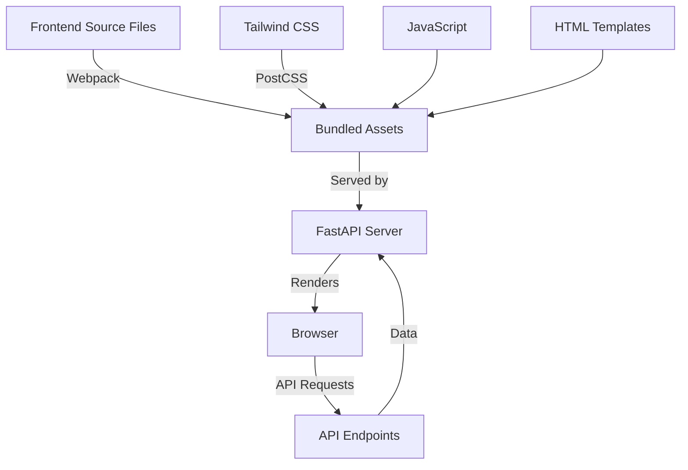

# Tailwind CSS Implementation Plan with Webpack for Sensylate

Based on your requirements, here's a detailed plan to implement Tailwind CSS with Webpack for the Sensylate application. This approach will provide a complete development environment with optimized builds for production.

## Current State Analysis

## Application Description

Sensylate: Sensitivity analysis meets portfolio simulation and strategy creation.

## Current State Analysis

The application currently:
- Is served by a FastAPI backend at `http://127.0.0.1:8000/viewer`
- Uses Tailwind CSS via CDN (`<script src="https://cdn.tailwindcss.com"></script>`)
- Has custom CSS in `styles.css` that mimics Tailwind classes
- Includes external dependencies like PapaParse, jQuery, and DataTables
- Supports hot reloading for HTML changes

## Implementation Plan

### 1. Set Up Node.js Project Structure

We'll create a Node.js project within the CSV Viewer directory to manage frontend dependencies:

```
app/sensylate/
├── dist/               # Compiled assets (to be created)
├── src/                # Source files (to be created)
│   ├── index.html      # Moved from root
│   ├── scripts/        # JavaScript files
│   │   └── main.js     # Renamed from script.js
│   └── styles/         # CSS files
│       └── main.css    # Will contain Tailwind imports
├── node_modules/       # Node.js dependencies (to be created)
├── package.json        # Node.js package configuration
├── webpack.config.js   # Webpack configuration
├── postcss.config.js   # PostCSS configuration
├── tailwind.config.js  # Tailwind CSS configuration
└── README.md           # Existing documentation
```

### 2. Initialize Node.js Project and Install Dependencies

```bash
# Initialize Node.js project
npm init -y

# Install Webpack and related tools
npm install --save-dev webpack webpack-cli webpack-dev-server html-webpack-plugin

# Install Tailwind CSS and related tools
npm install --save-dev tailwindcss postcss postcss-loader css-loader style-loader mini-css-extract-plugin autoprefixer

# Install other dependencies
npm install jquery datatables.net datatables.net-dt papaparse
```

### 3. Configure Tailwind CSS

Create a Tailwind configuration file that extends the default theme to match the current design:

```javascript
// tailwind.config.js
module.exports = {
  content: ['./src/**/*.{html,js}'],
  theme: {
    extend: {
      // Custom colors and other theme extensions based on current styles
    },
  },
  plugins: [],
}
```

### 4. Configure PostCSS

```javascript
// postcss.config.js
module.exports = {
  plugins: {
    tailwindcss: {},
    autoprefixer: {},
  }
}
```

### 5. Create Main CSS File with Tailwind Directives

```css
/* src/styles/main.css */
@tailwind base;
@tailwind components;
@tailwind utilities;

/* Custom styles for DataTables that can't be easily replaced with utilities */
@layer components {
  /* Convert existing styles.css to component classes */
}
```

### 6. Configure Webpack

```javascript
// webpack.config.js
const path = require('path');
const HtmlWebpackPlugin = require('html-webpack-plugin');
const MiniCssExtractPlugin = require('mini-css-extract-plugin');

module.exports = (env, argv) => {
  const isProduction = argv.mode === 'production';
  
  return {
    entry: './src/scripts/main.js',
    output: {
      path: path.resolve(__dirname, 'dist'),
      filename: 'js/[name].[contenthash].js',
      clean: true,
    },
    module: {
      rules: [
        {
          test: /\.css$/,
          use: [
            isProduction ? MiniCssExtractPlugin.loader : 'style-loader',
            'css-loader',
            'postcss-loader',
          ],
        },
      ],
    },
    plugins: [
      new HtmlWebpackPlugin({
        template: './src/index.html',
      }),
      isProduction && new MiniCssExtractPlugin({
        filename: 'css/[name].[contenthash].css',
      }),
    ].filter(Boolean),
    devServer: {
      static: {
        directory: path.join(__dirname, 'dist'),
      },
      port: 3000,
      hot: true,
      proxy: {
        '/api': 'http://localhost:8000',
      },
    },
  };
};
```

### 7. Update Entry JavaScript File

```javascript
// src/scripts/main.js
import '../styles/main.css';
import $ from 'jquery';
import 'datatables.net';
import 'datatables.net-dt/css/jquery.dataTables.css';
import Papa from 'papaparse';

// Import the existing JavaScript code
// (Converted from script.js)
```

### 8. Update HTML File

```html
<!-- src/index.html -->
<!DOCTYPE html>
<html lang="en">
<head>
    <meta charset="UTF-8" />
    <meta name="viewport" content="width=device-width, initial-scale=1.0" />
    <title>Sensylate</title>
    <!-- No more CDN links, everything will be bundled -->
</head>
<body class="bg-gray-50 p-6">
    <!-- Existing HTML structure -->
</body>
</html>
```

### 9. Integrate with FastAPI Server

Update the FastAPI server to serve the bundled assets from the `dist` directory:

```python
# In the FastAPI router file (update paths from csv_viewer to sensylate)
from fastapi.staticfiles import StaticFiles

# Mount the dist directory
app.mount("/static", StaticFiles(directory="app/sensylate/dist"), name="static")

@app.get("/viewer")
async def get_viewer():
    return FileResponse("app/sensylate/dist/index.html")
```

### 10. Update npm Scripts

Add scripts to package.json for development and production builds:

```json
"scripts": {
  "start": "webpack serve --mode development",
  "build": "webpack --mode production",
  "watch": "webpack --watch --mode development"
}
```

### 11. Development Workflow

For development, we'll set up two processes:

1. Webpack dev server for frontend development:
   ```bash
   cd app/sensylate
   npm run start
   ```

2. FastAPI server for backend API:
   ```bash
   python -m app.api.run --reload
   ```

The Webpack dev server will proxy API requests to the FastAPI server, allowing for a seamless development experience.

## Integration with Existing Features

### Hot Reloading

- Webpack's hot module replacement will handle hot reloading for CSS and JavaScript
- FastAPI's hot reloading will continue to work for backend changes

### API Integration

- The existing API endpoints will be accessible through the proxy configuration in Webpack
- No changes needed to the API calls in the JavaScript code

### DataTables Integration

- DataTables will be imported as a module rather than via CDN
- Custom styling will be handled through Tailwind utility classes and custom components

## Migration Strategy

1. Rename the directory from `app/csv_viewer` to `app/sensylate` to match the new application name
2. Update any references to the old directory path in the codebase (API routes, imports, etc.)
3. Set up the new project structure within the renamed directory
4. Create the Webpack and Tailwind configurations
5. Move and adapt the existing files to the new structure
6. Replace all instances of "CSV Viewer" with "Sensylate" in code and UI
7. Update the application description to "Sensitivity analysis meets portfolio simulation and strategy creation"
8. Convert custom CSS to Tailwind utility classes where possible
9. Test the development workflow
10. Build for production and update the FastAPI server to serve the bundled assets

## Benefits of This Approach

1. **Optimized Production Builds**: Smaller file sizes with tree-shaking and minification
2. **Improved Development Experience**: Hot module replacement, source maps, and faster builds
3. **Better CSS Organization**: Utility-first approach with the ability to extract components
4. **Dependency Management**: Proper versioning and management of frontend dependencies
5. **Code Splitting**: Ability to split code into smaller chunks for better performance
6. **Future Extensibility**: Easier to add new features like TypeScript, React, or Vue if needed

## Architecture Overview



## Development Workflow

```mermaid
graph LR
    A[Edit Source Files] --> B[Webpack Watch/Dev Server]
    B -->|Hot Reload| C[Browser Preview]
    D[Edit API Code] --> E[FastAPI with Reload]
    E -->|API Updates| C