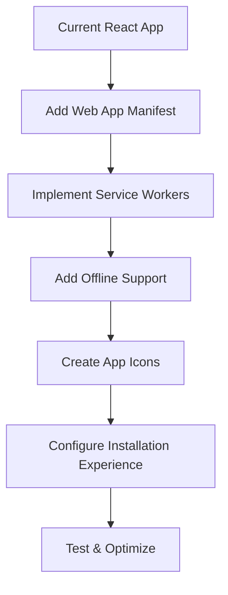

# Progressive Web App (PWA) Upgrade Plan for Sensylate

## Overview

This document outlines a comprehensive plan to upgrade the Sensylate application into a Progressive Web App (PWA). The upgrade will enable offline functionality, installability, and improved user experience across both desktop and mobile devices.



## 1. Project Analysis

### Current State

Sensylate is currently:
- A React application built with Vite and TypeScript
- Using Tailwind CSS for styling
- Integrated with a FastAPI backend
- No existing PWA capabilities

### Target State

After the upgrade, Sensylate will:
- Work offline with cached data
- Be installable on desktop and mobile devices
- Have a responsive design that works well across devices
- Provide a native-like experience
- Support Chrome as the primary target browser

## 2. Implementation Plan

### Phase 1: Setup and Configuration (1-2 days)

#### 1.1 Install Required Dependencies

```bash
npm install vite-plugin-pwa workbox-window
```

#### 1.2 Create Public Directory Structure

```
app/sensylate/
├── public/
│   ├── icons/
│   │   ├── icon-72x72.png
│   │   ├── icon-96x96.png
│   │   ├── icon-128x128.png
│   │   ├── icon-144x144.png
│   │   ├── icon-152x152.png
│   │   ├── icon-192x192.png
│   │   ├── icon-384x384.png
│   │   ├── icon-512x512.png
│   │   └── maskable-icon.png
│   ├── manifest.json
│   └── robots.txt
```

#### 1.3 Create Web App Manifest

```json
{
  "name": "Sensylate",
  "short_name": "Sensylate",
  "description": "Sensitivity analysis meets portfolio simulation and strategy creation",
  "start_url": "/",
  "display": "standalone",
  "background_color": "#ffffff",
  "theme_color": "#6366f1",
  "icons": [
    {
      "src": "icons/icon-72x72.png",
      "sizes": "72x72",
      "type": "image/png"
    },
    {
      "src": "icons/icon-96x96.png",
      "sizes": "96x96",
      "type": "image/png"
    },
    {
      "src": "icons/icon-128x128.png",
      "sizes": "128x128",
      "type": "image/png"
    },
    {
      "src": "icons/icon-144x144.png",
      "sizes": "144x144",
      "type": "image/png"
    },
    {
      "src": "icons/icon-152x152.png",
      "sizes": "152x152",
      "type": "image/png"
    },
    {
      "src": "icons/icon-192x192.png",
      "sizes": "192x192",
      "type": "image/png"
    },
    {
      "src": "icons/icon-384x384.png",
      "sizes": "384x384",
      "type": "image/png"
    },
    {
      "src": "icons/icon-512x512.png",
      "sizes": "512x512",
      "type": "image/png"
    },
    {
      "src": "icons/maskable-icon.png",
      "sizes": "192x192",
      "type": "image/png",
      "purpose": "maskable"
    }
  ]
}
```

#### 1.4 Update index.html

```html
<!DOCTYPE html>
<html lang="en">
  <head>
    <meta charset="UTF-8" />
    <meta name="viewport" content="width=device-width, initial-scale=1.0" />
    <meta name="theme-color" content="#6366f1" />
    <meta name="description" content="Sensitivity analysis meets portfolio simulation and strategy creation" />
    <link rel="icon" href="/favicon.ico" />
    <link rel="apple-touch-icon" href="/icons/apple-touch-icon.png" />
    <link rel="manifest" href="/manifest.json" />
    <title>Sensylate</title>
  </head>
  <body>
    <div id="root"></div>
    <noscript>You need to enable JavaScript to run this app.</noscript>
    <script type="module" src="/src/main.tsx"></script>
  </body>
</html>
```

#### 1.5 Configure Vite for PWA

Update the Vite configuration to include PWA support:

```typescript
// vite.config.ts
import { defineConfig } from 'vite';
import react from '@vitejs/plugin-react';
import path from 'path';
import { VitePWA } from 'vite-plugin-pwa';

export default defineConfig({
  plugins: [
    react(),
    VitePWA({
      registerType: 'autoUpdate',
      includeAssets: ['favicon.ico', 'robots.txt', 'icons/*.png'],
      manifest: {
        name: 'Sensylate',
        short_name: 'Sensylate',
        description: 'Sensitivity analysis meets portfolio simulation and strategy creation',
        theme_color: '#6366f1',
        icons: [
          {
            src: 'icons/icon-192x192.png',
            sizes: '192x192',
            type: 'image/png'
          },
          {
            src: 'icons/icon-512x512.png',
            sizes: '512x512',
            type: 'image/png'
          },
          {
            src: 'icons/maskable-icon.png',
            sizes: '192x192',
            type: 'image/png',
            purpose: 'maskable'
          }
        ]
      },
      workbox: {
        globPatterns: ['**/*.{js,css,html,ico,png,svg}'],
        runtimeCaching: [
          {
            urlPattern: /^https:\/\/fonts\.googleapis\.com\/.*/i,
            handler: 'CacheFirst',
            options: {
              cacheName: 'google-fonts-cache',
              expiration: {
                maxEntries: 10,
                maxAgeSeconds: 60 * 60 * 24 * 365 // 1 year
              },
              cacheableResponse: {
                statuses: [0, 200]
              }
            }
          },
          {
            urlPattern: /^https:\/\/fonts\.gstatic\.com\/.*/i,
            handler: 'CacheFirst',
            options: {
              cacheName: 'gstatic-fonts-cache',
              expiration: {
                maxEntries: 10,
                maxAgeSeconds: 60 * 60 * 24 * 365 // 1 year
              },
              cacheableResponse: {
                statuses: [0, 200]
              }
            }
          },
          {
            urlPattern: /\/api\/data\/list\/strategies/,
            handler: 'NetworkFirst',
            options: {
              cacheName: 'api-cache',
              expiration: {
                maxEntries: 10,
                maxAgeSeconds: 60 * 60 // 1 hour
              }
            }
          },
          {
            urlPattern: /\/api\/data\/csv\/.*/,
            handler: 'NetworkFirst',
            options: {
              cacheName: 'csv-cache',
              expiration: {
                maxEntries: 50,
                maxAgeSeconds: 60 * 60 * 24 // 1 day
              }
            }
          }
        ]
      }
    })
  ],
  resolve: {
    alias: {
      '@': path.resolve(__dirname, './src')
    }
  },
  server: {
    proxy: {
      '/api': {
        target: 'http://localhost:8000',
        changeOrigin: true
      }
    }
  },
  build: {
    outDir: 'dist',
    emptyOutDir: true
  }
});
```

### Phase 2: Create App Icons (1 day)

#### 2.1 Generate Simple Placeholder Icons

Create simple placeholder icons with the letter "S" for Sensylate in various sizes:

- 72x72
- 96x96
- 128x128
- 144x144
- 152x152
- 192x192
- 384x384
- 512x512
- Maskable icon (192x192 with safe area)

These icons should use a simple design with the indigo color (#6366f1) as the background and a white "S" in the center.

#### 2.2 Create Apple Touch Icon

Create a specific icon for iOS devices:

- apple-touch-icon.png (180x180)

### Phase 3: Implement Offline Support (2-3 days)

#### 3.1 Create Offline Context

```typescript
// src/context/OfflineContext.tsx
import React, { createContext, useState, useContext, useEffect, ReactNode } from 'react';

interface OfflineContextType {
  isOnline: boolean;
  lastUpdated: Date | null;
}

const OfflineContext = createContext<OfflineContextType | undefined>(undefined);

export const OfflineProvider: React.FC<{ children: ReactNode }> = ({ children }) => {
  const [isOnline, setIsOnline] = useState<boolean>(navigator.onLine);
  const [lastUpdated, setLastUpdated] = useState<Date | null>(null);

  useEffect(() => {
    const handleOnline = () => {
      setIsOnline(true);
      setLastUpdated(new Date());
    };

    const handleOffline = () => {
      setIsOnline(false);
    };

    window.addEventListener('online', handleOnline);
    window.addEventListener('offline', handleOffline);

    return () => {
      window.removeEventListener('online', handleOnline);
      window.removeEventListener('offline', handleOffline);
    };
  }, []);

  return (
    <OfflineContext.Provider
      value={{
        isOnline,
        lastUpdated
      }}
    >
      {children}
    </OfflineContext.Provider>
  );
};

export const useOffline = () => {
  const context = useContext(OfflineContext);
  if (context === undefined) {
    throw new Error('useOffline must be used within an OfflineProvider');
  }
  return context;
};
```

#### 3.2 Add Offline Banner Component

```typescript
// src/components/OfflineBanner.tsx
import React from 'react';
import { useOffline } from '../context/OfflineContext';

const OfflineBanner: React.FC = () => {
  const { isOnline, lastUpdated } = useOffline();

  if (isOnline) return null;

  return (
    <div className="bg-yellow-100 border-l-4 border-yellow-500 text-yellow-700 p-4 mb-4 rounded">
      <div className="flex">
        <div className="flex-shrink-0">
          <svg className="h-5 w-5 text-yellow-500" viewBox="0 0 20 20" fill="currentColor">
            <path fillRule="evenodd" d="M8.257 3.099c.765-1.36 2.722-1.36 3.486 0l5.58 9.92c.75 1.334-.213 2.98-1.742 2.98H4.42c-1.53 0-2.493-1.646-1.743-2.98l5.58-9.92zM11 13a1 1 0 11-2 0 1 1 0 012 0zm-1-8a1 1 0 00-1 1v3a1 1 0 002 0V6a1 1 0 00-1-1z" clipRule="evenodd" />
          </svg>
        </div>
        <div className="ml-3">
          <p className="text-sm">
            You are currently offline. Some features may be limited.
            {lastUpdated && (
              <span className="block text-xs mt-1">
                Last updated: {lastUpdated.toLocaleString()}
              </span>
            )}
          </p>
        </div>
      </div>
    </div>
  );
};

export default OfflineBanner;
```

#### 3.3 Modify API Service for Offline Support

```typescript
// src/services/api.ts
import axios from 'axios';
import { CSVFile, CSVData, UpdateStatus } from '../types';

// Simple in-memory cache for demo purposes
// In a real app, you'd use IndexedDB or another persistent storage
const cache = {
  fileList: null as CSVFile[] | null,
  csvData: new Map<string, CSVData>()
};

export const api = {
  getFileList: async (): Promise<CSVFile[]> => {
    try {
      // Try to fetch from network
      const response = await axios.get('/api/data/list/strategies');
      if (!response.data || !response.data.files) {
        throw new Error('Invalid response format');
      }
      
      // Filter for CSV files only and format them
      const files = response.data.files
        .filter((file: any) => file.path.endsWith('.csv'))
        .map((file: any) => ({
          path: file.path,
          name: file.path.split('/').pop()
        }))
        .sort((a: CSVFile, b: CSVFile) => a.name.localeCompare(b.name));
      
      // Save to cache for offline use
      cache.fileList = files;
      
      return files;
    } catch (error) {
      console.log('Error fetching files from network, trying cache', error);
      
      // If network request fails, try to get from cache
      if (cache.fileList) {
        return cache.fileList;
      }
      
      // If no cached data, rethrow the error
      throw error;
    }
  },
  
  getCSVData: async (filePath: string): Promise<CSVData> => {
    try {
      // Try to fetch from network
      const response = await axios.get(`/api/data/csv/${filePath}`);
      if (!response.data || !response.data.data || !response.data.data.data) {
        throw new Error('Invalid response format');
      }
      
      const data = response.data.data.data;
      const csvData = {
        data,
        columns: Object.keys(data[0] || {})
      };
      
      // Save to cache for offline use
      cache.csvData.set(filePath, csvData);
      
      return csvData;
    } catch (error) {
      console.log('Error fetching CSV data from network, trying cache', error);
      
      // If network request fails, try to get from cache
      const cachedData = cache.csvData.get(filePath);
      if (cachedData) {
        return cachedData;
      }
      
      // If no cached data, rethrow the error
      throw error;
    }
  },
  
  updatePortfolio: async (fileName: string): Promise<UpdateStatus> => {
    // This operation requires network connectivity
    const response = await axios.post('/api/scripts/update-portfolio', {
      portfolio: fileName
    });
    return response.data;
  }
};
```

### Phase 4: Add PWA Update Notification (1 day)

#### 4.1 Create PWA Update Notification Component

```typescript
// src/components/PWAUpdateNotification.tsx
import React, { useEffect, useState } from 'react';
import { useRegisterSW } from 'virtual:pwa-register/react';

const PWAUpdateNotification: React.FC = () => {
  const [needRefresh, setNeedRefresh] = useState(false);
  const {
    offlineReady,
    updateServiceWorker,
    needRefresh: swNeedRefresh
  } = useRegisterSW({
    onRegistered(r) {
      console.log('SW registered:', r);
    },
    onRegisterError(error) {
      console.log('SW registration error', error);
    }
  });

  useEffect(() => {
    if (swNeedRefresh) {
      setNeedRefresh(true);
    }
  }, [swNeedRefresh]);

  const close = () => {
    setNeedRefresh(false);
  };

  const updateSW = () => {
    updateServiceWorker(true);
  };

  if (!needRefresh) return null;

  return (
    <div className="fixed bottom-0 right-0 m-4 p-4 bg-white rounded-lg shadow-lg z-50 border border-indigo-200">
      <div className="flex flex-col">
        <div className="mb-2">
          <h3 className="text-lg font-semibold">New Version Available</h3>
          <p className="text-sm text-gray-600">
            A new version of Sensylate is available. Click update to get the latest features.
          </p>
        </div>
        <div className="flex justify-end space-x-2">
          <button
            className="px-3 py-1 text-sm text-gray-600 hover:text-gray-800"
            onClick={close}
          >
            Close
          </button>
          <button
            className="px-3 py-1 text-sm bg-indigo-600 text-white rounded hover:bg-indigo-700"
            onClick={updateSW}
          >
            Update
          </button>
        </div>
      </div>
    </div>
  );
};

export default PWAUpdateNotification;
```

### Phase 5: Add Installation Experience (1 day)

#### 5.1 Create Install Prompt Component

```typescript
// src/components/InstallPrompt.tsx
import React, { useEffect, useState } from 'react';

const InstallPrompt: React.FC = () => {
  const [installPromptEvent, setInstallPromptEvent] = useState<any>(null);
  const [showPrompt, setShowPrompt] = useState<boolean>(false);

  useEffect(() => {
    const handleBeforeInstallPrompt = (e: Event) => {
      // Prevent Chrome 67 and earlier from automatically showing the prompt
      e.preventDefault();
      // Stash the event so it can be triggered later
      setInstallPromptEvent(e);
      // Check if the user has already dismissed or installed
      const hasPrompted = localStorage.getItem('installPromptDismissed');
      if (!hasPrompted) {
        setShowPrompt(true);
      }
    };

    window.addEventListener('beforeinstallprompt', handleBeforeInstallPrompt);

    return () => {
      window.removeEventListener('beforeinstallprompt', handleBeforeInstallPrompt);
    };
  }, []);

  const handleInstallClick = () => {
    if (!installPromptEvent) return;

    // Show the install prompt
    installPromptEvent.prompt();

    // Wait for the user to respond to the prompt
    installPromptEvent.userChoice.then((choiceResult: { outcome: string }) => {
      if (choiceResult.outcome === 'accepted') {
        console.log('User accepted the install prompt');
      } else {
        console.log('User dismissed the install prompt');
      }
      // Clear the saved prompt since it can't be used again
      setInstallPromptEvent(null);
      setShowPrompt(false);
    });
  };

  const handleDismiss = () => {
    // Remember that the user has dismissed the prompt
    localStorage.setItem('installPromptDismissed', 'true');
    setShowPrompt(false);
  };

  if (!showPrompt) return null;

  return (
    <div className="fixed bottom-0 left-0 right-0 p-4 bg-indigo-600 text-white z-50">
      <div className="container mx-auto flex justify-between items-center">
        <div>
          <p className="font-medium">Install Sensylate</p>
          <p className="text-sm opacity-90">Add to your home screen for quick access</p>
        </div>
        <div className="flex space-x-2">
          <button
            onClick={handleDismiss}
            className="px-3 py-1 text-white bg-transparent border border-white rounded hover:bg-indigo-700"
          >
            Not now
          </button>
          <button
            onClick={handleInstallClick}
            className="px-3 py-1 text-indigo-600 bg-white rounded hover:bg-gray-100"
          >
            Install
          </button>
        </div>
      </div>
    </div>
  );
};

export default InstallPrompt;
```

### Phase 6: Testing and Optimization (1-2 days)

#### 6.1 Testing Checklist

- Verify the app works offline with cached data
- Test installation on desktop Chrome
- Test installation on mobile devices
- Verify service worker registration and caching
- Test the update notification
- Verify the offline banner appears when offline
- Test responsive design on various screen sizes

#### 6.2 Lighthouse Audit

Run Lighthouse audits to ensure the PWA meets all requirements:
- Progressive Web App
- Performance
- Accessibility
- Best Practices
- SEO

## 3. Implementation Timeline

| Phase | Task | Duration |
|-------|------|----------|
| 1 | Setup and Configuration | 1-2 days |
| 2 | Create App Icons | 1 day |
| 3 | Implement Offline Support | 2-3 days |
| 4 | Add PWA Update Notification | 1 day |
| 5 | Add Installation Experience | 1 day |
| 6 | Testing and Optimization | 1-2 days |
| **Total** | | **7-10 days** |

## 4. Benefits of PWA Upgrade

1. **Offline Functionality**: Users can access previously loaded data even without an internet connection
2. **Installability**: The app can be installed on desktop and mobile devices for quick access
3. **Improved Performance**: Caching strategies will make the app load faster
4. **Better User Experience**: Native-like experience with app-like navigation
5. **Cross-Platform Compatibility**: Works on all modern browsers and devices