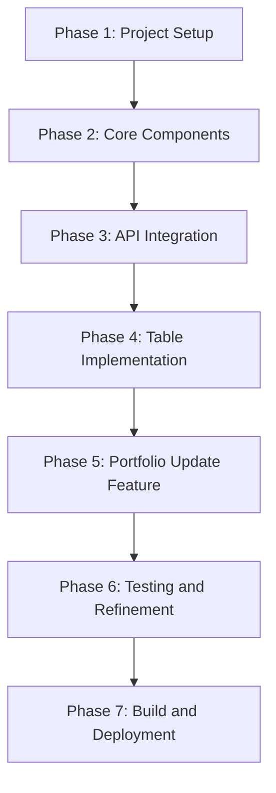

# Migration Plan: Replacing jQuery with React in Sensylate

Based on the analysis of the current codebase, this document outlines a comprehensive plan to migrate from jQuery to React while introducing TypeScript and using react-table for the data grid functionality.

## 1. Current Application Analysis

### Architecture Overview

The current Sensylate application is a single-page web application with the following components:

- **Frontend Technologies**:
  - HTML with Tailwind CSS for styling
  - jQuery for DOM manipulation
  - DataTables.net for table rendering and interaction
  - Server-Sent Events (SSE) for real-time updates

- **Key Features**:
  - CSV file selection from a dropdown
  - Data display in a sortable, filterable table
  - Toggle between table view and raw text view
  - Portfolio update functionality with real-time progress tracking
  - Error handling and loading states

- **API Integration**:
  - Fetches file list from `/api/data/list/strategies`
  - Loads CSV data from `/api/data/csv/{filePath}`
  - Updates portfolios via `/api/scripts/update-portfolio`
  - Tracks update progress via SSE at `/api/scripts/status-stream/{executionId}`

## 2. Migration Strategy

We recommend a phased approach to migrate from jQuery to React:



## 3. Detailed Implementation Plan

### Phase 1: Project Setup (1-2 days)

#### Update Dependencies

```json
{
  "dependencies": {
    "react": "^18.2.0",
    "react-dom": "^18.2.0",
    "@tanstack/react-table": "^8.10.7",
    "axios": "^1.6.2"
  },
  "devDependencies": {
    "@types/react": "^18.2.15",
    "@types/react-dom": "^18.2.7",
    "typescript": "^5.0.2",
    "vite": "^4.4.5",
    "@vitejs/plugin-react": "^4.0.3",
    "autoprefixer": "^10.4.21",
    "postcss": "^8.5.3",
    "tailwindcss": "^4.1.3"
  }
}
```

#### Project Structure

```
app/sensylate/
├── src/
│   ├── components/           # React components
│   │   ├── FileSelector.tsx
│   │   ├── DataTable.tsx
│   │   ├── RawTextView.tsx
│   │   ├── UpdateButton.tsx
│   │   ├── LoadingIndicator.tsx
│   │   ├── ErrorMessage.tsx
│   │   ├── ViewToggle.tsx
│   │   └── FileInfo.tsx
│   ├── context/              # React Context
│   │   └── AppContext.tsx
│   ├── hooks/                # Custom React hooks
│   │   ├── useFileList.ts
│   │   ├── useCSVData.ts
│   │   └── usePortfolioUpdate.ts
│   ├── services/             # API services
│   │   └── api.ts
│   ├── types/                # TypeScript type definitions
│   │   └── index.ts
│   ├── utils/                # Utility functions
│   │   └── csvUtils.ts
│   ├── App.tsx               # Main application component
│   ├── main.tsx              # Entry point
│   └── index.css             # Global styles
├── tsconfig.json             # TypeScript configuration
├── vite.config.ts            # Vite configuration
└── tailwind.config.js        # Tailwind configuration
```

#### TypeScript Configuration

```json
// tsconfig.json
{
  "compilerOptions": {
    "target": "ES2020",
    "useDefineForClassFields": true,
    "lib": ["ES2020", "DOM", "DOM.Iterable"],
    "module": "ESNext",
    "skipLibCheck": true,
    "moduleResolution": "bundler",
    "allowImportingTsExtensions": true,
    "resolveJsonModule": true,
    "isolatedModules": true,
    "noEmit": true,
    "jsx": "react-jsx",
    "strict": true,
    "noUnusedLocals": true,
    "noUnusedParameters": true,
    "noFallthroughCasesInSwitch": true,
    "baseUrl": ".",
    "paths": {
      "@/*": ["src/*"]
    }
  },
  "include": ["src"],
  "references": [{ "path": "./tsconfig.node.json" }]
}
```

#### Vite Configuration

```typescript
// vite.config.ts
import { defineConfig } from 'vite';
import react from '@vitejs/plugin-react';
import path from 'path';

export default defineConfig({
  plugins: [react()],
  resolve: {
    alias: {
      '@': path.resolve(__dirname, './src')
    }
  },
  server: {
    proxy: {
      '/api': {
        target: 'http://localhost:8000',
        changeOrigin: true
      }
    }
  }
});
```

### Phase 2: Core Components (2-3 days)

#### Type Definitions

```typescript
// src/types/index.ts
export interface CSVFile {
  path: string;
  name: string;
}

export interface CSVData {
  data: Record<string, any>[];
  columns: string[];
}

export interface UpdateStatus {
  status: 'accepted' | 'running' | 'completed' | 'failed';
  execution_id?: string;
  progress?: number;
  error?: string;
  message?: string;
}
```

#### Context Setup

```typescript
// src/context/AppContext.tsx
import React, { createContext, useState, useContext, ReactNode } from 'react';
import { CSVData } from '../types';

interface AppContextType {
  selectedFile: string | null;
  setSelectedFile: (file: string | null) => void;
  viewMode: 'table' | 'text';
  setViewMode: (mode: 'table' | 'text') => void;
  csvData: CSVData | null;
  setCsvData: (data: CSVData | null) => void;
  isLoading: boolean;
  setIsLoading: (loading: boolean) => void;
  error: string | null;
  setError: (error: string | null) => void;
}

const AppContext = createContext<AppContextType | undefined>(undefined);

export const AppProvider: React.FC<{ children: ReactNode }> = ({ children }) => {
  const [selectedFile, setSelectedFile] = useState<string | null>(null);
  const [viewMode, setViewMode] = useState<'table' | 'text'>('table');
  const [csvData, setCsvData] = useState<CSVData | null>(null);
  const [isLoading, setIsLoading] = useState<boolean>(false);
  const [error, setError] = useState<string | null>(null);

  return (
    <AppContext.Provider
      value={{
        selectedFile,
        setSelectedFile,
        viewMode,
        setViewMode,
        csvData,
        setCsvData,
        isLoading,
        setIsLoading,
        error,
        setError
      }}
    >
      {children}
    </AppContext.Provider>
  );
};

export const useAppContext = () => {
  const context = useContext(AppContext);
  if (context === undefined) {
    throw new Error('useAppContext must be used within an AppProvider');
  }
  return context;
};
```

#### Main App Component

```typescript
// src/App.tsx
import React from 'react';
import { AppProvider } from './context/AppContext';
import FileSelector from './components/FileSelector';
import FileInfo from './components/FileInfo';
import ViewToggle from './components/ViewToggle';
import DataTable from './components/DataTable';
import RawTextView from './components/RawTextView';
import LoadingIndicator from './components/LoadingIndicator';
import ErrorMessage from './components/ErrorMessage';
import UpdateButton from './components/UpdateButton';

const App: React.FC = () => {
  return (
    <AppProvider>
      <div className="max-w-full mx-auto bg-gray-50 p-6">
        <h1 className="text-2xl font-bold mb-4">Sensylate</h1>
        
        <div className="mb-4 p-3 bg-white rounded shadow-sm">
          <div className="flex items-center space-x-2">
            <FileSelector />
            <UpdateButton />
          </div>
        </div>
        
        <FileInfo />
        <LoadingIndicator />
        <ErrorMessage />
        <ViewToggle />
        
        <DataTable />
        <RawTextView />
      </div>
    </AppProvider>
  );
};

export default App;
```

#### Entry Point

```typescript
// src/main.tsx
import React from 'react';
import ReactDOM from 'react-dom/client';
import App from './App';
import './index.css';

ReactDOM.createRoot(document.getElementById('root')!).render(
  <React.StrictMode>
    <App />
  </React.StrictMode>
);
```

### Phase 3: API Integration (1-2 days)

#### API Service

```typescript
// src/services/api.ts
import axios from 'axios';
import { CSVFile, CSVData, UpdateStatus } from '../types';

export const api = {
  getFileList: async (): Promise<CSVFile[]> => {
    const response = await axios.get('/api/data/list/strategies');
    if (!response.data || !response.data.files) {
      throw new Error('Invalid response format');
    }
    
    // Filter for CSV files only and format them
    return response.data.files
      .filter((file: any) => file.path.endsWith('.csv'))
      .map((file: any) => ({
        path: file.path,
        name: file.path.split('/').pop()
      }))
      .sort((a: CSVFile, b: CSVFile) => a.name.localeCompare(b.name));
  },
  
  getCSVData: async (filePath: string): Promise<CSVData> => {
    const response = await axios.get(`/api/data/csv/${filePath}`);
    if (!response.data || !response.data.data || !response.data.data.data) {
      throw new Error('Invalid response format');
    }
    
    const data = response.data.data.data;
    return {
      data,
      columns: Object.keys(data[0] || {})
    };
  },
  
  updatePortfolio: async (fileName: string): Promise<UpdateStatus> => {
    const response = await axios.post('/api/scripts/update-portfolio', {
      portfolio: fileName
    });
    return response.data;
  }
};
```

#### Custom Hooks

```typescript
// src/hooks/useFileList.ts
import { useState, useEffect } from 'react';
import { api } from '../services/api';
import { CSVFile } from '../types';
import { useAppContext } from '../context/AppContext';

export const useFileList = () => {
  const [files, setFiles] = useState<CSVFile[]>([]);
  const { setError, setIsLoading } = useAppContext();
  
  useEffect(() => {
    const fetchFiles = async () => {
      try {
        setIsLoading(true);
        const fileList = await api.getFileList();
        setFiles(fileList);
        
        // Check if DAILY.csv exists and select it by default
        const dailyFile = fileList.find(file => file.name === 'DAILY.csv');
        if (dailyFile) {
          // You would need to handle this in the component that uses this hook
          return dailyFile;
        }
      } catch (error) {
        setError(error instanceof Error ? error.message : 'Failed to load file list');
      } finally {
        setIsLoading(false);
      }
    };
    
    fetchFiles();
  }, [setError, setIsLoading]);
  
  return files;
};
```

```typescript
// src/hooks/useCSVData.ts
import { useState, useEffect } from 'react';
import { api } from '../services/api';
import { CSVData } from '../types';
import { useAppContext } from '../context/AppContext';

export const useCSVData = (filePath: string | null) => {
  const { setCsvData, setError, setIsLoading } = useAppContext();
  
  useEffect(() => {
    if (!filePath) return;
    
    const fetchData = async () => {
      try {
        setIsLoading(true);
        setError(null);
        const data = await api.getCSVData(filePath);
        setCsvData(data);
      } catch (error) {
        setError(error instanceof Error ? error.message : 'Failed to load CSV data');
        setCsvData(null);
      } finally {
        setIsLoading(false);
      }
    };
    
    fetchData();
  }, [filePath, setCsvData, setError, setIsLoading]);
};
```

```typescript
// src/hooks/usePortfolioUpdate.ts
import { useState, useEffect, useRef } from 'react';
import { api } from '../services/api';
import { UpdateStatus } from '../types';

export const usePortfolioUpdate = (onUpdateComplete?: () => void) => {
  const [updateStatus, setUpdateStatus] = useState<UpdateStatus | null>(null);
  const [progress, setProgress] = useState<number>(0);
  const [error, setError] = useState<string | null>(null);
  const [isUpdating, setIsUpdating] = useState<boolean>(false);
  const eventSourceRef = useRef<EventSource | null>(null);
  
  // Clean up event source on unmount
  useEffect(() => {
    return () => {
      if (eventSourceRef.current) {
        eventSourceRef.current.close();
      }
    };
  }, []);
  
  const startUpdate = async (fileName: string) => {
    try {
      setIsUpdating(true);
      setError(null);
      
      const response = await api.updatePortfolio(fileName);
      setUpdateStatus(response);
      
      if (response.status === 'accepted' && response.execution_id) {
        // Set up SSE connection
        const eventSource = new EventSource(`/api/scripts/status-stream/${response.execution_id}`);
        eventSourceRef.current = eventSource;
        
        eventSource.onmessage = (event) => {
          try {
            const data = JSON.parse(event.data) as UpdateStatus;
            setUpdateStatus(data);
            setProgress(data.progress || 0);
            
            if (data.status === 'completed') {
              setIsUpdating(false);
              eventSource.close();
              if (onUpdateComplete) onUpdateComplete();
            } else if (data.status === 'failed') {
              setError(data.error || 'Update failed');
              setIsUpdating(false);
              eventSource.close();
            }
          } catch (err) {
            setError('Failed to parse update status');
            setIsUpdating(false);
            eventSource.close();
          }
        };
        
        eventSource.onerror = () => {
          setError('Connection to update stream lost');
          setIsUpdating(false);
          eventSource.close();
        };
      } else {
        setError(response.message || 'Failed to start update');
        setIsUpdating(false);
      }
    } catch (err) {
      setError(err instanceof Error ? err.message : 'Failed to start update');
      setIsUpdating(false);
    }
  };
  
  return {
    startUpdate,
    updateStatus,
    progress,
    error,
    isUpdating
  };
};
```

### Phase 4: Table Implementation with react-table (2-3 days)

```typescript
// src/components/DataTable.tsx
import React, { useMemo } from 'react';
import {
  useReactTable,
  getCoreRowModel,
  getSortedRowModel,
  getFilteredRowModel,
  flexRender,
  createColumnHelper,
  ColumnDef
} from '@tanstack/react-table';
import { useAppContext } from '../context/AppContext';

const DataTable: React.FC = () => {
  const { csvData, viewMode } = useAppContext();
  
  const columns = useMemo(() => {
    if (!csvData || !csvData.columns.length) return [];
    
    const columnHelper = createColumnHelper<Record<string, any>>();
    
    return csvData.columns.map(column => {
      // Create a clean key without special characters for internal use
      const cleanKey = column.replace(/[\[\]%]/g, '_');
      
      return columnHelper.accessor(row => row[cleanKey], {
        id: cleanKey,
        header: column,
        cell: info => {
          const value = info.getValue();
          
          // Handle null/undefined values
          if (value === null || value === undefined) {
            return '';
          }
          
          // Special handling for percentage columns
          if (
            column.includes('[%]') ||
            column.toLowerCase().includes('rate') ||
            column.toLowerCase().includes('percent')
          ) {
            if (typeof value === 'number') {
              return `${value.toFixed(2)}%`;
            } else if (typeof value === 'string' && !isNaN(parseFloat(value))) {
              return `${parseFloat(value).toFixed(2)}%`;
            }
          }
          
          // Format numbers with appropriate precision
          if (typeof value === 'number') {
            if (value === 0) {
              return '0';
            } else if (Math.abs(value) < 0.01) {
              return value.toExponential(4);
            } else if (Math.abs(value) >= 1000) {
              return value.toLocaleString(undefined, { maximumFractionDigits: 2 });
            } else {
              return value.toLocaleString(undefined, { maximumFractionDigits: 4 });
            }
          }
          
          return String(value);
        }
      });
    });
  }, [csvData]);
  
  const data = useMemo(() => {
    if (!csvData || !csvData.data) return [];
    
    // Create a clean version of the data for react-table
    return csvData.data.map(row => {
      const cleanRow: Record<string, any> = {};
      Object.keys(row).forEach(key => {
        // Create a clean key without special characters for internal use
        const cleanKey = key.replace(/[\[\]%]/g, '_');
        cleanRow[cleanKey] = row[key];
      });
      return cleanRow;
    });
  }, [csvData]);
  
  const table = useReactTable({
    data,
    columns,
    getCoreRowModel: getCoreRowModel(),
    getSortedRowModel: getSortedRowModel(),
    getFilteredRowModel: getFilteredRowModel()
  });
  
  if (viewMode !== 'table' || !csvData) {
    return null;
  }
  
  return (
    <div className="overflow-x-auto bg-white rounded-lg shadow-lg p-4">
      <div className="mb-4">
        <input
          placeholder="Search..."
          className="px-3 py-2 border border-gray-300 rounded-md shadow-sm focus:outline-none focus:ring-indigo-500 focus:border-indigo-500"
          onChange={e => table.setGlobalFilter(e.target.value)}
        />
      </div>
      
      <table className="w-full border-collapse border border-gray-200">
        <thead>
          {table.getHeaderGroups().map(headerGroup => (
            <tr key={headerGroup.id}>
              {headerGroup.headers.map(header => (
                <th
                  key={header.id}
                  className="bg-gray-50 text-left p-2 text-sm font-medium text-gray-700 border-b"
                  onClick={header.column.getToggleSortingHandler()}
                >
                  {flexRender(header.column.columnDef.header, header.getContext())}
                  {header.column.getIsSorted() ? (
                    header.column.getIsSorted() === 'asc' ? ' 🔼' : ' 🔽'
                  ) : null}
                </th>
              ))}
            </tr>
          ))}
        </thead>
        <tbody>
          {table.getRowModel().rows.map(row => (
            <tr key={row.id} className="hover:bg-gray-100">
              {row.getVisibleCells().map(cell => (
                <td key={cell.id} className="p-2 text-sm border-b border-gray-200">
                  {flexRender(cell.column.columnDef.cell, cell.getContext())}
                </td>
              ))}
            </tr>
          ))}
        </tbody>
      </table>
    </div>
  );
};

export default DataTable;
```

### Phase 5: Remaining Components (2-3 days)

Here are a few key components to give you an idea of the implementation:

```typescript
// src/components/FileSelector.tsx
import React from 'react';
import { useFileList } from '../hooks/useFileList';
import { useAppContext } from '../context/AppContext';
import { useCSVData } from '../hooks/useCSVData';

const FileSelector: React.FC = () => {
  const files = useFileList();
  const { selectedFile, setSelectedFile } = useAppContext();
  
  // This hook will fetch CSV data when selectedFile changes
  useCSVData(selectedFile);
  
  const handleChange = (e: React.ChangeEvent<HTMLSelectElement>) => {
    setSelectedFile(e.target.value || null);
  };
  
  return (
    <div className="flex-grow">
      <label htmlFor="file-selector" className="block text-sm font-medium text-gray-700 mb-2">
        Select CSV File:
      </label>
      <select
        id="file-selector"
        className="block w-full px-3 py-2 border border-gray-300 rounded-md shadow-sm focus:outline-none focus:ring-indigo-500 focus:border-indigo-500"
        value={selectedFile || ''}
        onChange={handleChange}
      >
        <option value="">Select a file...</option>
        {files.map(file => (
          <option key={file.path} value={file.path}>
            {file.name}
          </option>
        ))}
      </select>
    </div>
  );
};

export default FileSelector;
```

```typescript
// src/components/UpdateButton.tsx
import React from 'react';
import { useAppContext } from '../context/AppContext';
import { usePortfolioUpdate } from '../hooks/usePortfolioUpdate';

const UpdateButton: React.FC = () => {
  const { selectedFile, setError } = useAppContext();
  const { startUpdate, isUpdating, progress, updateStatus, error } = usePortfolioUpdate(() => {
    // Reload CSV data when update completes
    // This will be handled by the useCSVData hook since selectedFile won't change
    // We could implement a refetch mechanism if needed
  });
  
  const handleClick = () => {
    if (!selectedFile) {
      setError('No file selected');
      return;
    }
    
    const fileName = selectedFile.split('/').pop();
    if (!fileName) {
      setError('Invalid file path');
      return;
    }
    
    startUpdate(fileName);
  };
  
  return (
    <div className="pt-6">
      <button
        disabled={!selectedFile || isUpdating}
        className="px-4 py-2 bg-indigo-600 text-white rounded-md shadow-sm hover:bg-indigo-700 focus:outline-none focus:ring-2 focus:ring-offset-2 focus:ring-indigo-500 disabled:opacity-50 disabled:cursor-not-allowed"
        onClick={handleClick}
      >
        {isUpdating ? (
          <>
            <span className="animate-spin inline-block mr-2">↻</span> Updating...
          </>
        ) : (
          'Update'
        )}
      </button>
      
      {updateStatus && (
        <div className={`mt-2 p-2 rounded ${
          updateStatus.status === 'completed' ? 'bg-green-100 text-green-800' :
          updateStatus.status === 'failed' ? 'bg-red-100 text-red-800' :
          'bg-blue-100 text-blue-800'
        }`}>
          {updateStatus.status === 'completed' ? 'Update completed' :
           updateStatus.status === 'failed' ? `Update failed: ${updateStatus.error || 'Unknown error'}` :
           `Status: ${updateStatus.status} ${progress > 0 ? `(${progress}%)` : ''}`}
          
          {progress > 0 && updateStatus.status !== 'completed' && updateStatus.status !== 'failed' && (
            <div className="w-full bg-gray-200 rounded-full h-2.5 mt-2">
              <div
                className="bg-indigo-600 h-2.5 rounded-full"
                style={{ width: `${progress}%` }}
              ></div>
            </div>
          )}
        </div>
      )}
      
      {error && (
        <div className="mt-2 p-2 rounded bg-red-100 text-red-800">
          {error}
        </div>
      )}
    </div>
  );
};

export default UpdateButton;
```

```typescript
// src/components/RawTextView.tsx
import React, { useMemo } from 'react';
import { useAppContext } from '../context/AppContext';
import { convertToRawText } from '../utils/csvUtils';

const RawTextView: React.FC = () => {
  const { csvData, viewMode } = useAppContext();
  
  const rawText = useMemo(() => {
    if (!csvData) return '';
    return convertToRawText(csvData.data, csvData.columns);
  }, [csvData]);
  
  if (viewMode !== 'text' || !csvData) {
    return null;
  }
  
  return (
    <div className="overflow-x-auto bg-white rounded-lg shadow-lg p-4">
      <textarea
        id="csv-text"
        className="w-full h-[70vh] font-mono text-sm border border-gray-300 rounded-md p-2"
        value={rawText}
        readOnly
      ></textarea>
    </div>
  );
};

export default RawTextView;
```

```typescript
// src/utils/csvUtils.ts
export const convertToRawText = (data: Record<string, any>[], columns: string[]): string => {
  // Create header row
  let rawText = columns.join(',') + '\n';
  
  // Add data rows
  data.forEach(row => {
    const rowValues = columns.map(col => {
      // Get the value and handle null/undefined
      let value = row[col];
      
      // Format numbers appropriately for CSV
      if (typeof value === 'number') {
        // Don't round numbers in the raw CSV data
        value = String(value);
      } else {
        // Handle null/undefined
        value = value !== null && value !== undefined ? String(value) : '';
      }
      
      // Handle values with commas by quoting them
      return value.includes(',') ? `"${value}"` : value;
    });
    rawText += rowValues.join(',') + '\n';
  });
  
  return rawText;
};
```

### Phase 6: Testing and Refinement (1-2 days)

1. **Manual Testing**:
   - Test file selection functionality
   - Test table sorting and filtering
   - Test view toggle between table and text
   - Test update functionality and SSE integration
   - Test error handling and loading states

2. **Performance Optimization**:
   - Implement virtualization for large datasets
   - Optimize memoization of expensive computations
   - Add pagination for very large datasets

3. **Accessibility Improvements**:
   - Add proper ARIA attributes
   - Ensure keyboard navigation
   - Test with screen readers

### Phase 7: Build and Deployment (1 day)

1. **Production Build**:
   ```bash
   npm run build
   ```

2. **Update FastAPI Integration**:
   - Update the FastAPI server to serve the React app from the `dist` directory
   - Ensure all API endpoints are properly accessible

3. **Deployment Verification**:
   - Test the deployed application
   - Verify all features work as expected

## 4. Migration Benefits

1. **Improved Maintainability**: Component-based architecture makes the code more modular and easier to maintain
2. **Type Safety**: TypeScript provides better type checking and IDE support
3. **Performance**: React's virtual DOM and optimized rendering improve performance
4. **Developer Experience**: Modern tooling and patterns enhance development workflow
5. **Testability**: React components are easier to test
6. **Future-proofing**: React has a strong ecosystem and community support

## 5. Implementation Timeline

| Week | Tasks | Deliverables |
|------|-------|-------------|
| Week 1 | Project setup, core components, API integration | Basic application structure with file selection |
| Week 2 | Table implementation, remaining components | Functional data display with sorting and filtering |
| Week 3 | Testing, refinement, deployment | Complete feature parity with original |

## 6. Next Steps

Once this migration plan is approved, the recommended next steps are:

1. Set up the initial React project with TypeScript and Vite
2. Implement the core components and context
3. Integrate the API services and custom hooks
4. Implement the table with react-table
5. Add the remaining components
6. Test and refine the implementation
7. Build and deploy the application