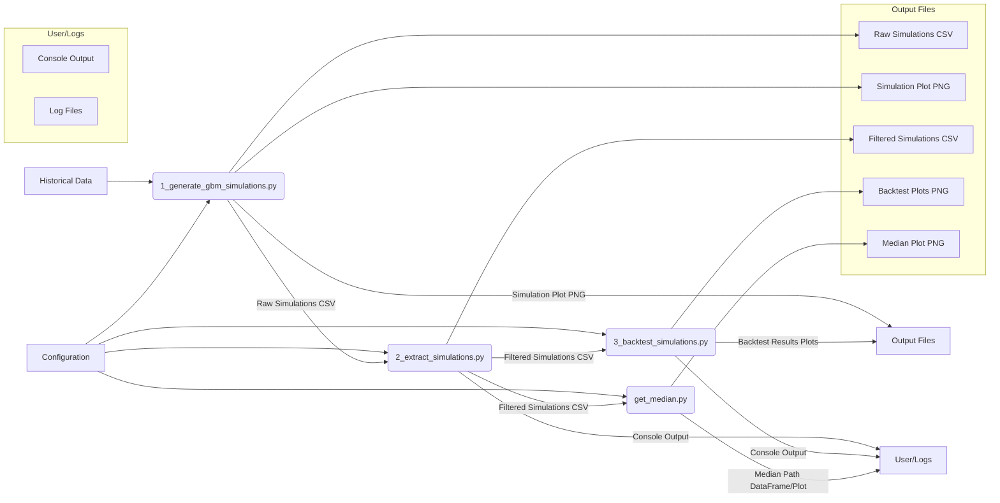

# Geometric Brownian Motion (GBM) Simulation and Analysis Pipeline Documentation

This document provides technical and product documentation for the Python scripts located in the `app/geometric_brownian_motion` directory. These scripts form a pipeline designed to generate, analyze, and backtest financial asset price simulations using the Geometric Brownian Motion model.

**Directory Contents:**

- `1_generate_gbm_simulations.py`: Generates GBM price path simulations.
- `2_extract_simulations.py`: Extracts key statistical simulations from the generated set.
- `3_backtest_simulations.py`: Backtests a trading strategy on the extracted simulations.
- `get_median.py`: Utility script to extract the median simulation path.

---

## 1. `1_generate_gbm_simulations.py`

**Purpose:**
This script serves as the starting point of the pipeline. Its primary function is to simulate future price paths for a given financial asset (ticker) based on its historical price data, using the Geometric Brownian Motion (GBM) model. GBM is a stochastic process often used in finance to model asset prices.

**Functionality:**

1.  **Configuration:** Loads configuration parameters (e.g., ticker symbol, historical data period, simulation time horizon, number of simulations) using `app.tools.get_config`, with defaults provided in a `GBMConfig` TypedDict.
2.  **Data Retrieval:** Fetches historical price data for the specified ticker using `app.tools.get_data`.
3.  **Parameter Calculation (`calculate_gbm_parameters`):**
    - Takes the historical price data (Polars DataFrame).
    - Calculates essential GBM parameters:
      - `initial_price`: The most recent closing price.
      - `drift`: The annualized average rate of return, calculated from historical percentage changes.
      - `volatility`: The annualized standard deviation of returns (historical volatility).
      - `dt`: The time step for the simulation (fixed at daily increments, represented as a fraction of a year).
    - Raises a `ValueError` if the input data is empty.
4.  **Simulation Generation (`generate_gbm_simulations`):**
    - Takes the calculated GBM parameters, the number of steps (`n_steps`, derived from `TIME_HORIZON` and `dt`), and the number of simulations (`n_sims`).
    - Uses the GBM formula iteratively to generate `n_sims` price paths over `n_steps`, incorporating random shocks (standard normal variables).
    - Returns a NumPy array where each row represents a simulation path.
5.  **Plotting (`plot_simulations`):**
    - Takes the simulation results (NumPy array), configuration, and original data (for timestamp reference).
    - Generates a plot showing all simulated price paths over time using `matplotlib`.
    - Saves the plot as a PNG file to a structured directory (`png/geometric_brownian_motion/`). File naming is handled by `app.utils.get_path` and `app.utils.get_filename`.
6.  **Saving (`save_simulations`):**
    - Takes the simulation results, original data, number of steps, configuration, and a logging function.
    - Converts the NumPy array of simulations into a Polars DataFrame.
    - Generates a corresponding timestamp range starting from the day after the last historical data point.
    - Adds the timestamps as the first column.
    - Exports the DataFrame to a CSV file using `app.tools.export_csv` into a structured directory (`csv/geometric_brownian_motion/`). File naming is handled by `app.utils.get_path` and `app.utils.get_filename`.
7.  **Logging:** Uses `app.tools.setup_logging` for structured logging of the process, including errors.
8.  **Main Execution (`main`):** Orchestrates the steps: setup logging, load config, get data, calculate parameters, generate simulations, plot, save, log completion or errors.

**Inputs:**

- **Configuration (`GBMConfig`):** Ticker, data period/years, time horizon, number of simulations, base directory, etc. Can be overridden via a config file mechanism (`get_config`).
- **Historical Price Data:** Fetched via `get_data` based on the configuration.

**Outputs:**

- **CSV File:** Contains the generated simulation paths, with timestamps in the first column and each subsequent column representing one simulation. (e.g., `csv/geometric_brownian_motion/MSTR_gbm_simulations.csv`)
- **PNG File:** A plot visualizing all generated simulation paths. (e.g., `png/geometric_brownian_motion/MSTR_gbm_simulations.png`)
- **Log File:** Records the execution steps and any errors. (e.g., `logs/geometric_brownian_motion/1_generate_gbm_simulations.log`)

**Dependencies:**

- **Libraries:** `polars`, `numpy`, `matplotlib`
- **Internal Modules:** `app.tools.get_data`, `app.tools.get_config`, `app.utils`, `app.tools.export_csv`, `app.tools.setup_logging`

---

## 2. `2_extract_simulations.py`

**Purpose:**
This script processes the raw simulation data generated by the first script. It reads the CSV file containing potentially thousands of simulations and extracts a smaller, representative set based on statistical performance metrics. This reduces the data volume for subsequent analysis or backtesting.

**Functionality:**

1.  **Configuration:** Loads configuration parameters, primarily to determine the input file path using `app.utils.get_path` and `app.utils.get_filename`.
2.  **CSV Reading (`read_csv_data`):**
    - Takes the raw CSV content as a string.
    - Uses Python's built-in `csv` module and `io.StringIO` to parse the data.
    - Separates timestamps and simulation price data into lists. Returns timestamps and a list of lists (each inner list is a simulation path).
3.  **Performance Calculation (`calculate_performance`):**
    - Takes a single simulation price path (list of floats).
    - Calculates the total percentage return from the start to the end of the simulation.
4.  **Simulation Extraction (`extract_simulations`):**
    - Reads the CSV content using `read_csv_data`.
    - Calculates the performance for every simulation using `calculate_performance`.
    - **Conditional Extraction:**
      - If the number of simulations is 6 or fewer, it keeps all simulations.
      - If there are 7 or more simulations, it identifies and extracts the simulations corresponding to:
        - Highest performance
        - Lowest performance
        - Mean performance (closest simulation to the mean)
        - Median performance (closest simulation to the median)
        - 25th percentile performance (closest simulation)
        - 75th percentile performance (closest simulation)
    - Stores the performance values of the selected simulations in a dictionary (`results`).
    - Creates a Polars DataFrame (`df`) containing the timestamps and the price paths of the selected simulations, naming the columns appropriately (e.g., "highest", "median").
    - Renames the timestamp column to "Date".
    - Returns the `results` dictionary and the `df` DataFrame.
5.  **Main Execution Flow:**
    - Gets the input CSV file path based on configuration.
    - Reads the CSV file content.
    - Calls `extract_simulations` to get the results dictionary and the filtered DataFrame.
    - Prints the performance results to the console.
    - Prints the resulting DataFrame to the console.
    - Saves the filtered DataFrame to a new CSV file (e.g., `csv/geometric_brownian_motion/MSTR_gbm_extracted_simulations.csv`). The filename indicates it contains extracted/filtered simulations.

**Inputs:**

- **CSV File:** The output from `1_generate_gbm_simulations.py` containing all simulation paths.
- **Configuration:** Used primarily to locate the input CSV file.

**Outputs:**

- **CSV File:** Contains the timestamps and the selected representative simulation paths (e.g., highest, lowest, median, etc.). (e.g., `csv/geometric_brownian_motion/MSTR_gbm_extracted_simulations.csv`)
- **Console Output:** Prints the performance metrics of the extracted simulations and the head of the resulting DataFrame.

**Dependencies:**

- **Libraries:** `csv`, `io`, `numpy`, `polars`
- **Internal Modules:** `app.tools.get_config`, `app.utils`

---

## 3. `3_backtest_simulations.py`

**Purpose:**
This script takes the representative set of simulations extracted by the previous script and backtests a specific trading strategy (in this case, an Exponential Moving Average (EMA) crossover strategy) on each simulation path. This helps assess how the strategy might perform under different potential future market scenarios as modeled by GBM.

**Functionality:**

1.  **Configuration:** Loads configuration, including EMA window lengths (`SHORT_WINDOW`, `LONG_WINDOW`) and the path to the input CSV file (filtered simulations).
2.  **Logging Setup:** Configures basic logging to `logs/ema_cross.log`.
3.  **Data Loading:** Reads the filtered simulations CSV file (output of `2_extract_simulations.py`) into a Pandas DataFrame using `pd.read_csv`, setting the 'Date' column as the index.
4.  **Iterative Backtesting:**
    - Loops through each column (representing a simulation path, e.g., 'highest', 'median') in the DataFrame.
    - For each simulation path (`price` series):
      - Calculates the fast and slow EMAs using `vectorbt.MA.run`.
      - Generates entry signals (fast EMA crosses above slow EMA) and exit signals (fast EMA crosses below slow EMA).
      - Runs a portfolio simulation using `vectorbt.Portfolio.from_signals`, providing the price series, entry/exit signals, initial cash, fees, and data frequency ('D' for daily).
      - Stores the resulting `vectorbt` portfolio object in the `results` dictionary, keyed by the simulation name (column name).
      - Prints key performance metrics (Total Return, Sharpe, Sortino, Calmar Ratios, Max Drawdown) for the current simulation to the console.
5.  **Results Aggregation:**
    - Checks if any simulations were processed.
    - If results exist, creates a Pandas DataFrame (`combined_results`) summarizing the key performance metrics for all backtested simulations.
    - Handles potential infinite values in ratio calculations by replacing them with NaN.
    - Calculates the median value for each performance metric across all simulations.
    - Adds a 'Median' row to the `combined_results` DataFrame.
    - Prints the `combined_results` DataFrame to the console.
6.  **Visualization:**
    - **Performance Metrics Plot:** Generates bar charts using `matplotlib` to visualize the Total Return, Sharpe Ratio, Sortino Ratio, Calmar Ratio, and Max Drawdown for each simulation.
    - **Equity Curves Plot:** Generates a plot showing the equity curve (portfolio value over time, normalized) for each simulation's backtest.
    - Plots are displayed using `plt.show()`. (Saving functionality is commented out).

**Inputs:**

- **CSV File:** The filtered simulations CSV file generated by `2_extract_simulations.py`.
- **Configuration:** EMA window lengths (`SHORT_WINDOW`, `LONG_WINDOW`), input file path details.

**Outputs:**

- **Console Output:** Detailed backtest performance metrics for each simulation and a summary table including median performance.
- **Plots (Displayed):** Bar charts of performance metrics and line plots of equity curves for all simulations.
- **Log File:** Basic logging information (`logs/ema_cross.log`).

**Dependencies:**

- **Libraries:** `logging`, `os`, `vectorbt`, `pandas`, `numpy`, `matplotlib`
- **Internal Modules:** `app.tools.get_config`, `app.utils`

---

## 4. `get_median.py`

**Purpose:**
This is a utility script designed specifically to extract the median price path simulation from the filtered simulations CSV file. It provides a convenient way to isolate the 'most typical' simulation outcome according to the GBM process and the filtering logic in script 2.

**Functionality:**

1.  **Configuration:** Loads configuration, primarily to determine the input file path.
2.  **Median Extraction (`get_median` function):**
    - Takes the configuration dictionary as input.
    - Constructs the full path to the filtered simulations CSV file using `app.utils.get_path` and `app.utils.get_filename`.
    - Reads the CSV file using `pl.read_csv`.
    - Selects only the "Date" and "median" columns.
    - Converts the "Date" column string to a datetime object.
    - Renames the "median" column to "Close". This standardizes the column name, potentially for use in other tools or functions expecting a 'Close' price column.
    - Returns the resulting Polars DataFrame containing only the Date and the median simulation's closing prices.
3.  **Main Execution (`if __name__ == "__main__":`)**
    - Loads the default configuration using `get_config`.
    - Calls the `get_median` function to extract the median data.
    - Prints the resulting DataFrame to the console.
    - Generates and displays a plot of the median price path over time using `matplotlib`.

**Inputs:**

- **CSV File:** The filtered simulations CSV file generated by `2_extract_simulations.py`.
- **Configuration:** Used to locate the input CSV file.

**Outputs:**

- **Polars DataFrame (Return Value):** A DataFrame with 'Date' (datetime) and 'Close' (float) columns representing the median simulation path.
- **Console Output (if run directly):** Prints the extracted median DataFrame.
- **Plot (Displayed, if run directly):** A line plot of the median simulation price path.

**Dependencies:**

- **Libraries:** `polars`, `matplotlib`
- **Internal Modules:** `app.tools.get_config`, `app.utils`

---

## Overall Pipeline Flow

This pipeline provides a structured approach to exploring potential future price movements based on historical data and testing trading strategy robustness against these simulated scenarios.
