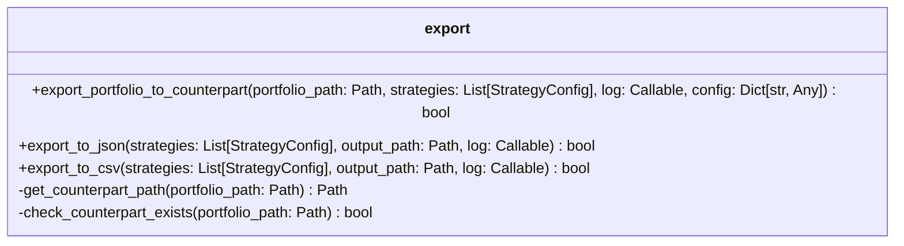
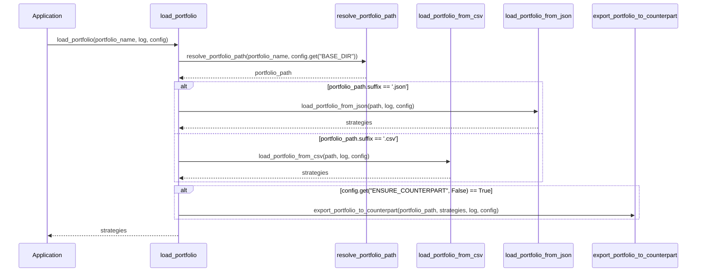

# Implementation Plan: CSV to JSON Conversion Feature

## Overview

The task is to implement a feature that exports a loaded portfolio to its counterpart format (CSV to JSON or JSON to CSV) when the `ENSURE_COUNTERPART` configuration option is set to `True`. This will allow users to use both CSV and JSON files interchangeably and produce the exact same outcomes.

## Requirements Analysis

1. **Activation Condition**: The feature should only be active when `config["ENSURE_COUNTERPART"] = True`
2. **Counterpart Check**: Check if the counterpart portfolio exists (e.g., if a CSV file is loaded, check for a JSON file with the same name)
3. **Skip Condition**: If the counterpart file exists, do not export or overwrite it
4. **Export Format**: The exported file must follow the existing schema for the target format

## File Format Analysis

### JSON Format
- Array of strategy objects
- Required fields: ticker, timeframe, type, direction, short_window, long_window, signal_window (for MACD only)
- Optional fields: stop_loss, rsi_period, rsi_threshold
- Strategy types: "SMA", "EMA", "MACD"

### CSV Format
- Headers: Ticker, Use SMA, Short Window, Long Window
- "Use SMA" determines if the strategy is SMA (true) or EMA (false)
- May include additional performance metrics in the full version

## Implementation Plan

### 1. Create a New Module for Format Conversion

Create a new module `app/tools/portfolio/export.py` to handle the export functionality:



### 2. Modify the Portfolio Loading Process

Modify the `load_portfolio` function in `app/tools/portfolio/loader.py` to check for the counterpart file and export it if needed:



### 3. Implement the Export Functions

#### 3.1 Export to JSON

The `export_to_json` function will convert strategy configurations to the JSON format:

```python
def export_to_json(strategies: List[StrategyConfig], output_path: Path, log: Callable) -> bool:
    """
    Export strategies to a JSON file.
    
    Args:
        strategies: List of strategy configurations
        output_path: Path to the output JSON file
        log: Logging function
        
    Returns:
        bool: True if export successful, False otherwise
    """
    # Convert strategies to JSON format
    json_strategies = []
    for strategy in strategies:
        json_strategy = {
            "ticker": strategy["TICKER"],
            "timeframe": "Hourly" if strategy.get("USE_HOURLY", False) else "Daily",
            "type": strategy["STRATEGY_TYPE"],
            "direction": strategy.get("DIRECTION", "Long"),
            "short_window": strategy["SHORT_WINDOW"],
            "long_window": strategy["LONG_WINDOW"]
        }
        
        # Add optional fields if present
        if "STOP_LOSS" in strategy:
            json_strategy["stop_loss"] = strategy["STOP_LOSS"]
        
        if strategy.get("USE_RSI", False):
            if "RSI_WINDOW" in strategy:
                json_strategy["rsi_period"] = strategy["RSI_WINDOW"]
            if "RSI_THRESHOLD" in strategy:
                json_strategy["rsi_threshold"] = strategy["RSI_THRESHOLD"]
        
        if strategy["STRATEGY_TYPE"] == "MACD" and "SIGNAL_WINDOW" in strategy:
            json_strategy["signal_window"] = strategy["SIGNAL_WINDOW"]
        
        json_strategies.append(json_strategy)
    
    # Write to file
    try:
        # Ensure directory exists
        output_path.parent.mkdir(parents=True, exist_ok=True)
        
        with open(output_path, 'w') as f:
            json.dump(json_strategies, f, indent=4)
        
        log(f"Successfully exported {len(json_strategies)} strategies to {output_path}", "info")
        return True
    except Exception as e:
        log(f"Failed to export strategies to JSON: {str(e)}", "error")
        return False
```

#### 3.2 Export to CSV

The `export_to_csv` function will convert strategy configurations to the CSV format:

```python
def export_to_csv(strategies: List[StrategyConfig], output_path: Path, log: Callable) -> bool:
    """
    Export strategies to a CSV file.
    
    Args:
        strategies: List of strategy configurations
        output_path: Path to the output CSV file
        log: Logging function
        
    Returns:
        bool: True if export successful, False otherwise
    """
    # Define CSV headers
    headers = ["Ticker", "Use SMA", "Short Window", "Long Window"]
    
    # Check if any strategy has MACD type
    has_macd = any(strategy["STRATEGY_TYPE"] == "MACD" for strategy in strategies)
    if has_macd:
        headers.append("Signal Window")
    
    # Check if any strategy has stop loss
    has_stop_loss = any("STOP_LOSS" in strategy for strategy in strategies)
    if has_stop_loss:
        headers.append("Stop Loss")
    
    # Check if any strategy uses RSI
    has_rsi = any(strategy.get("USE_RSI", False) for strategy in strategies)
    if has_rsi:
        headers.extend(["RSI Window", "RSI Threshold"])
    
    # Convert strategies to CSV rows
    rows = []
    for strategy in strategies:
        row = {
            "Ticker": strategy["TICKER"],
            "Use SMA": str(strategy.get("USE_SMA", False)).lower(),
            "Short Window": strategy["SHORT_WINDOW"],
            "Long Window": strategy["LONG_WINDOW"]
        }
        
        if has_macd and strategy["STRATEGY_TYPE"] == "MACD":
            row["Signal Window"] = strategy.get("SIGNAL_WINDOW", "")
        elif has_macd:
            row["Signal Window"] = ""
        
        if has_stop_loss:
            row["Stop Loss"] = strategy.get("STOP_LOSS", "")
        
        if has_rsi:
            row["RSI Window"] = strategy.get("RSI_WINDOW", "")
            row["RSI Threshold"] = strategy.get("RSI_THRESHOLD", "")
        
        rows.append(row)
    
    # Write to file
    try:
        # Ensure directory exists
        output_path.parent.mkdir(parents=True, exist_ok=True)
        
        with open(output_path, 'w', newline='') as f:
            writer = csv.DictWriter(f, fieldnames=headers)
            writer.writeheader()
            writer.writerows(rows)
        
        log(f"Successfully exported {len(rows)} strategies to {output_path}", "info")
        return True
    except Exception as e:
        log(f"Failed to export strategies to CSV: {str(e)}", "error")
        return False
```

#### 3.3 Main Export Function

The main export function will determine the counterpart format and call the appropriate export function:

```python
def export_portfolio_to_counterpart(
    portfolio_path: Path,
    strategies: List[StrategyConfig],
    log: Callable,
    config: Dict[str, Any]
) -> bool:
    """
    Export portfolio to its counterpart format (CSV to JSON or JSON to CSV).
    
    Args:
        portfolio_path: Path to the original portfolio file
        strategies: List of strategy configurations
        log: Logging function
        config: Configuration dictionary
        
    Returns:
        bool: True if export successful, False otherwise
    """
    # Check if counterpart export is enabled
    if not config.get("ENSURE_COUNTERPART", False):
        return True
    
    # Get counterpart path
    counterpart_path = get_counterpart_path(portfolio_path)
    
    # Check if counterpart already exists
    if counterpart_path.exists():
        log(f"Counterpart file already exists: {counterpart_path}. Skipping export.", "info")
        return True
    
    # Export to counterpart format
    if portfolio_path.suffix.lower() == '.json':
        return export_to_csv(strategies, counterpart_path, log)
    else:
        return export_to_json(strategies, counterpart_path, log)
```

#### 3.4 Helper Functions

```python
def get_counterpart_path(portfolio_path: Path) -> Path:
    """
    Get the path to the counterpart file.
    
    Args:
        portfolio_path: Path to the original portfolio file
        
    Returns:
        Path: Path to the counterpart file
    """
    base_dir = portfolio_path.parent.parent.parent  # Go up to project root
    file_name = portfolio_path.stem
    
    if portfolio_path.suffix.lower() == '.json':
        # JSON to CSV
        return base_dir / "csv" / "portfolios" / f"{file_name}.csv"
    else:
        # CSV to JSON
        return base_dir / "json" / "portfolios" / f"{file_name}.json"
```

### 4. Update the Module Exports

Update `app/tools/portfolio/__init__.py` to export the new functions:

```python
from app.tools.portfolio.export import (
    export_portfolio_to_counterpart,
    export_to_json,
    export_to_csv
)

__all__ = [
    # ... existing exports ...
    
    # Export functions
    'export_portfolio_to_counterpart',
    'export_to_json',
    'export_to_csv'
]
```

## Integration Points

1. **Main Integration Point**: The `load_portfolio` function in `app/tools/portfolio/loader.py` will be modified to check for the counterpart file and export it if needed.

2. **Configuration Check**: The feature will only be active when `config["ENSURE_COUNTERPART"] = True`, which is already set in the default configuration in `app/concurrency/review.py`.

## Logging Strategy

Following the Core Development Principles, we'll implement consistent logging:

1. Log when a counterpart file is generated
2. Log when a counterpart file already exists and export is skipped
3. Log any errors that occur during the export process
4. Include context in error messages

## Implementation Timeline

1. Create the `export.py` module with the export functions
2. Modify the `load_portfolio` function to integrate the export functionality
3. Update the module exports in `__init__.py`
4. Test the implementation with various portfolio files
5. Document the new feature

## Conclusion

This implementation plan provides a comprehensive approach to adding CSV to JSON conversion (and vice versa) to the trading application. The feature will be activated when `ENSURE_COUNTERPART` is set to `True`, will check for existing counterpart files, and will export the portfolio to the counterpart format following the existing schema.

The implementation follows the Core Development Principles, including proper type hints, error handling, and logging. The code is organized in a modular way, with clear separation of concerns and reuse of existing functionality where possible.