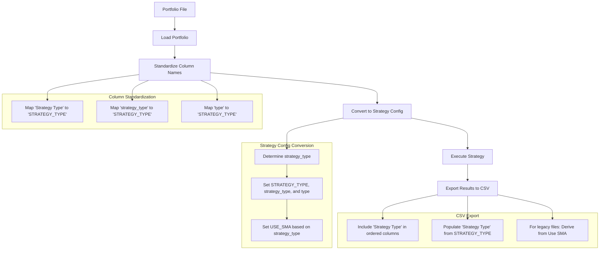

# Simplified Implementation Plan: Standardizing Strategy Type Fields

This plan focuses on standardizing the strategy type fields across CSV and JSON schemas without adding new fields.

## Requirements

1. Do not add a new "Type" field to the CSV schema
2. Rename "STRATEGY_TYPE" to "Strategy Type" in the CSV schema and all related locations, without backwards compatibility
3. Rename the existing "type" field in the JSON schema to "strategy_type" and ensure backward compatibility
4. "Use SMA" should be consistent with Strategy Type.
5. For legacy CSV files without the "Strategy Type" field, derive it from "Use SMA" (True = "SMA", False = "EMA")

## State Analysis

1. **CSV Portfolio Schema**:
   - The strategy type is currently stored as "STRATEGY_TYPE" internally
   - When exporting to CSV, this field should be explicitly included between the "Use SMA" and "Short Window" columns.
   - Legacy CSV files may not contain a "Strategy Type" column, in which case it should be derived from "Use SMA"

2. **JSON Portfolio Schema**:
   - The strategy type is currently stored as "type" in JSON files and should be updated to "STRATEGY_TYPE"
   - This is mapped to "STRATEGY_TYPE" internally

3. **Internal Representation**:
   - The strategy type is stored as both "STRATEGY_TYPE" and "type" in the strategy configuration
   - The "USE_SMA" (JSON) and "Use SMA" (CSV) fields are derived from the strategy type (TRUE if type is SMA, FALSE otherwise)

## Implementation Steps

### 1. Update CSV Column Mappings in `app/tools/portfolio/format.py`

Modify the column mappings in `standardize_portfolio_columns` to use "Strategy Type" instead of "STRATEGY_TYPE":

```python
column_mappings = {
    # Existing mappings...
    
    # Update strategy type mappings
    'Strategy Type': 'STRATEGY_TYPE',
    'strategy_type': 'STRATEGY_TYPE',
    
    # Keep existing mappings for backward compatibility with JSON
    'Strategy Type': 'STRATEGY_TYPE',
    'strategy_type': 'STRATEGY_TYPE',
    'type': 'STRATEGY_TYPE',  # For backward compatibility with JSON
}
```

### 2. Update JSON Schema Handling in `app/tools/portfolio/format.py`

Modify the `convert_csv_to_strategy_config` function to handle the renamed JSON field:

```python
# Determine strategy type
strategy_type = None

# Check if STRATEGY_TYPE is directly provided
if "STRATEGY_TYPE" in row:
    strategy_type = row["STRATEGY_TYPE"]
# Check if strategy_type is provided (new JSON field name)
elif "strategy_type" in row:
    strategy_type = row["strategy_type"]
# Check if type is provided (old JSON field name for backward compatibility)
elif "type" in row:
    strategy_type = row["type"]
# Otherwise determine from USE_SMA
else:
    use_sma = row.get("USE_SMA", True)
    if isinstance(use_sma, str):
        use_sma = use_sma.lower() in ['true', 'yes', '1']
    strategy_type = "SMA" if use_sma else "EMA"
```

### 3. Update Strategy Configuration Creation in `app/tools/portfolio/format.py`

Modify the strategy configuration creation to use the new field names:

```python
# Create strategy configuration
strategy_config = {
    "TICKER": ticker,
    "USE_SMA": strategy_type == "SMA",
    "STRATEGY_TYPE": strategy_type,
    "strategy_type": strategy_type,  # New JSON field name
    "type": strategy_type,  # Old JSON field name for backward compatibility
    "DIRECTION": direction,
    "USE_HOURLY": use_hourly,
    "USE_RSI": False,
    "BASE_DIR": config.get("BASE_DIR", "."),
    "REFRESH": config.get("REFRESH", True),
}
```

### 4. Update CSV Export Logic in `app/ma_cross/tools/export_portfolios.py`

Modify the `export_portfolios` function to use "Strategy Type" in the exported CSV files:

1. Add "Strategy Type" to the ordered columns list, placing it between "Use SMA" and "Short Window":
```python
ordered_columns = [
    "Ticker",
    "Use SMA",
    "Strategy Type",  # Place between Use SMA and Short Window
    "Short Window",
    "Long Window",
    "Signal Entry",
    "Total Trades"
]
```

2. Ensure the "Strategy Type" column is populated correctly, with special handling for legacy CSV files:

```python
# Add Strategy Type column based on strategy type information
if "Strategy Type" not in df.columns:
    # Check if we have strategy type information
    if "STRATEGY_TYPE" in df.columns:
        df = df.with_columns(pl.col("STRATEGY_TYPE").alias("Strategy Type"))
    elif "strategy_type" in df.columns:
        df = df.with_columns(pl.col("strategy_type").alias("Strategy Type"))
    elif "type" in df.columns:
        df = df.with_columns(pl.col("type").alias("Strategy Type"))
    else:
        # For legacy CSV files: Derive from Use SMA
        # This is critical for backward compatibility with existing CSV files
        log("Deriving Strategy Type from Use SMA for legacy CSV file", "info")
        df = df.with_columns(
            pl.when(pl.col("Use SMA").eq(True))
            .then(pl.lit("SMA"))
            .otherwise(pl.lit("EMA"))
            .alias("Strategy Type")
        )
```

### 5. Update CSV Import Logic for Legacy Files

Add explicit handling for legacy CSV files during import:

```python
# When loading a CSV file in load_portfolio_from_csv
def load_portfolio_from_csv(csv_path, log, config):
    # ... existing code ...
    
    # After reading the CSV file and standardizing column names
    df = standardize_portfolio_columns(df, log)
    
    # Handle legacy CSV files without Strategy Type column
    if "STRATEGY_TYPE" not in df.columns:
        log("Legacy CSV file detected without Strategy Type column. Deriving from Use SMA.", "info")
        # Derive STRATEGY_TYPE from USE_SMA
        df = df.with_columns(
            pl.when(pl.col("USE_SMA").eq(True))
            .then(pl.lit("SMA"))
            .otherwise(pl.lit("EMA"))
            .alias("STRATEGY_TYPE")
        )
    
    # ... continue with existing code ...
```

### 6. Simplify Strategy Type Determination in `app/tools/portfolio/format.py`

To reduce duplication and simplify the code, consolidate the strategy type determination logic:

```python
def determine_strategy_type(row, log, ticker):
    """
    Determine strategy type from row data with consistent priority.
    
    Priority order:
    1. STRATEGY_TYPE column
    2. strategy_type column (new JSON field name)
    3. type column (old JSON field name)
    4. Derived from USE_SMA
    
    Args:
        row: Row data dictionary
        log: Logging function
        ticker: Ticker symbol for logging
        
    Returns:
        str: Strategy type (SMA, EMA, or MACD)
    """
    # Check for explicit type fields in priority order
    for type_field in ["STRATEGY_TYPE", "strategy_type", "type"]:
        if type_field in row and row[type_field]:
            strategy_type = row[type_field]
            # Validate strategy type
            if strategy_type in ["SMA", "EMA", "MACD"]:
                return strategy_type
            else:
                log(f"Invalid strategy type '{strategy_type}' for {ticker}, defaulting to EMA", "warning")
                return "EMA"
    
    # For legacy data: Derive from USE_SMA if no explicit type
    log(f"No explicit strategy type found for {ticker}. Deriving from USE_SMA.", "info")
    use_sma = row.get("USE_SMA", True)
    if isinstance(use_sma, str):
        use_sma = use_sma.lower() in ['true', 'yes', '1']
    return "SMA" if use_sma else "EMA"
```

Then use this function in `convert_csv_to_strategy_config`:

```python
# Determine strategy type using the consolidated function
strategy_type = determine_strategy_type(row, log, ticker)

# Create strategy configuration with consistent type fields
strategy_config = {
    "TICKER": ticker,
    "STRATEGY_TYPE": strategy_type,
    "strategy_type": strategy_type,  # New JSON field name
    "type": strategy_type,  # Old JSON field name for backward compatibility
    "USE_SMA": strategy_type == "SMA",
    # Other fields...
}
```

## Legacy CSV File Handling

A critical aspect of this implementation is proper handling of legacy CSV files that don't contain the "Strategy Type" column. The approach is:

1. **During Import**:
   - When loading a legacy CSV file without a "Strategy Type" column, derive the strategy type from the "Use SMA" column
   - If "Use SMA" is True, set "STRATEGY_TYPE" to "SMA"
   - If "Use SMA" is False, set "STRATEGY_TYPE" to "EMA"
   - Log this derivation for transparency

2. **During Export**:
   - Always include the "Strategy Type" column in the output
   - If the source data doesn't have strategy type information, derive it from "Use SMA"
   - Place the "Strategy Type" column between "Use SMA" and "Short Window"

3. **Consistency Check**:
   - Ensure that "Use SMA" and "Strategy Type" are always consistent
   - "Use SMA" should be True when "Strategy Type" is "SMA"
   - "Use SMA" should be False when "Strategy Type" is "EMA" or "MACD"

This approach ensures backward compatibility with existing CSV files while standardizing the schema going forward.

## Implementation Diagram



## Conclusion

This simplified implementation plan standardizes the strategy type fields across CSV and JSON schemas without adding new fields. It renames "STRATEGY_TYPE" to "Strategy Type" in the CSV schema and "type" to "strategy_type" in the JSON schema, while maintaining backward compatibility for JSON files.

The plan includes explicit handling for legacy CSV files that don't contain the "Strategy Type" column, deriving it from the "Use SMA" field (True = "SMA", False = "EMA"). This ensures backward compatibility while moving toward a more standardized schema.

The plan also includes opportunities to simplify the code and reduce duplication by consolidating the strategy type determination logic into a single function. This makes the code more maintainable and ensures consistent handling of type information throughout the application.