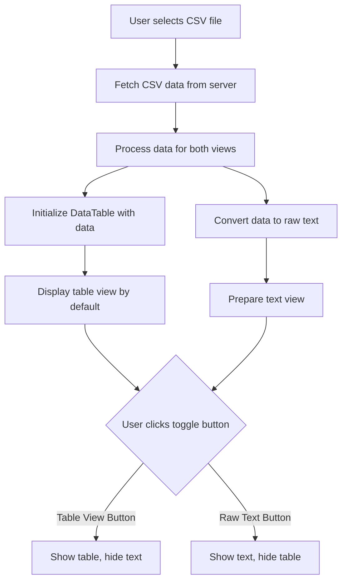

# Implementation Plan: CSV Viewer Toggle Between Table and Raw Text Views

## Overview

The current CSV viewer displays data in a table format using DataTables. The task is to add functionality to toggle between the current table view and a raw text view of the CSV data. The raw text view should have the same dimensions as the table view, and only one view should be displayed at a time.

## Current System Analysis

### Frontend (app/csv_viewer/index.html)
- Uses DataTables to display CSV data in a table format
- Fetches CSV data from the backend API
- Has a file selector dropdown to choose which CSV file to view
- Includes an "Update" button to refresh the data

### Backend
- FastAPI endpoints for:
  - Serving the CSV viewer HTML page (`/viewer/`)
  - Listing available CSV files (`/api/data/list/strategies`)
  - Reading CSV data (`/api/data/csv/{file_path}`)
  - Updating portfolios (`/api/scripts/update-portfolio`)

### Data Flow
1. User selects a CSV file from the dropdown
2. Application fetches CSV data from the server
3. Data is displayed in a table using DataTables

## Implementation Plan

### 1. UI Changes

#### Add Toggle Buttons
Add two buttons above the table container:
- "Table View" button (default active)
- "Raw Text View" button

```html
<!-- View toggle buttons -->
<div id="view-toggle" class="mb-4 p-3 bg-white rounded shadow-sm">
    <div class="flex space-x-2">
        <button id="table-view-btn" class="px-4 py-2 bg-indigo-600 text-white rounded-md shadow-sm hover:bg-indigo-700 focus:outline-none focus:ring-2 focus:ring-offset-2 focus:ring-indigo-500">
            Table View
        </button>
        <button id="text-view-btn" class="px-4 py-2 bg-gray-200 text-gray-700 rounded-md shadow-sm hover:bg-gray-300 focus:outline-none focus:ring-2 focus:ring-offset-2 focus:ring-indigo-500">
            Raw Text View
        </button>
    </div>
</div>
```

#### Add Raw Text Container
Add a new div for displaying the raw text, with the same dimensions as the table:

```html
<!-- Raw text container -->
<div id="text-container" class="hidden overflow-x-auto bg-white rounded-lg shadow-lg p-4">
    <textarea id="csv-text" class="w-full h-[70vh] font-mono text-sm border border-gray-300 rounded-md p-2" readonly></textarea>
</div>
```

### 2. JavaScript Implementation

#### Toggle Functionality
Add JavaScript functions to toggle between the views:

```javascript
// View toggle functionality
const tableViewBtn = document.getElementById('table-view-btn');
const textViewBtn = document.getElementById('text-view-btn');
const tableContainer = document.getElementById('table-container');
const textContainer = document.getElementById('text-container');
const csvText = document.getElementById('csv-text');

// Function to switch to table view
function showTableView() {
    tableContainer.classList.remove('hidden');
    textContainer.classList.add('hidden');
    tableViewBtn.classList.remove('bg-gray-200', 'text-gray-700');
    tableViewBtn.classList.add('bg-indigo-600', 'text-white');
    textViewBtn.classList.remove('bg-indigo-600', 'text-white');
    textViewBtn.classList.add('bg-gray-200', 'text-gray-700');
}

// Function to switch to text view
function showTextView() {
    tableContainer.classList.add('hidden');
    textContainer.classList.remove('hidden');
    tableViewBtn.classList.remove('bg-indigo-600', 'text-white');
    tableViewBtn.classList.add('bg-gray-200', 'text-gray-700');
    textViewBtn.classList.remove('bg-gray-200', 'text-gray-700');
    textViewBtn.classList.add('bg-indigo-600', 'text-white');
}

// Event listeners for toggle buttons
tableViewBtn.addEventListener('click', showTableView);
textViewBtn.addEventListener('click', showTextView);
```

#### CSV to Text Conversion
Add a function to convert the CSV data to raw text:

```javascript
// Function to convert CSV data to raw text
function convertToRawText(data, columns) {
    // Create header row
    let rawText = columns.join(',') + '\n';
    
    // Add data rows
    data.forEach(row => {
        const rowValues = columns.map(col => {
            // Handle values with commas by quoting them
            const value = row[col] !== null && row[col] !== undefined ? String(row[col]) : '';
            return value.includes(',') ? `"${value}"` : value;
        });
        rawText += rowValues.join(',') + '\n';
    });
    
    return rawText;
}
```

#### Update the loadCSVData Function
Modify the existing `loadCSVData` function to populate both the table and text views:

```javascript
// Function to load CSV data
function loadCSVData(filePath) {
    loadingIndicator.classList.remove('hidden');
    tableContainer.classList.add('hidden');
    textContainer.classList.add('hidden');
    errorMessage.classList.add('hidden');
    
    fetch(`/api/data/csv/${filePath}`)
        .then(response => {
            if (!response.ok) {
                throw new Error('Failed to load CSV file');
            }
            return response.json();
        })
        .then(response => {
            // Hide loading indicator
            loadingIndicator.classList.add('hidden');
            
            if (!response || !response.data || !response.data.data) {
                showError('Invalid response format');
                return;
            }
            
            const data = response.data.data;
            const columns = response.data.columns || Object.keys(data[0]);
            
            if (data.length === 0) {
                showError('No data found in the CSV file.');
                return;
            }
            
            // Display file info
            fileInfo.innerHTML = `
                <p><strong>File:</strong> ${filePath.split('/').pop()}</p>
                <p><strong>Rows:</strong> ${data.length}</p>
                <p><strong>Columns:</strong> ${columns.length}</p>
            `;
            
            // Show view toggle buttons
            document.getElementById('view-toggle').classList.remove('hidden');
            
            // Populate raw text view
            const rawText = convertToRawText(data, columns);
            csvText.value = rawText;
            
            // Show table container (default view)
            showTableView();
            
            // Initialize DataTable
            $('#csv-table').DataTable({
                destroy: true, // Destroy existing table
                data: data,
                columns: columns.map(key => ({
                    title: key,
                    data: key
                })),
                scrollX: true,
                scrollY: '70vh',
                scrollCollapse: true,
                paging: false,
                searching: true,
                ordering: true,
                info: true,
                lengthMenu: [[10, 25, 50, 100, -1], [10, 25, 50, 100, "All"]],
                pageLength: "All",
                responsive: true,
                // Set default sort to "Score" column in descending order if it exists
                order: columns.includes("Score") ? [[columns.indexOf("Score"), 'desc']] : []
            });
        })
        .catch(error => {
            showError('Error loading CSV file: ' + error.message);
        });
}
```

### 3. CSS Styling

Ensure the text area has the same dimensions and styling as the table:

```css
#csv-text {
    width: 100%;
    height: 70vh;
    font-family: monospace;
    font-size: 0.875rem;
    white-space: pre;
    overflow: auto;
    border: 1px solid #e5e7eb;
    border-radius: 0.375rem;
    padding: 0.5rem;
    background-color: #f9fafb;
}

#view-toggle {
    display: flex;
    justify-content: flex-start;
    margin-bottom: 1rem;
}

#view-toggle button {
    transition: all 0.2s;
}
```

## Implementation Sequence

1. Add the toggle buttons HTML above the table container
2. Add the raw text container HTML below the table container
3. Add the CSS styling for the new elements
4. Implement the JavaScript functions for toggling between views
5. Modify the loadCSVData function to populate both views
6. Test the functionality with different CSV files

## Mermaid Diagram



## Considerations

1. **Performance**: For large CSV files, generating the raw text might be resource-intensive. Consider implementing lazy loading for the raw text view, only generating it when the user switches to that view.

2. **Accessibility**: Ensure the toggle buttons are keyboard accessible and have appropriate ARIA attributes.

3. **Responsiveness**: The text area should adapt to different screen sizes, just like the table does.

4. **Error Handling**: Add appropriate error handling for cases where the CSV data cannot be converted to raw text.

5. **User Experience**: The active view button should be visually distinct to indicate the current view.