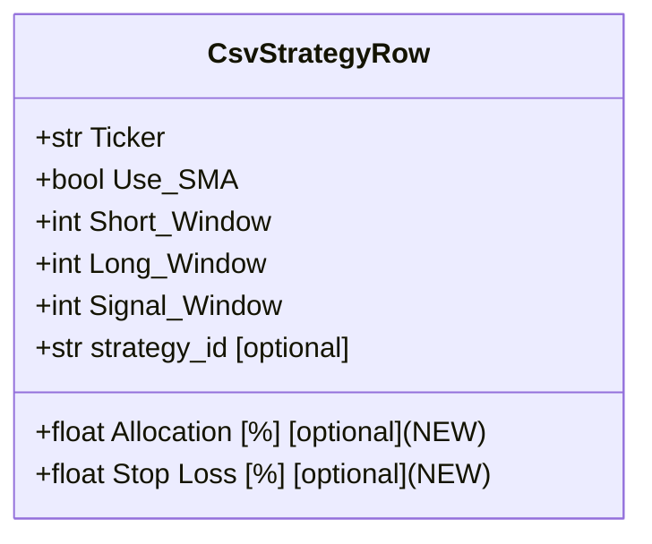
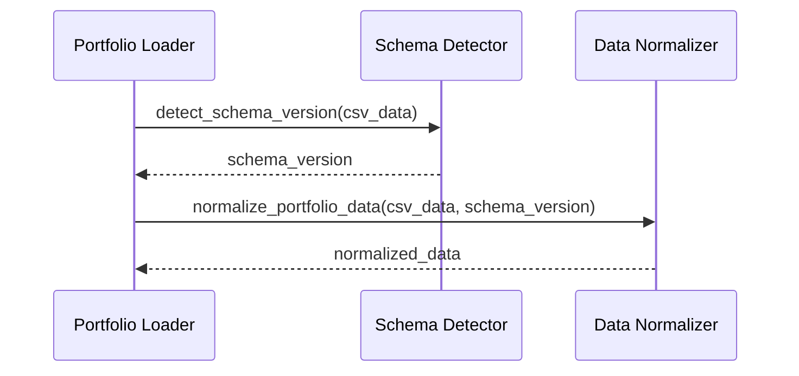
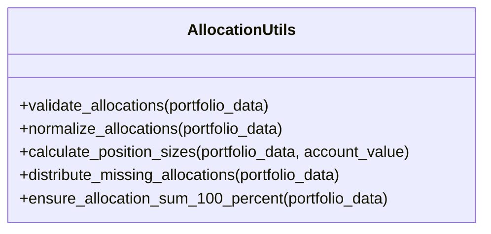
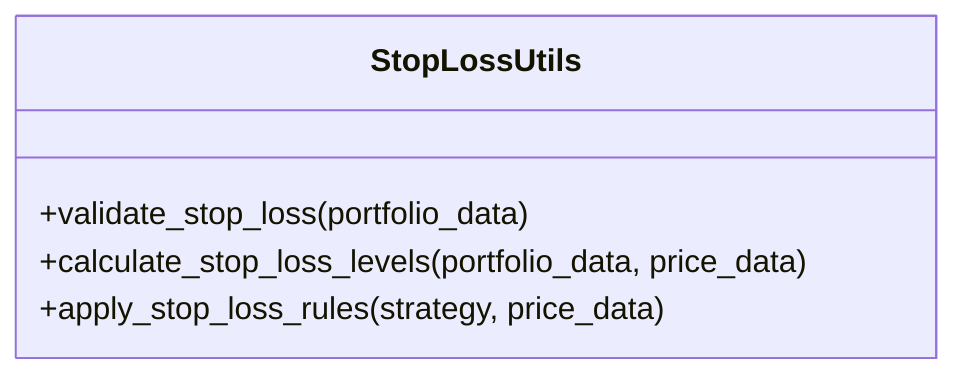

# Implementation Plan: Adding Support for Extended CSV Schema with Allocation and Stop Loss Columns

Based on my analysis of the codebase, I've developed a multi-step implementation plan to update the project to accept schemas that include the "Allocation [%]" and "Stop Loss [%]" columns. This plan follows SOLID principles and ensures each step is implemented individually without introducing breaking changes.

## Current State Analysis

The trading system currently has two CSV schemas:
1. **Base Schema**: Original schema without Allocation [%] and Stop Loss [%] columns
2. **Extended Schema**: New schema with Allocation [%] (2nd column) and Stop Loss [%] (7th column)

The file `trades_20250520.csv` already uses the extended schema, but the code doesn't fully utilize these columns yet. The system loads CSV files using `csv.DictReader` which automatically handles additional columns, but the TypedDict definitions and processing logic need to be updated.

## Implementation Plan

### Step 1: Update Type Definitions

**Files to modify:**
- `app/concurrency/config.py`

**Changes:**
- Update the `CsvStrategyRow` TypedDict to include Allocation [%] and Stop Loss [%] fields as optional parameters
- This ensures type safety while maintaining backward compatibility

### Step 2: Create Schema Detection Utility

**Files to create:**
- `app/tools/portfolio/schema_detection.py`

**Changes:**
- Create a utility function to detect which schema version a CSV file is using
- This will allow the system to handle both schema versions gracefully
- Implement functions to normalize data between schemas

### Step 3: Update Portfolio Loading Logic

**Files to modify:**
- `app/tools/portfolio.py`

**Changes:**
- Enhance `load_csv_portfolio` to detect and handle the extended schema
- Add schema version information to the loaded portfolio data
- Ensure backward compatibility with existing code

### Step 4: Update Concurrency Analysis Module

**Files to modify:**
- `app/concurrency/review.py`

**Changes:**
- Update the portfolio context handling to process Allocation [%] and Stop Loss [%] values
- Modify the strategy processing logic to incorporate these values

### Step 5: Update Portfolio Export Logic

**Files to modify:**
- `app/tools/strategy/export_portfolios.py`

**Changes:**
- Update the export logic to include Allocation [%] and Stop Loss [%] columns in the output
- Ensure proper column ordering in the exported CSV files
- Always export using the Extended Schema format, even when importing from Base Schema
- Handle the following specific cases:
  1. When Allocation [%] column exists but no values: maintain the column with empty values
  2. When Allocation [%] column doesn't exist: add it with empty fields
  3. When some rows have Allocation [%] values and others don't: assign equal values to empty ones so the sum equals 100%
  4. Always export using the Extended Schema for strategy portfolio CSV files

### Step 6: Update MA Cross Portfolio Processing

**Files to modify:**
- `app/ma_cross/1_get_portfolios.py`

**Changes:**
- Update the portfolio filtering and processing logic to handle Allocation [%] and Stop Loss [%] values
- Modify the strategy execution to incorporate Stop Loss [%] parameters
- Ensure backward compatibility with existing code

### Step 7: Update Portfolio Update Module

**Files to modify:**
- `app/strategies/update_portfolios.py`

**Changes:**
- Update the portfolio processing logic to handle Allocation [%] and Stop Loss [%] values
- Modify the strategy processing to incorporate these values
- Ensure backward compatibility with existing code

### Step 8: Create Allocation Utility Module

**Files to create:**
- `app/tools/portfolio/allocation.py`

**Changes:**
- Create utility functions for working with allocation percentages
- Implement validation and normalization of allocation values
- Provide functions for calculating position sizes based on allocations
- Implement logic to handle the special cases:
  - Detecting empty allocation values
  - Distributing equal allocations when some values are missing
  - Ensuring the sum of all allocations equals 100%

### Step 9: Create Stop Loss Utility Module

**Files to create:**
- `app/tools/portfolio/stop_loss.py`

**Changes:**
- Create utility functions for working with stop loss values
- Implement validation and processing of stop loss parameters
- Provide functions for calculating stop loss levels

### Step 10: Update Configuration Documentation

**Files to modify:**
- `docs/csv_schemas.md`

**Changes:**
- Update the documentation to reflect the new schema support
- Add examples and usage guidelines for the Allocation [%] and Stop Loss [%] columns
- Document the backward compatibility features
- Document the special cases for allocation handling

## Implementation Approach

Each step will be implemented following these principles:

1. **Single Responsibility**: Each module will have a clear, focused purpose
2. **Open/Closed**: Extend functionality without modifying existing code where possible
3. **Liskov Substitution**: Ensure new implementations honor existing contracts
4. **Interface Segregation**: Create focused interfaces for allocation and stop loss functionality
5. **Dependency Inversion**: High-level modules will depend on abstractions, not concrete implementations

## Backward Compatibility

The implementation will maintain backward compatibility by:
1. Making new fields optional in type definitions
2. Detecting schema version automatically
3. Providing default values when fields are missing
4. Preserving existing behavior for files using the base schema

## Special Cases Handling

The implementation will handle these specific cases:

1. **Case 1**: When Allocation [%] column exists (Extended Schema) yet no Allocation values exist in any row
   - The exported CSV will maintain the column with empty values (similar to imported file)
   - The extended schema structure will be preserved

2. **Case 2**: When Allocation [%] column does not exist (Base Schema)
   - The system will export CSV with Allocation [%] column and empty fields
   - This ensures all exports follow the Extended Schema format

3. **Case 3**: When Allocation [%] column exists (Extended Schema) and some rows contain Allocation values while some do not
   - The empty Allocation [%] values will be assigned equal values
   - The sum of all Allocations will equal 100%
   - This ensures proper portfolio allocation

4. **Case 4**: Extended Schema will always be used
   - All strategy portfolio CSV exports will use the Extended Schema format
   - This ensures consistency across the system

## Conclusion

This implementation plan provides a structured approach to updating the trading system to support the extended CSV schema with Allocation [%] and Stop Loss [%] columns. By following SOLID principles and making incremental changes, we can enhance the system's capabilities without disrupting existing functionality.