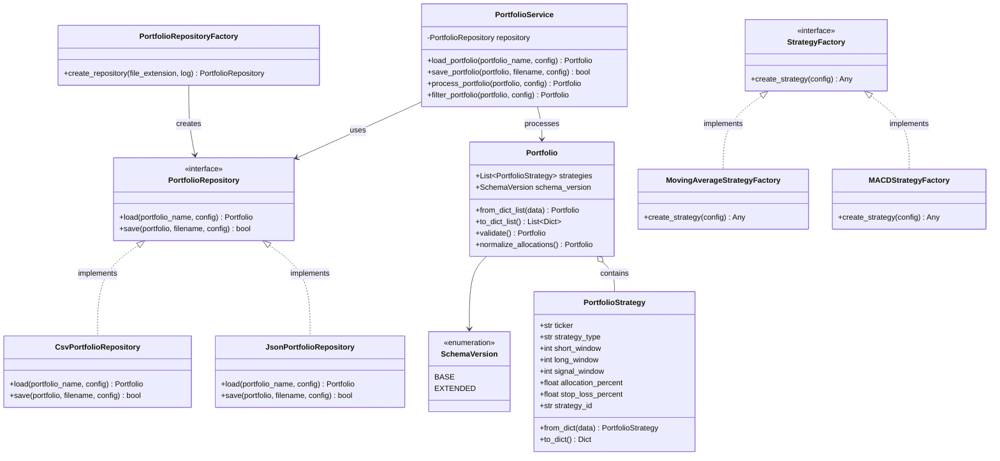
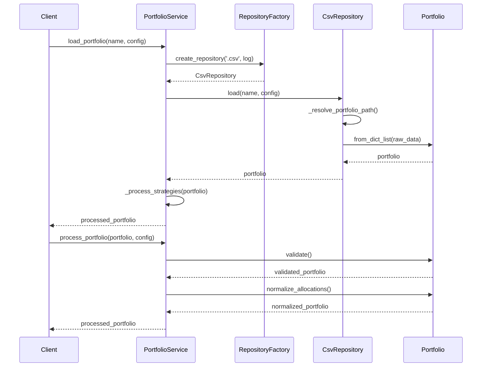

# Implementation Plan: Improving CSV Schema Extension with SOLID Principles

## Overview

After analyzing the codebase, I've identified several issues related to SOLID principles:

1. **Single Responsibility Violations**: Large functions handling multiple concerns
2. **Open/Closed Principle Violations**: Direct modification of existing code rather than extension
3. **Liskov Substitution Issues**: Inconsistent handling of portfolio data types
4. **Interface Segregation Problems**: Lack of focused interfaces
5. **Dependency Inversion Issues**: High-level modules directly depend on low-level modules

This implementation plan addresses these issues while maintaining backward compatibility and adhering to KISS and YAGNI principles.

## Current State Analysis

The trading system currently has two CSV schemas:
1. **Base Schema**: Original schema without Allocation [%] and Stop Loss [%] columns
2. **Extended Schema**: New schema with Allocation [%] (2nd column) and Stop Loss [%] (7th column)

The implementation of schema handling is spread across multiple files:
- `app/tools/portfolio/schema_detection.py`: Detects schema version and normalizes data
- `app/tools/portfolio/allocation.py`: Handles allocation percentages
- `app/tools/portfolio/stop_loss.py`: Handles stop loss values
- `app/tools/portfolio.py`: Loads portfolio data from CSV/JSON files
- `app/tools/strategy/export_portfolios.py`: Exports portfolio data to CSV files

The main modules that use these utilities have significant code duplication:
- `app/ma_cross/1_get_portfolios.py`
## Implementation Steps

### Step 1: Create a Portfolio Domain Model

**Files to Create:**
- `app/tools/portfolio/models.py`

**Purpose:**
- Define clear domain models for portfolio data
- Encapsulate schema detection and validation logic
- Provide a consistent interface for portfolio operations

**Implementation Details:**
- Create a `SchemaVersion` enum to represent different schema versions
- Implement a `PortfolioStrategy` class to represent individual trading strategies
- Implement a `Portfolio` class to represent a collection of strategies
- Add methods for validation, normalization, and conversion between different formats
- Ensure backward compatibility with existing code

### Step 2: Create Repository Interfaces and Implementations

**Files to Create:**
- `app/tools/portfolio/repository.py`

**Purpose:**
- Define interfaces for portfolio data access
- Implement concrete repositories for different data sources
- Decouple data access from business logic

**Implementation Details:**
- Create a `PortfolioRepository` interface with `load` and `save` methods
- Implement `CsvPortfolioRepository` for CSV files
- Implement `JsonPortfolioRepository` for JSON files
- Create a `PortfolioRepositoryFactory` to instantiate appropriate repositories
- Handle error cases consistently

### Step 3: Create Portfolio Service Layer

**Files to Create:**
- `app/tools/portfolio/service.py`

**Purpose:**
- Provide a unified interface for portfolio operations
- Encapsulate business logic for portfolio processing
- Decouple high-level modules from implementation details

**Implementation Details:**
- Create a `PortfolioService` class with methods for loading, processing, and saving portfolios
- Implement allocation normalization logic
- Implement stop loss processing logic
- Add filtering capabilities based on configuration
- Ensure proper error handling and logging

### Step 4: Create Strategy Factory

**Files to Create:**
- `app/tools/strategy/factory.py`

**Purpose:**
- Provide a factory for creating strategy implementations
- Decouple strategy creation from usage
- Allow for easy extension with new strategy types

**Implementation Details:**
- Create a `StrategyFactory` interface
- Implement concrete factories for different strategy types (SMA, EMA, MACD)
- Use dependency injection for configuration and logging
- Handle errors gracefully

### Step 5: Update Main Modules to Use New Architecture

**Files to Modify:**
- `app/ma_cross/1_get_portfolios.py`
- `app/strategies/update_portfolios.py`
- `app/concurrency/review.py`

**Purpose:**
- Refactor main modules to use the new architecture
- Remove duplicated code
- Improve maintainability and testability

**Implementation Details:**
- Replace direct schema detection and processing with `PortfolioService` calls
- Use the repository pattern for data access
- Use the factory pattern for strategy creation
- Ensure backward compatibility with existing code
- Add proper error handling and logging

### Step 6: Add Comprehensive Tests

**Files to Create:**
- `tests/tools/portfolio/test_models.py`
- `tests/tools/portfolio/test_repository.py`
- `tests/tools/portfolio/test_service.py`
- `tests/tools/strategy/test_factory.py`

**Purpose:**
- Ensure correctness of the implementation
- Prevent regressions
- Document expected behavior
## Dynamic Configuration Detection

One of the key improvements in the new architecture is the elimination of explicit configuration flags like `USE_EXTENDED_SCHEMA`, `HANDLE_ALLOCATIONS`, and `HANDLE_STOP_LOSS`. Instead, the system will dynamically detect and handle these aspects based on the data itself.

### Current Approach (To Be Removed)

Currently, in files like `app/strategies/update_portfolios.py`, explicit configuration flags are set:

```python
# Set extended schema flag to ensure proper handling
extended_config = {
    "USE_EXTENDED_SCHEMA": use_extended,  # Set based on detection
    "HANDLE_ALLOCATIONS": True,           # Enable allocation handling
    "HANDLE_STOP_LOSS": True              # Enable stop loss handling
}
```

### New Approach (Dynamic Detection)

In the new architecture, these flags are eliminated in favor of dynamic detection:

1. **Schema Version Detection**: The `Portfolio` class automatically detects the schema version when loading data:

```python
@staticmethod
def _detect_schema_version(data: List[Dict[str, Any]]) -> SchemaVersion:
    """Detect the schema version from a list of dictionaries."""
    if not data:
        return SchemaVersion.BASE
    
    # Check the first row for allocation or stop loss fields
    first_row = data[0]
    
    # Check for Allocation [%] field
    has_allocation = any(key in first_row for key in ['Allocation [%]', 'ALLOCATION'])
    
    # Check for Stop Loss [%] field
    has_stop_loss = any(key in first_row for key in ['Stop Loss [%]', 'STOP_LOSS'])
    
    # If either field is present, it's the extended schema
    if has_allocation or has_stop_loss:
        return SchemaVersion.EXTENDED
    
    return SchemaVersion.BASE
```

2. **Automatic Processing**: The `PortfolioService` automatically applies the appropriate processing based on the detected schema version:

```python
def process_portfolio(self, portfolio: Portfolio, config: Dict[str, Any]) -> Portfolio:
    """Process a portfolio according to configuration."""
    # Validate the portfolio
    validated = portfolio.validate()
    
    # Process allocations if schema is extended
    if portfolio.schema_version == SchemaVersion.EXTENDED:
        validated = validated.normalize_allocations()
        
        # Calculate position sizes if account value is provided
        if "ACCOUNT_VALUE" in config and config["ACCOUNT_VALUE"] > 0:
            validated = self._calculate_position_sizes(validated, config["ACCOUNT_VALUE"])
    
    return validated
```

3. **Consistent Export Format**: The repositories ensure consistent export format based on the schema version:

```python
def save(self, portfolio: Portfolio, filename: str, config: Dict[str, Any]) -> bool:
    """Save a portfolio to a CSV file."""
    # ... (other code)
    
    # Define the column order based on schema version
    if portfolio.schema_version == SchemaVersion.EXTENDED:
        # Define the column order with Allocation [%] and Stop Loss [%]
        ordered_fields = [
            "Ticker",
            "Allocation [%]",
            "Strategy Type",
            # ... (other fields)
        ]
    else:
        # For base schema, use standard fields
        ordered_fields = [
            "Ticker",
            "Strategy Type",
            # ... (other fields)
        ]
    
    # ... (other code)
```

### Benefits of Dynamic Detection

1. **Simplified Configuration**: No need to explicitly set configuration flags
2. **Reduced Error Potential**: Eliminates the possibility of misconfiguration
3. **Self-Adapting System**: The system automatically adapts to the data it's processing
4. **Consistent Behavior**: Ensures consistent handling of different schema versions
5. **Improved Maintainability**: Reduces the number of configuration parameters to manage

This approach aligns with the Open/Closed Principle by allowing the system to handle different schema versions without modification, and with the Single Responsibility Principle by encapsulating schema detection logic in the appropriate classes.
## Architecture Diagrams

### Class Diagram



### Sequence Diagram for Portfolio Loading and Processing


## Code Examples

### Example 1: Portfolio Domain Model

```python
# app/tools/portfolio/models.py
from enum import Enum, auto
from typing import List, Dict, Any, Optional, Union
from dataclasses import dataclass, field

class SchemaVersion(Enum):
    """Enum representing the different schema versions."""
    BASE = auto()      # Original schema without Allocation and Stop Loss columns
    EXTENDED = auto()  # New schema with Allocation and Stop Loss columns

@dataclass
class PortfolioStrategy:
    """Represents a single trading strategy in a portfolio."""
    ticker: str
    strategy_type: str
    short_window: int
    long_window: int
    signal_window: Optional[int] = None
    allocation_percent: Optional[float] = None
    stop_loss_percent: Optional[float] = None
    strategy_id: Optional[str] = None
    
    # Additional fields with default values
    signal_entry: Optional[int] = None
    signal_exit: Optional[int] = None
    
    # Performance metrics
    total_trades: Optional[int] = None
    win_rate: Optional[float] = None
    profit_factor: Optional[float] = None
    
    # Additional data storage for flexible extension
    _additional_data: Dict[str, Any] = field(default_factory=dict)
    
    def __getitem__(self, key: str) -> Any:
        """Allow dictionary-like access to strategy attributes."""
        if hasattr(self, key):
            return getattr(self, key)
        return self._additional_data.get(key)
    
    def __setitem__(self, key: str, value: Any) -> None:
        """Allow dictionary-like setting of strategy attributes."""
        if hasattr(self, key):
            setattr(self, key, value)
        else:
            self._additional_data[key] = value
    
    @classmethod
    def from_dict(cls, data: Dict[str, Any]) -> 'PortfolioStrategy':
        """Create a PortfolioStrategy from a dictionary."""
        # Extract known fields
        ticker = data.get('Ticker') or data.get('TICKER')
        strategy_type = data.get('Strategy Type') or data.get('STRATEGY_TYPE')
        
        # Handle legacy USE_SMA field
        if not strategy_type and 'USE_SMA' in data:
            use_sma = data['USE_SMA']
            if isinstance(use_sma, str):
                use_sma = use_sma.lower() in ['true', 'yes', '1']
            strategy_type = "SMA" if use_sma else "EMA"
        
        # Extract window parameters
        short_window = cls._extract_int(data, ['Short Window', 'SHORT_WINDOW'])
        long_window = cls._extract_int(data, ['Long Window', 'LONG_WINDOW'])
        signal_window = cls._extract_int(data, ['Signal Window', 'SIGNAL_WINDOW'])
        
        # Extract allocation and stop loss
        allocation_percent = cls._extract_float(data, ['Allocation [%]', 'ALLOCATION'])
        stop_loss_percent = cls._extract_float(data, ['Stop Loss [%]', 'STOP_LOSS'])
        
        # Create instance with required fields
        instance = cls(
            ticker=ticker,
            strategy_type=strategy_type,
            short_window=short_window,
            long_window=long_window,
            signal_window=signal_window,
            allocation_percent=allocation_percent,
            stop_loss_percent=stop_loss_percent,
            strategy_id=data.get('strategy_id')
        )
        
        # Add all other fields to _additional_data
        for key, value in data.items():
            if not hasattr(instance, key):
                instance._additional_data[key] = value
        
        return instance
    
    # Other methods omitted for brevity...

@dataclass
class Portfolio:
    """Represents a collection of trading strategies."""
    strategies: List[PortfolioStrategy] = field(default_factory=list)
    schema_version: SchemaVersion = SchemaVersion.BASE
    
    @classmethod
    def from_dict_list(cls, data: List[Dict[str, Any]]) -> 'Portfolio':
        """Create a Portfolio from a list of dictionaries."""
        if not data:
            return cls([], SchemaVersion.BASE)
        
        # Detect schema version
        schema_version = cls._detect_schema_version(data)
        
        # Convert dictionaries to PortfolioStrategy objects
        strategies = [PortfolioStrategy.from_dict(item) for item in data]
        
        return cls(strategies, schema_version)
    
    # Other methods omitted for brevity...
```

### Example 2: Using the Portfolio Service

```python
# Example usage in app/ma_cross/1_get_portfolios.py

from app.tools.portfolio.service import PortfolioService
from app.tools.portfolio.models import Portfolio

def run(config):
    """Run portfolio analysis for single or multiple tickers."""
    with logging_context(
        module_name='ma_cross',
        log_file='1_get_portfolios.log'
    ) as log:
        # Initialize the portfolio service
        portfolio_service = PortfolioService(log)
        
        # Load portfolio if specified
        if "PORTFOLIO" in config:
            portfolio = portfolio_service.load_portfolio(config["PORTFOLIO"], config)
            
            # Process the portfolio (validate, normalize allocations, etc.)
            processed_portfolio = portfolio_service.process_portfolio(portfolio, config)
            
            # Filter the portfolio based on configuration
            filtered_portfolio = portfolio_service.filter_portfolio(processed_portfolio, config)
            
            # Save the filtered portfolio
            portfolio_service.save_portfolio(
                filtered_portfolio, 
                f"{config.get('TICKER', 'portfolio')}_filtered.csv", 
                config
            )
            
            return True
        
        # Rest of the function...
```

### Example 3: Repository Implementation

```python
# app/tools/portfolio/repository.py (partial)

class CsvPortfolioRepository(PortfolioRepository):
    """CSV implementation of portfolio repository."""
    
    def __init__(self, log: Optional[Callable[[str, Optional[str]], None]] = None):
        self.log = log
        
    def load(self, portfolio_name: str, config: Dict[str, Any]) -> Portfolio:
        """Load a portfolio from a CSV file."""
        try:
            # Resolve portfolio path
            portfolio_path = self._resolve_portfolio_path(
                portfolio_name,
                config.get("BASE_DIR", ".")
            )
            
            if self.log:
                self.log(f"Loading CSV portfolio from {portfolio_path}", "info")
            
            # Load raw CSV data
            with open(portfolio_path, 'r', newline='', encoding='utf-8') as f:
                reader = csv.DictReader(f)
                raw_data = list(reader)
                
            # Create portfolio from raw data
            portfolio = Portfolio.from_dict_list(raw_data)
            
            if self.log:
                self.log(f"Loaded portfolio with {len(portfolio.strategies)} strategies "
                         f"using schema version {portfolio.schema_version.name}", "info")
                
            return portfolio
            
        except FileNotFoundError:
            raise PortfolioLoadError(f"CSV file not found: {portfolio_name}")
        except PermissionError:
            raise PortfolioLoadError(f"Permission denied when accessing CSV file: {portfolio_name}")
        except csv.Error as e:
            raise PortfolioLoadError(f"CSV parsing error: {str(e)}")
        except Exception as e:
            raise PortfolioLoadError(f"Unexpected error loading CSV file: {str(e)}")
    
    # Other methods omitted for brevity...
```

**Implementation Details:**
- Write unit tests for each component
- Test edge cases and error handling
- Use mock objects for dependencies
- Ensure test coverage for all critical paths
- `app/strategies/update_portfolios.py`
- `app/concurrency/review.py`
## Benefits of the New Architecture

### 1. Improved Adherence to SOLID Principles

#### Single Responsibility Principle
- Each class has a clear, focused responsibility
- Domain models handle data representation
- Repositories handle data access
- Services handle business logic
- Factories handle object creation

#### Open/Closed Principle
- New functionality can be added through extension rather than modification
- New schema versions can be added without changing existing code
- New strategy types can be added by implementing the factory interface

#### Liskov Substitution Principle
- Interfaces ensure substitutability
- Different repository implementations can be used interchangeably
- Different strategy factory implementations can be used interchangeably

#### Interface Segregation Principle
- Focused interfaces for specific needs
- Clear separation of concerns
- No unnecessary dependencies

#### Dependency Inversion Principle
- High-level modules depend on abstractions, not concrete implementations
- Dependency injection for configuration and logging
- Factory pattern for object creation

### 2. Reduced Code Duplication

- Common functionality is centralized in shared components
- Schema detection and normalization logic is in one place
- Allocation and stop loss processing logic is in one place
- Portfolio loading and saving logic is in one place

### 3. Improved Maintainability

- Clear separation of concerns
- Consistent error handling
- Proper logging
- Well-defined interfaces
- Testable components

### 4. Enhanced Extensibility

- New schema versions can be added easily
- New strategy types can be added easily
- New data sources can be added easily
- New processing logic can be added easily

## Migration Plan

### Phase 1: Core Infrastructure

1. Create the domain models (`app/tools/portfolio/models.py`)
2. Create the repository interfaces and implementations (`app/tools/portfolio/repository.py`)
3. Create the portfolio service (`app/tools/portfolio/service.py`)
4. Create the strategy factory (`app/tools/strategy/factory.py`)
5. Write unit tests for each component

### Phase 2: Refactor Main Modules

1. Refactor `app/ma_cross/1_get_portfolios.py` to use the new architecture
2. Refactor `app/strategies/update_portfolios.py` to use the new architecture
3. Refactor `app/concurrency/review.py` to use the new architecture
4. Write integration tests for each module

### Phase 3: Deprecate Legacy Code

1. Mark legacy functions in `app/tools/portfolio/schema_detection.py` as deprecated
2. Mark legacy functions in `app/tools/portfolio/allocation.py` as deprecated
3. Mark legacy functions in `app/tools/portfolio/stop_loss.py` as deprecated
4. Mark legacy functions in `app/tools/portfolio.py` as deprecated
5. Update documentation to reflect the new architecture

### Phase 4: Remove Legacy Code

1. Remove deprecated functions from `app/tools/portfolio/schema_detection.py`
2. Remove deprecated functions from `app/tools/portfolio/allocation.py`
3. Remove deprecated functions from `app/tools/portfolio/stop_loss.py`
4. Remove deprecated functions from `app/tools/portfolio.py`
5. Update documentation to reflect the changes

## Conclusion

This implementation plan provides a comprehensive approach to improving the CSV schema extension functionality while adhering to SOLID principles. By creating a clear domain model, repository interfaces, service layer, and strategy factory, we can significantly improve the maintainability, extensibility, and testability of the codebase.

The plan follows a phased approach to minimize disruption and ensure backward compatibility. Each phase builds on the previous one, allowing for incremental improvements and testing at each step.

By following this plan, we can create a more robust and flexible system that can easily accommodate future changes and extensions.