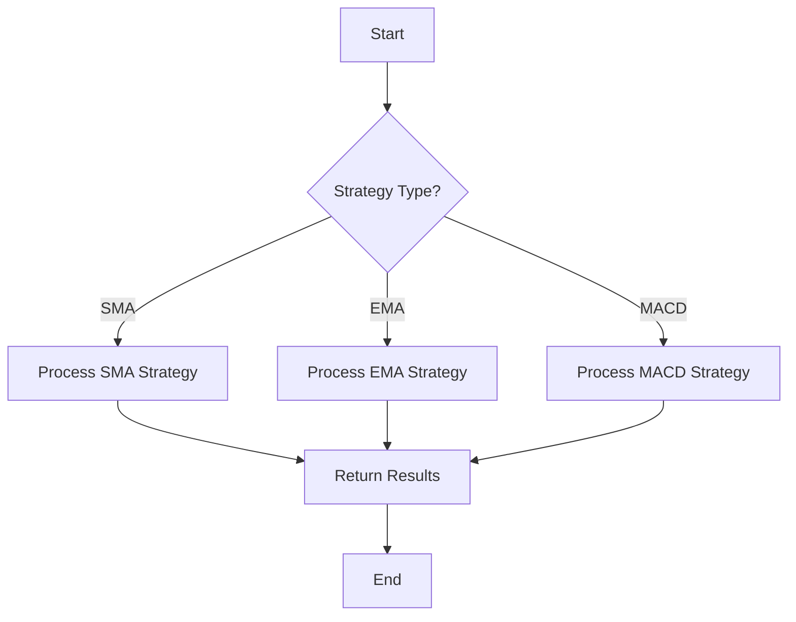
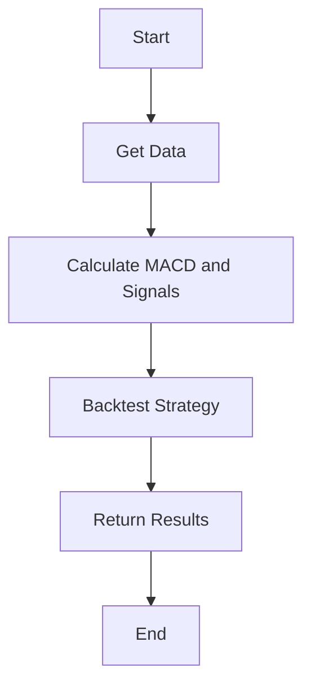
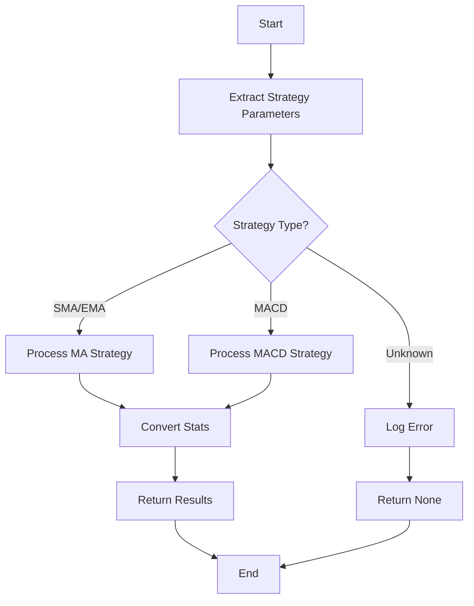

# Implementation Plan: Extending MA Cross Portfolio Processing for MACD Strategies

## 1. Overview

This implementation plan outlines the steps required to extend the existing MA Cross portfolio processing functionality to handle MACD strategy types. The goal is to create a more generalized and modular approach that can process SMA, EMA, and MACD strategies within the same workflow, allowing for mixed strategy types in a single portfolio file.

## 2. Current Architecture Analysis

### 2.1 Current Implementation

The current implementation in `app/ma_cross/2_update_portfolios.py` processes portfolios containing SMA and EMA strategies. The main workflow is:

1. Load portfolio using `load_portfolio` from `app/tools/portfolio`
2. Process each ticker using `process_ticker_portfolios`
3. For each ticker, determine if it's SMA or EMA based on `USE_SMA` flag
4. Process the ticker using `process_ma_portfolios`
5. Export results using `export_summary_results`

The `process_ma_portfolios` function is specifically designed for MA strategies and doesn't support MACD.

### 2.2 MACD Implementation

MACD strategies require three parameters:
- Short window (fast EMA period)
- Long window (slow EMA period)
- Signal window (signal line EMA period)

The MACD calculation and signal generation are already implemented in:
- `app/tools/calculate_macd.py`
- `app/tools/calculate_macd_signals.py`
- `app/tools/calculate_macd_and_signals.py`

### 2.3 Portfolio Loading

The portfolio loader in `app/tools/portfolio/loader.py` already has support for MACD strategies, including validation of the required signal window parameter.

## 3. Implementation Strategy

We will create a more generalized approach by:

1. Creating a new generic `process_strategy_portfolios` function that can handle all strategy types
2. Modifying `process_ticker_portfolios` to use the strategy type from the portfolio data
3. Ensuring proper handling of MACD-specific parameters (signal window)
4. Maintaining backward compatibility with existing portfolio files

## 4. Detailed Implementation Steps

### 4.1 Create Generic Strategy Processing Function

Create a new file `app/ma_cross/tools/process_strategy_portfolios.py` with a generic function that can handle all strategy types:

```python
def process_strategy_portfolios(
    ticker: str,
    strategy_type: str,
    short_window: int,
    long_window: int,
    signal_window: Optional[int] = None,
    config: dict = None,
    log: Callable = None
) -> Optional[Tuple[Optional[pl.DataFrame], dict, Optional[pl.DataFrame]]]:
    """
    Process portfolios for a given ticker based on strategy type.
    
    Args:
        ticker: Ticker symbol
        strategy_type: Strategy type (SMA, EMA, MACD)
        short_window: Short/fast window period
        long_window: Long/slow window period
        signal_window: Signal window period (required for MACD)
        config: Configuration dictionary
        log: Logging function
        
    Returns:
        Optional tuple of (portfolio DataFrame or None, config, data with signals or None)
        Returns None if processing fails entirely
    """
    # Implementation details
```

### 4.2 Modify Summary Processing Module

Update `app/ma_cross/tools/summary_processing.py` to handle MACD strategies:

1. Modify `process_ticker_portfolios` to detect strategy type and use the appropriate processing function
2. Add support for MACD-specific parameters (signal window)
3. Update the stats collection to include MACD-specific information

### 4.3 Create Strategy Type Handling Functions

Create specific handler functions for each strategy type:

1. `process_sma_strategy`
2. `process_ema_strategy`
3. `process_macd_strategy`

These functions will encapsulate the specific logic for each strategy type while sharing common code.

### 4.4 Update Main Portfolio Processing Module

Update `app/ma_cross/2_update_portfolios.py` to handle MACD strategies:

1. Ensure the config has appropriate defaults for MACD strategies
2. Update comments and docstrings to reflect MACD support

## 5. Detailed Function Specifications

### 5.1 process_strategy_portfolios



This function will:
1. Accept strategy parameters including strategy type
2. Validate parameters based on strategy type
3. Call the appropriate strategy-specific processing function
4. Return standardized results

### 5.2 process_macd_strategy



This function will:
1. Get price data for the ticker
2. Calculate MACD indicators using the provided parameters
3. Generate trading signals
4. Backtest the strategy
5. Return the portfolio results

### 5.3 Modified process_ticker_portfolios



This function will:
1. Extract strategy parameters from the portfolio row
2. Determine the strategy type (SMA, EMA, MACD)
3. Call the appropriate processing function
4. Convert and standardize the results
5. Return the processed portfolio stats

## 6. File Changes

### 6.1 New Files

1. `app/ma_cross/tools/process_strategy_portfolios.py` - Generic strategy processing function

### 6.2 Modified Files

1. `app/ma_cross/tools/summary_processing.py` - Update to handle MACD strategies
2. `app/ma_cross/2_update_portfolios.py` - Update to support MACD strategies

### 6.3 Deprecated Functions

1. `process_ma_portfolios` in `app/ma_cross/tools/process_ma_portfolios.py` - Will be deprecated in favor of the new generic function

## 8. Implementation Phases

### Phase 1: Core Implementation

1. Create the generic `process_strategy_portfolios` function
2. Implement MACD strategy processing
3. Update `process_ticker_portfolios` to handle all strategy types
4. Basic testing with MACD strategies

### Phase 2: Integration and Refinement

1. Update `2_update_portfolios.py` to fully support MACD
2. Comprehensive support of mixed portfolios
3. Performance optimization
4. Documentation updates

### Phase 3: Finalization

1. validation
2. Code cleanup and refactoring
3. Update any dependent modules

## 9. Backward Compatibility Considerations

1. Maintain support for the `USE_SMA` flag for backward compatibility
2. Ensure existing portfolio files continue to work without modification
3. Provide clear error messages for missing required parameters

## 10. Future Extensibility

The new implementation will be designed to make it easier to add support for additional strategy types in the future by:

1. Using a strategy type-based dispatch mechanism
2. Standardizing the interface for strategy processing functions
3. Centralizing parameter validation and processing

This approach will make the codebase more maintainable and easier to extend with new strategy types.