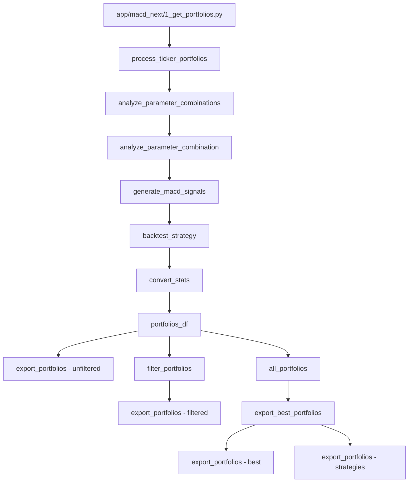
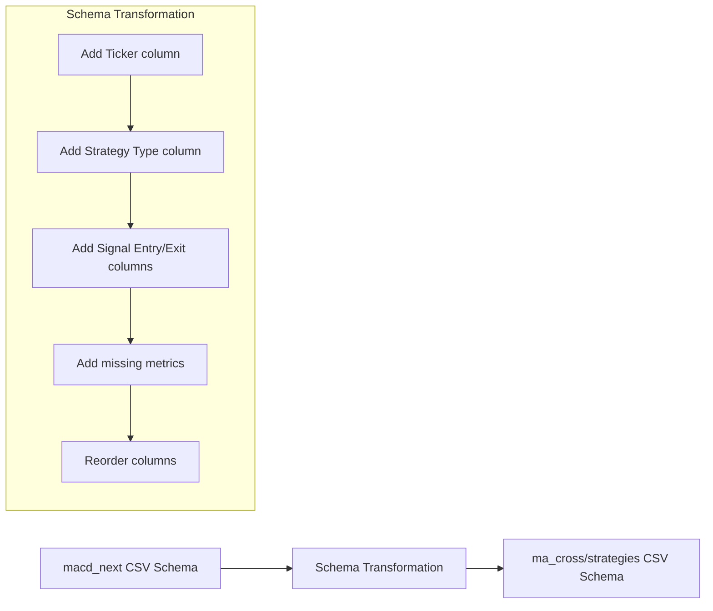

# Comprehensive Investigation and Implementation Plan

After conducting a thorough investigation of the codebase, I've identified the key differences between the portfolio export mechanisms in the `ma_cross`, `strategies`, and `macd_next` modules. This analysis will inform our implementation plan to renovate the `app/macd_next/1_get_portfolios.py` file.

## Key Findings

### 1. CSV Schema Differences

| Feature | ma_cross/strategies | macd_next |
|---------|---------------------|-----------|
| Ticker column | ✅ Included | ❌ Uses filename instead |
| Strategy Type column | ✅ Included (SMA, EMA) | ❌ Missing (always MACD) |
| Signal Entry/Exit columns | ✅ Included | ❌ Missing |
| Performance metrics | ✅ Comprehensive set | ⚠️ Limited set |
| Signal/Position Count | ✅ Included | ❌ Missing |

### 2. Export Mechanism Differences

- **ma_cross**: Uses `export_best_portfolios` from `app/tools/portfolio/collection.py`, which calls `export_portfolios` from `app/tools/strategy/export_portfolios.py`
- **macd_next**: Uses its own `export_portfolios` function from `app/macd_next/tools/export_portfolios.py`
- Both ultimately use the same `export_csv` function from `app/tools/export_csv.py`, but with different configurations

### 3. Directory Structure Differences

- **ma_cross**: Exports to `csv/portfolios_best/` or `csv/strategies/`
- **macd_next**: Exports to `csv/macd_next/portfolios/` or `csv/macd_next/portfolios_filtered/`

### 4. Portfolio Processing Differences

- **ma_cross**: Processes portfolios using `execute_strategy` from `app/ma_cross/tools/strategy_execution.py`
- **macd_next**: Processes portfolios using `process_ticker_portfolios` from `app/macd_next/tools/signal_processing.py`

## Implementation Plan

Based on these findings, I propose the following implementation plan to renovate `app/macd_next/1_get_portfolios.py`:

### Phase 1: Update Export Mechanism

1. **Modify `app/macd_next/tools/export_portfolios.py`**:
   - Update the `VALID_EXPORT_TYPES` to include `portfolios_best`
   - Enhance the column reordering to match the schema used by `ma_cross`
   - Add logic to include Ticker, Strategy Type, Signal Entry, and Signal Exit columns
   - Ensure all performance metrics are included

2. **Create a new function `export_best_portfolios` in `app/macd_next/tools/export_portfolios.py`**:
   - This will be similar to the function in `app/tools/portfolio/collection.py`
   - It will sort portfolios and export them using the enhanced `export_portfolios` function

### Phase 2: Update Portfolio Processing

3. **Enhance `app/macd_next/tools/signal_processing.py`**:
   - Modify `process_ticker_portfolios` to include additional metrics
   - Add Signal Count and Position Count calculations
   - Add Signal Entry and Signal Exit flags

4. **Update `app/macd_next/tools/sensitivity_analysis.py`**:
   - Enhance `analyze_parameter_combination` to include additional metrics
   - Ensure Strategy Type is set to "MACD" for all portfolios

### Phase 3: Update Main Module

5. **Renovate `app/macd_next/1_get_portfolios.py`**:
   - Update the `run` function to use the new `export_best_portfolios` function
   - Modify the export directory structure to match `ma_cross`
   - Add support for exporting to `csv/strategies/` directory
   - Ensure all portfolios have the required columns

### Phase 4: Testing and Validation

6. **Test the renovated module**:
   - Run the module with various configurations
   - Compare the exported CSV files with those from `ma_cross`
   - Verify that all required columns and metrics are included
   - Ensure the directory structure matches expectations

## Implementation Details

### 1. Modify `app/macd_next/tools/export_portfolios.py`

```python
# Update VALID_EXPORT_TYPES
VALID_EXPORT_TYPES = {
    'portfolios',
    'portfolios_scanner',
    'portfolios_filtered',
    'portfolios_best'  # Add this
}

# Enhance _reorder_columns function
def _reorder_columns(df: pl.DataFrame, export_type: str) -> pl.DataFrame:
    # Fix precision first
    df = _fix_precision(df)
    
    # Add Ticker column if missing
    if "Ticker" not in df.columns and "TICKER" in config:
        ticker = config["TICKER"]
        if isinstance(ticker, str):
            df = df.with_columns(pl.lit(ticker).alias("Ticker"))
    
    # Add Strategy Type column if missing
    if "Strategy Type" not in df.columns:
        df = df.with_columns(pl.lit("MACD").alias("Strategy Type"))
    
    # Add Signal Entry and Signal Exit columns if missing
    if "Signal Entry" not in df.columns:
        df = df.with_columns(pl.lit(False).alias("Signal Entry"))
    if "Signal Exit" not in df.columns:
        df = df.with_columns(pl.lit(False).alias("Signal Exit"))
    
    # Define standard column order
    if export_type in ['portfolios_best', 'portfolios_filtered']:
        ordered_cols = [
            "Ticker",
            "Strategy Type",
            "Short Window",
            "Long Window",
            "Signal Window",
            "Signal Entry",
            "Signal Exit",
            "Total Open Trades",
            "Total Trades"
        ]
        
        # Add remaining columns
        remaining_cols = [col for col in df.columns if col not in ordered_cols]
        ordered_cols.extend(remaining_cols)
        
        # Select only columns that exist in the DataFrame
        existing_cols = [col for col in ordered_cols if col in df.columns]
        return df.select(existing_cols)
    
    # Original logic for other export types
    # ...
```

### 2. Create `export_best_portfolios` function

```python
def export_best_portfolios(
    portfolios: List[Dict[str, Any]],
    config: Dict,
    log: callable
) -> bool:
    """Export the best portfolios to a CSV file.

    Args:
        portfolios: List of portfolio dictionaries to export
        config: Configuration for the export
        log: Logging function

    Returns:
        bool: True if export successful, False otherwise
    """
    if not portfolios:
        log("No portfolios to export", "warning")
        return False
        
    try:
        # Sort portfolios by Score or Total Return [%]
        sort_by = config.get('SORT_BY', 'Total Return [%]')
        df = pl.DataFrame(portfolios)
        sorted_df = df.sort(sort_by, descending=True)
        sorted_portfolios = sorted_df.to_dicts()
        
        # Export to both portfolios_best and strategies directories
        export_portfolios(
            portfolios=sorted_portfolios,
            config=config,
            export_type="portfolios_best",
            log=log
        )
        
        # Also export to strategies directory
        export_portfolios(
            portfolios=sorted_portfolios,
            config=config,
            export_type="",  # Empty string for direct export
            feature_dir="strategies",  # Use strategies directory
            log=log
        )
        
        log(f"Exported {len(sorted_portfolios)} portfolios sorted by {sort_by}")
        return True
    except Exception as e:
        log(f"Failed to export portfolios: {str(e)}", "error")
        return False
```

### 3. Update `app/macd_next/1_get_portfolios.py`

```python
def run(config: PortfolioConfig = DEFAULT_CONFIG) -> bool:
    """Run portfolio analysis for single or multiple tickers using the MACD cross strategy.
    
    This function handles the main workflow of portfolio analysis:
    1. Processes each ticker (single or multiple)
    2. Performs parameter sensitivity analysis on MACD parameters
    3. Filters portfolios based on criteria
    4. Displays and saves results
    
    Args:
        config (PortfolioConfig): Configuration dictionary containing analysis parameters
        
    Returns:
        bool: True if execution successful
        
    Raises:
        Exception: If portfolio analysis fails
    """
    log, log_close, _, _ = setup_logging(
        module_name='macd_cross',
        log_file='1_get_portfolios.log'
    )
    
    try:
        # Initialize configuration and tickers
        config = get_config(config)
        tickers = [config["TICKER"]] if isinstance(config["TICKER"], str) else config["TICKER"]
        
        # Process each ticker
        all_portfolios = []
        
        for ticker in tickers:
            log(f"Processing ticker: {ticker}")
            
            # Create a config copy with single ticker
            ticker_config = config.copy()
            ticker_config["TICKER"] = ticker
            
            # Process portfolios for ticker
            portfolios_df = process_ticker_portfolios(ticker, ticker_config, log)
            if portfolios_df is None:
                continue
                
            # Export unfiltered portfolios
            try:
                export_portfolios(
                    portfolios=portfolios_df.to_dicts(),
                    config=ticker_config,
                    export_type="portfolios",
                    log=log
                )
            except (ValueError, PortfolioExportError) as e:
                log(f"Failed to export portfolios for {ticker}: {str(e)}", "error")
                continue

            # Filter portfolios for individual ticker
            filtered_portfolios = filter_portfolios(portfolios_df, ticker_config, log)
            if filtered_portfolios is not None:
                log(f"Filtered results for {ticker}")
                print(filtered_portfolios)

                # Export filtered portfolios
                try:
                    export_portfolios(
                        portfolios=filtered_portfolios.to_dicts(),
                        config=ticker_config,
                        export_type="portfolios_filtered",
                        log=log
                    )
                except (ValueError, PortfolioExportError) as e:
                    log(f"Failed to export filtered portfolios for {ticker}: {str(e)}", "error")
            
            # Add portfolios to all_portfolios
            all_portfolios.extend(portfolios_df.to_dicts())
        
        # Export best portfolios across all tickers
        if all_portfolios:
            from app.macd_next.tools.export_portfolios import export_best_portfolios
            export_best_portfolios(all_portfolios, config, log)

        log_close()
        return True
            
    except Exception as e:
        log(f"Execution failed: {str(e)}", "error")
        log_close()
        raise
```

## Mermaid Diagram: Export Flow



## Mermaid Diagram: CSV Schema Transformation



This implementation plan provides a comprehensive approach to renovating the `app/macd_next/1_get_portfolios.py` file to export CSV files with the same schema and data as the other modules. By following this plan, we'll ensure consistency across the codebase and improve the overall maintainability of the project.