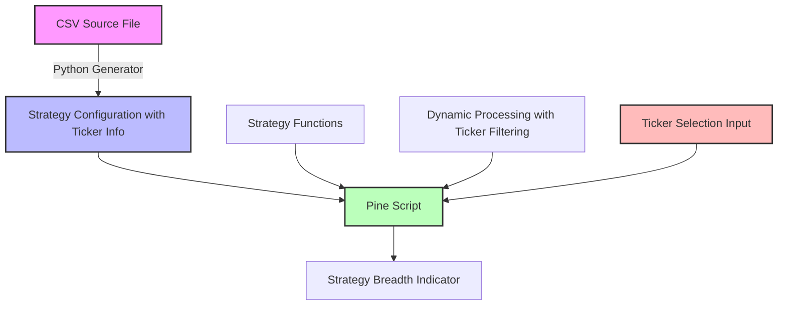

# Strategy Breadth Implementation Guide

## Overview

The Strategy Breadth Oscillator indicator tracks multiple trading strategies and displays how many are in bullish positions at any given time. The current implementation has hardcoded strategy parameters, making it difficult to update when the source CSV file changes. This guide provides a comprehensive approach to refactoring the indicator for improved maintainability and multi-asset support.

## Problem Statement

The current Pine script (`strategy_breadth.pine`) has several maintenance challenges:

1. Strategy parameters are hardcoded throughout the code
2. The total number of strategies is fixed
3. Each strategy requires its own implementation block
4. There's no direct connection to the source CSV file
5. There's no support for strategies across different assets (tickers)

When the source file (`csv/strategies/BTC_d_20250427.csv`) changes, the Pine script must be manually updated, which is time-consuming and error-prone. Additionally, the current implementation doesn't account for strategies that might be specific to different assets.

## Solution Architecture

The proposed solution follows SOLID principles to create a more maintainable and extensible implementation with multi-asset support:



### Key Components

1. **Strategy Configuration Array with Ticker Info**: A centralized data structure containing all strategy parameters and their associated tickers
2. **Ticker Selection Input**: A user input to select which ticker's strategies to display
3. **Dynamic Processing Function with Ticker Filtering**: A single function that processes all strategies based on their type, parameters, and ticker
4. **Python Generator Script with Ticker Support**: A tool that reads the CSV file, extracts ticker information, and generates the Pine script configuration
5. **Refactored Pine Script**: The updated script that uses the dynamic approach and supports multiple assets

## Implementation Plan

### Step 1: Create the Python Generator Script with Ticker Support

Create a Python script that reads the CSV file, extracts ticker information, and generates the Pine script configuration. This script is provided in the [Strategy Config Generator](strategy_config_generator.md) document.

### Step 2: Generate the Initial Configuration with Ticker Information

Run the Python script with the current CSV file to generate the initial configuration:

```bash
python generate_strategy_config.py csv/strategies/BTC_d_20250427.csv
```

This will produce a configuration file with all the strategy parameters and their associated tickers.

Optionally, you can filter for a specific ticker:

```bash
python generate_strategy_config.py csv/strategies/BTC_d_20250427.csv BTC-USD
```

### Step 3: Refactor the Pine Script with Multi-Asset Support

Update the Pine script to use the dynamic approach with ticker support:

1. Replace the hardcoded strategy definitions with the generated configuration array that includes ticker information
2. Add the ticker selection input to allow users to switch between different assets' strategies
3. Replace the `calculateBreadth()` function with the dynamic calculation function that supports ticker filtering
4. Update the `totalStrategies` variable to be dynamically updated based on applicable strategies

A detailed example of the refactored script is provided in the [Strategy Breadth Refactored Example](strategy_breadth_refactored_example.md) document.

### Step 4: Test the Refactored Script with Different Tickers

Upload the refactored script to TradingView and verify that it produces the same results as the original script. Test with different timeframes and tickers to ensure everything works correctly.

1. Test with the default ticker (e.g., BTC-USD)
2. Test with other tickers to ensure proper filtering
3. Test with the "ALL" option to ensure all strategies are included

### Step 5: Document the Update Process with Ticker Support

Create documentation for the update process to ensure that future changes to the CSV file can be easily incorporated into the Pine script. This should include:

1. Instructions for running the Python generator script with or without ticker filtering
2. Guidelines for updating the Pine script with the generated configuration
3. Testing procedures to verify the changes across different assets

## Maintenance Workflow

When the source CSV file changes:

1. Run the Python generator script with the updated CSV file
2. Optionally specify a ticker filter if you only want strategies for a specific asset
3. Copy the generated configuration into the Pine script
4. Update the ticker selection input options if new tickers have been added
5. Test the updated script to ensure it works correctly with all tickers
6. Upload the updated script to TradingView

This workflow ensures that the Pine script stays in sync with the source data, making it much easier to maintain over time and supporting strategies across multiple assets.

## Future Enhancements

### 1. Add Support for New Strategy Types

The current implementation supports SMA, EMA, and MACD strategies. To add support for new strategy types:

1. Add a new signal generation function for the strategy type
2. Update the dynamic processing function to handle the new strategy type
3. Add the new strategy to the configuration array

### 2. Implement Asset-Specific Visualization

Enhance the visualization to provide asset-specific insights:

1. Add asset-specific colors or styles
2. Display asset-specific statistics
3. Create separate tabs or panels for different assets

### 3. Create a TradingView Library

Consider creating a TradingView library for the common strategy functions to make the main script more concise and easier to maintain.

### 4. Implement Cross-Asset Analysis

Extend the indicator to provide cross-asset analysis:

1. Compare strategy performance across different assets
2. Identify correlations between assets
3. Create a composite breadth indicator that combines multiple assets

## References

- [Strategy Breadth Implementation Plan](strategy_breadth_implementation_plan.md): Detailed analysis and improvement methods
- [Strategy Config Generator](strategy_config_generator.md): Python script for generating the Pine script configuration
- [Strategy Breadth Refactored Example](strategy_breadth_refactored_example.md): Before-and-after comparison of the Pine script

## Conclusion

By implementing these changes, the Strategy Breadth Oscillator indicator will be much easier to maintain and update when the source CSV file changes. The refactored implementation follows SOLID principles, making it more extensible and robust for future enhancements.

The dynamic approach with ticker support eliminates code duplication, centralizes the strategy configuration, and provides multi-asset capabilities. This reduces the risk of errors, makes it easier to add, remove, or modify strategies, and allows users to analyze strategies across different assets.

The Python generator script automates the update process, ensuring that the Pine script stays in sync with the source data and properly handles ticker information.