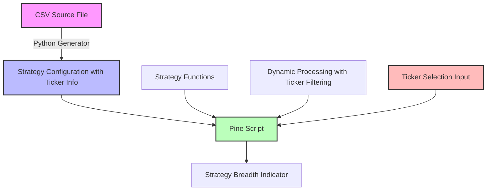

# Strategy Breadth Refactoring Project Summary

## Project Overview

This project provides a comprehensive solution for improving the maintainability of the Strategy Breadth Oscillator indicator in TradingView Pine Script. The goal is to make the indicator easier to update when the source CSV file containing strategy parameters changes, and to add support for strategies across different assets (tickers).

## Documentation Index

The following documents provide a complete guide to understanding and implementing the proposed solution:

1. **[Strategy Breadth Implementation Guide](strategy_breadth_implementation_guide.md)**
   - The main guide that provides an overview of the problem and solution
   - Includes a step-by-step implementation plan with multi-asset support
   - Describes the maintenance workflow for future updates

2. **[Strategy Breadth Implementation Plan](strategy_breadth_implementation_plan.md)**
   - Detailed analysis of the current implementation
   - Recommended improvement methods with ticker support
   - Benefits of each approach

3. **[Strategy Config Generator](strategy_config_generator.md)**
   - Contains a Python script for generating the Pine script configuration with ticker information
   - Includes usage instructions and integration guidelines
   - Demonstrates how to automate the update process and filter by ticker

4. **[Strategy Breadth Refactored Example](strategy_breadth_refactored_example.md)**
   - Before-and-after comparison of the Pine script
   - Highlights key differences and benefits, including multi-asset support
   - Provides implementation steps

## Solution Architecture

The proposed solution follows SOLID principles to create a more maintainable and extensible implementation with multi-asset support:

## Key Benefits

The refactored implementation offers several key benefits:

1. **Improved Maintainability**: Centralized configuration and reduced code duplication make the script easier to maintain.

2. **Automated Updates**: The Python generator script automates the process of updating the Pine script when the source CSV changes.

3. **Multi-Asset Support**: The solution now supports strategies across different assets, allowing users to switch between different tickers or view all strategies at once.

4. **Dynamic Strategy Count**: The total number of strategies is dynamically updated based on the selected ticker, ensuring accurate percentage calculations.

5. **Extensibility**: The dynamic approach makes it easier to add new strategy types or modify existing ones.

6. **Reduced Errors**: Centralizing the configuration reduces the risk of errors when updating the script.

7. **SOLID Compliance**: The refactored implementation follows SOLID principles, making it more robust and flexible.

## Implementation Roadmap

1. Create the Python generator script with ticker support
2. Generate the initial configuration with ticker information
3. Refactor the Pine script with multi-asset support
4. Test the refactored script with different tickers
5. Document the update process

## Multi-Asset Support Features

The solution includes several features specifically designed to support strategies across different assets:

1. **Ticker Information in Configuration**: Each strategy in the configuration array includes its associated ticker.

2. **Ticker Selection Input**: The Pine script includes a user input to select which ticker's strategies to display.

3. **Dynamic Filtering**: The calculation function filters strategies based on the selected ticker.

4. **Dynamic Strategy Count**: The total number of strategies is updated based on the applicable strategies for the selected ticker.

5. **Ticker-Specific Generator Options**: The Python script can generate configurations for all tickers or filter for a specific ticker.

## Next Steps

To implement this solution:

1. Review the [Strategy Breadth Implementation Guide](strategy_breadth_implementation_guide.md) for a comprehensive overview
2. Extract the Python script from [Strategy Config Generator](strategy_config_generator.md)
3. Follow the refactoring example in [Strategy Breadth Refactored Example](strategy_breadth_refactored_example.md)
4. Test the implementation with the current CSV file and different ticker selections
5. Document the update process for future maintenance

## Conclusion

By implementing these changes, the Strategy Breadth Oscillator indicator will be much easier to maintain and update when the source CSV file changes. The refactored implementation follows SOLID principles, making it more extensible and robust for future enhancements.

The addition of multi-asset support significantly enhances the indicator's capabilities, allowing users to analyze strategies across different assets and providing a more comprehensive view of market sentiment.